# 源码级的debug方法

在本章中，我们主要介绍如何使用qemu+gdb的方式来实现源码级的debug方法。

# 特别提醒

+ 经过测试后发现，在gdb 8或者更高的版本中，`set architecture i8086`执行后，使用形如`x/10i $pc`的语句反汇编的代码仍然是32位，不是期望的16位代码。因此，我们下面使用加载符号表的方式来显示我们的汇编源代码。在 gdb 7.12下则无上述问题。

+ 对于nasm版本不是2.15的同学，我们需要安装2.15版本的nasm。

+ `x/FMT address`最后两个关于pc和esp的实例在gitee上显示有问题，实际的命令如下。

  ```
  x/10i $pc(显示当前指令后面的10条汇编指令，包括当前指令)
  x/12xw $esp(显示栈中的12个字，以16进制显示)
  ```

# 安装2.15版本的Nasm

对于使用Ubuntu 18.04的同学来说，我们使用命令`sudo apt install nasm`安装的nasm版本默认是`2.13`的。我们可以使用命令`nasm -v`来查看我们的nasm的版本。

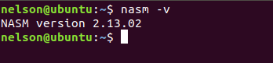

在本章中，我们给出的方法是使用加载符号表的方式来显示汇编源代码。对于`2.13`版本的`nasm`来说，我们即使加上了`-g`参数生成的带debug信息的文件，如`mbr.symbol`等，生成的文件也不包含有关于代码行号的debug信息。简单来说，如果我们使用了`2.13`版本的nasm生成的文件来debug，那么我们无法在`src`窗口下显示汇编代码，而在`2.15`版本的nasm中则没有这个问题。

因此，对于nasm版本不是`2.15`的同学，我们需要按如下方式来安装`2.15`版本的nasm。`2.15`版本的nasm已经放在了项目的`env`文件夹下。

你可以将`env/nasm-2.15.05.tar.xz`移动到任何你喜欢的文件夹，作为示例，我们不妨移动到`~/env`文件夹下。

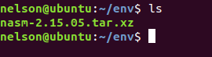

在`~/env`文件夹下，我们先将`nasm-2.15.05.tar.xz`解压出来。

```shell
tar -xvf nasm-2.15.05.tar.xz
```

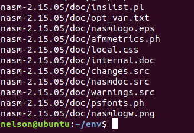

进入解压出的文件夹。

```shell
cd nasm-2.15.05
```


执行如下命令，可以看到一大堆的`checking`。

```shell
./configure
```

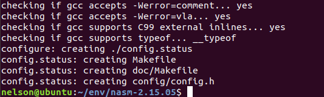

上一步执行完成后，执行make命令，可以看到满屏的编译命令。

```
make
```

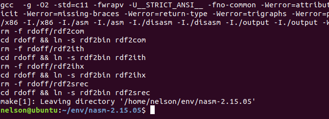

上一步执行完成后，安装nasm

```
sudo make install
```

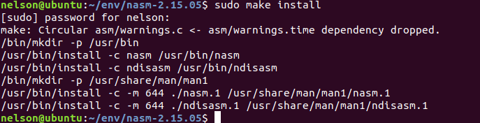

最后我们查看nasm的版本。

```
nasm -v
```

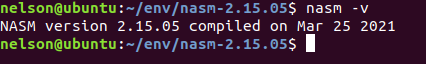

至此，妈妈再也不用担心我的gdb无法显示源代码了，gdb 8还可以显示中文呢。

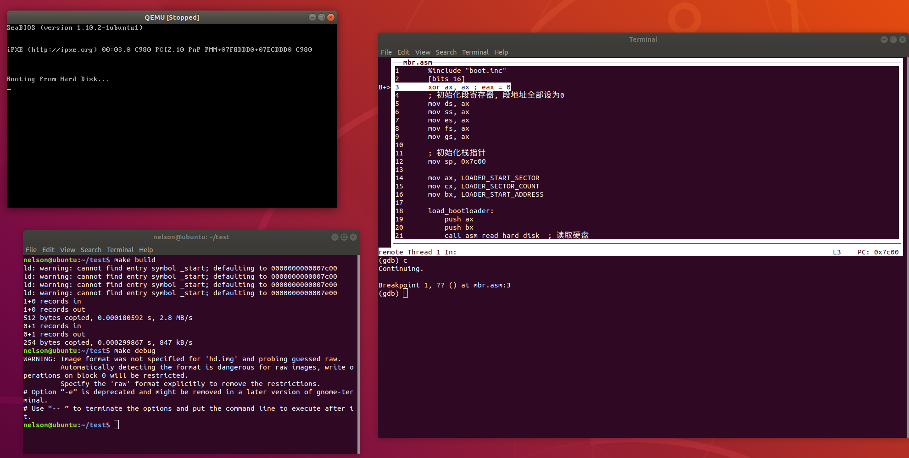

# gdb+qemu的debug方法

虽然网上关于gdb的教程非常多，但大多数教程都是介绍如何使用gdb来调试一个运行在特定的操作系统上的程序，关于如何使用gdb来调试操作系统开发的代码则是凤毛麟角。例如，关于如何对C语言的代码进行单步跟踪提的很多，但关于对汇编的代码进行单步跟踪提的很少。因此，在本章中，我们将会通过3个简单的例子来学习如何使用gdb和qemu来调试我们的操作系统代码。

# 基本调试思路

使用gdb和qemu调试操作系统的基本流程如下。

1. **qemu启动**。我们先在一个Terminal下启动qemu，注意，qemu运行的参数需要加上`-s -S`参数，且在gdb启动之前不能关闭qemu。
2. **gdb启动**。在另一个Terminal下启动gdb并连接上第1步启动的qemu。
3. **加载符号表**。符号表会为gdb提供源代码和标识符等debug信息。
4. **设置断点**。gdb运行到我们设置的断点处会暂停，我们会在我们感兴趣的代码地址处设置断点，断点一般是我们认为bug出现的地方。
5. **运行至断点处**。使用命令跳过其他我们不感兴趣的代码，使代码一直执行到我们设置的断点处暂停。
6. **查看寄存器或特定地址的值**。我们可以在gdb暂停的地方查看寄存器或特定地址的值，并根据输出来判断前面执行的代码是否出现bug。
7. **单步调试跟踪**。gdb在断点处暂停后，我们可以一条一条语句地执行来跟踪程序的运行逻辑，gdb每执行条语句就会暂停。
8. **重复3、4、5、6一直到bug解决**。这个过程可能需要反复执行，但不一定是按照$\{3, 4, 5, 6\}$的顺序，可以是$\{3, 4, 6, 5, 6, 6, 6, 5, 3, 4, 5\}$。

# 常用的gdb调试指令

| gdb指令                          | 含义                                                         | 实例                                   |
| -------------------------------- | ------------------------------------------------------------ | -------------------------------------- |
| break *adress或b *address        | 在地址adress处设置断点。                                     | break *0x7c00<br>b *0x7c00             |
| break symbol或b symbol           | 在符号symbol处设置断点，例如symbol一般是函数名。             | break setup\_kernel<br>b setup\_kernel |
| break filename:line\_number      | 在文件filename处的第line_numer行设置断点                     | b mbr.asm:12                           |
| add-symbol-file filename address | 加载符号表filename到地址address处                            | add-symbol-file mbr.symbol 0x7c00      |
| x/FMT address                    | address是内存地址，FMT格式是重复的单元个数+格式+大小。<br/>重复的单元个数是一个数字，表示我们希望查看多少个单元。正数表示从address向后查看。负数表示从address向前查看。<br/>格式是一个字符，可以是o(octal), x(hex), d(decimal), u(unsigned decimal), t(binary), f(float), a(address), i(instruction), c(char), s(string)。<br/>大小是一个字符，可以是b(byte, 1 byte), h(halfword, 2 byte), w(word, 4 byte), g(giant, 8 bytes)。 | x/5xw 0x8032<br/>x/10i 0x7c00          |
| continue或c                      | 继续执行正在调试的程序到断点处暂停。                         |                                        |
| step或s                          | 执行一条C语句，如果遇到函数调用语句，则会进入函数体中。      |                                        |
| next或n                          | 执行一条C语句，函数调用语句不会进入函数体，把函数当成一条语句执行。 |                                        |
| stepi或si                        | 执行一条汇编语句，如果遇到函数调用语句，则会进入函数体中。   |                                        |
| nexti或ni                        | 执行一条汇编语句，函数调用语句不会进入函数体，把函数当成一条语句执行。 |                                        |
| info registers                   | 查看所有寄存器的值                                           |                                        |
| layout layout\_name              | layout\_name包含src，asm，split，regs。<br/>src显示源代码窗口和命令窗口，asm显示汇编代码窗口和命令窗口，split显示源代码窗口、汇编代码窗口和命令窗口，regs显示寄存器窗口。 | layout split                           |
| focus layout\_window             | 转换当前窗口到layout窗口，layout\_window包含src，asm，regs，cmd。任何时刻gdb的当前窗口只有一个，并且使用方向键的效果只会在当前窗口处显示。<bt/> | focus cmd                              |
| file symbol\_file                | 加载符号表，为gdb提供debug信息。                             | file ../build/kernel.o                 |
| set disassembly-flavor intel     | 设置汇编代码格式为intel风格                                  |                                        |
| set architecture name            | 设置指令对应的CPU架构，name包含i8086(16位)，i386(32位)       | set architecture i386                  |

# 汇编代码

> 我们使用第二章的例子来讲解如何使用gdb来调试汇编代码。

## 生成符号表

我们如果想要在使用gdb来debug的过程中看到我们的源代码，那么我们就要给gdb提供相关的debug信息，这些信息也被称为符号表。在Linux下，符号表是保存在`ELF`格式的文件下的。注意到我们之前使用`nasm`编译生成的是`bin`格式文件，`bin`文件仅包含代码和数据，而`ELF`格式文件除了包含`bin`文件的内容外，还包含有其他信息，例如符号表等。

因此，我们如果想给gdb提供debug所需的符号表，我们就不能一步地从汇编代码生成`bin`格式文件，而是需要先编译汇编代码生成一个可重定位文件，这个文件也是`ELF`格式的。然后我们使用这个可重定位文件生成可执行文件和`bin`格式文件，这个可执行文件就是我们给gdb提供的符号表所在的`ELF`文件。那么这两个`ELF`文件有什么区别呢？顾名思义，可重定位文件的“可重定位”字样说明代码和数据的起始地址是待定的，可执行文件是我们在可重定位文件的基础上指定了代码和数据的起始地址生成的文件，起始地址不为0。

接下来，我们就来生成符号表。

我们首先删除`mbr.asm`和`bootloader.asm`的`org`语句，因为我们会在链接的过程中指定他们代码和数据的起始地址，其效果和`org`指令完全相同。

我们编译`mbr.asm`，生成可重定位文件`mbr.o`。其中，`-g`参数是为了加上debug信息。

```
nasm -o mbr.o -g -f elf32 mbr.asm 
```

然后我们为可重定位文件`mbr.o`指定起始地址`0x7c00`，分别链接生成可执行文件`mbr.symbol`和`mbr.bin`（注意，这一步会在lab4中讲解，如果还没学习到lab4的内容，可以暂时跳过）。

```
ld -o mbr.symbol -melf_i386 -N mbr.o -Ttext 0x7c00
ld -o mbr.bin -melf_i386 -N mbr.o -Ttext 0x7c00 --oformat binary
```

对于`bootloader.asm`，我们执行上述类似的操作。

```
nasm -o bootloader.o -g -f elf32 bootloader.asm 
ld -o bootloader.symbol -melf_i386 -N bootloader.o -Ttext 0x7e00
ld -o bootloader.bin -melf_i386 -N bootloader.o -Ttext 0x7e00 --oformat binary
```

然后将`mbr.bin`和`bootloader.bin`分别写入`hd.img`，写入的位置是lab2-Example 2中指定的位置。

```
dd if=mbr.bin of=hd.img bs=512 count=1 seek=0 conv=notrunc
dd if=bootloader.bin of=hd.img bs=512 count=5 seek=1 conv=notrunc
```

接下来，我们开始学习如何使用gdb来debug。

## debug的基本流程

我们首先使用qemu加载`hd.img`运行。

```
qemu-system-i386 -s -S -hda hd.img -serial null -parallel stdio
```

在另外一个Terminal下启动gdb。

```
gdb
```

**特别注意，之后的所有命令默认在gdb的命令窗口下执行。**

连接上qemu。

```
target remote:1234
```

在MBR的第一条指令处设置断点。

```
b *0x7c00
```

输入c执行到断点`0x7c00`处暂停。

```
c
```

结果如下。

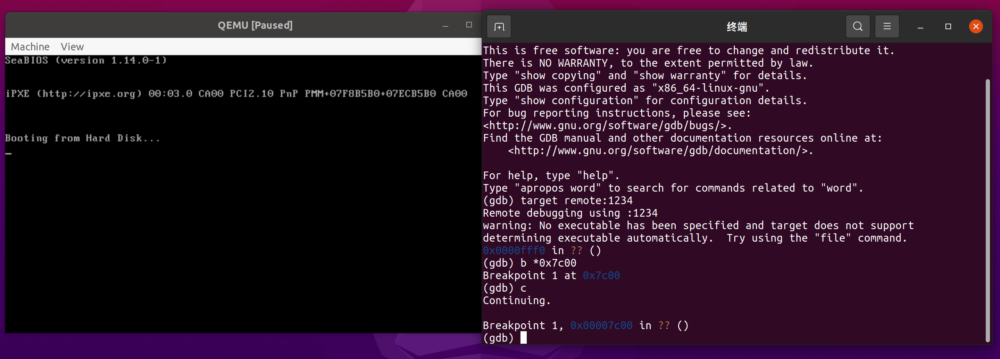

然后我们打开可以显示源代码的窗口。

```
layout src
```

注意，此时我们没有加载符号表，所以gdb找不到任何debug信息来显示我们的源代码。

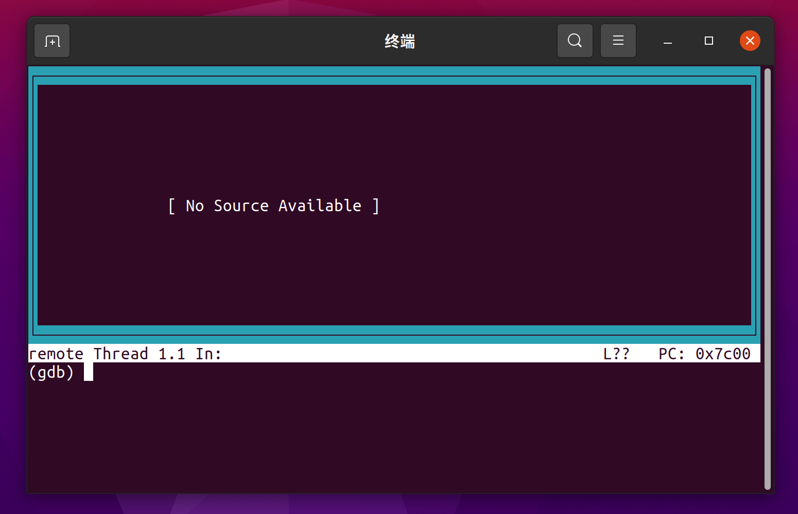

因此，我们加载MBR对应的符号表。

```
add-symbol-file mbr.symbol 0x7c00
```

此时，src窗口显示出了我们的源代码。其中，`B+`表示断点，白色条框表示下一条执行的指令。但中文的显示有问题，不必在意。

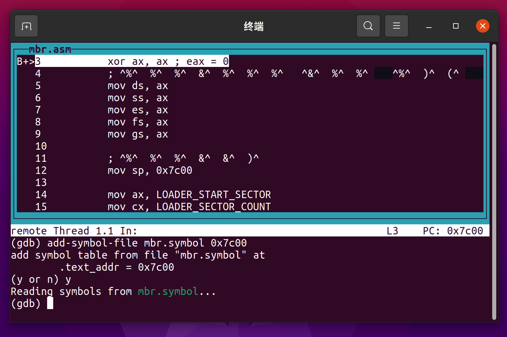

注意，我们现在有两个窗口，一个是输入命令的cmd窗口，一个是显示源代码的src窗口。而方向键的效果只会在当前窗口起作用，并且当前窗口只有一个。在src窗口下，上下键的作用是上下滚动代码，在cmd窗口下，上键的作用是找到之前执行的命令。如果想要在两个窗口之前切换，可以使用`focus`命令，例如切换当前窗口到cmd窗口。

```
fs cmd
```

然后单步执行若干条指令，这里我们没有涉及到函数调用，因此单步执行命令`si`和`ni`的效果是相同的。

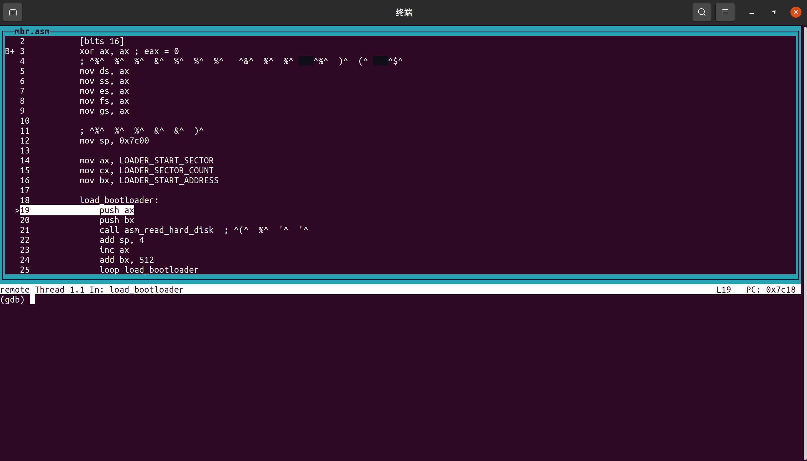

使用`info registers`查看寄存器的内容。

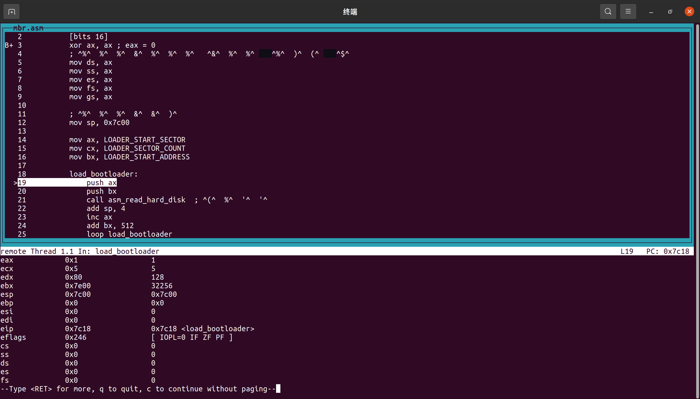

我们可以看到`ax`保存的是`LOADER_START_SECTOR`。

接着，我们在`bootloader`的起始地址设置断点。

```
b *0x7e00
```

然后执行。

```
c
```

此时`src`没有显示任何源代码，这是因为我们没有加载`bootloader`的符号表。和上面的过程一样，我们加载`booloader`的符号表到`0x7e00`。

```
add-symbol-file bootloader.symbol 0x7e00
```

我们在进入保护模式的第一条指令处设置断点。

```
b protect_mode_begin
```

继续执行。

```
c
```

结果如下。

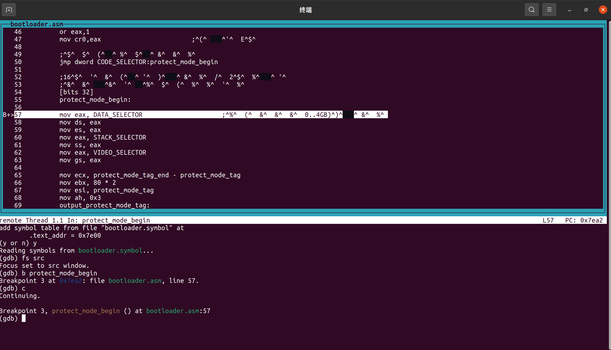

最后，我们输入`c`让程序执行到最后一条`jmp`指令。此时，我们并未设置断点，但我们可以使用`ctrl`和`C`组合键来中断程序执行。

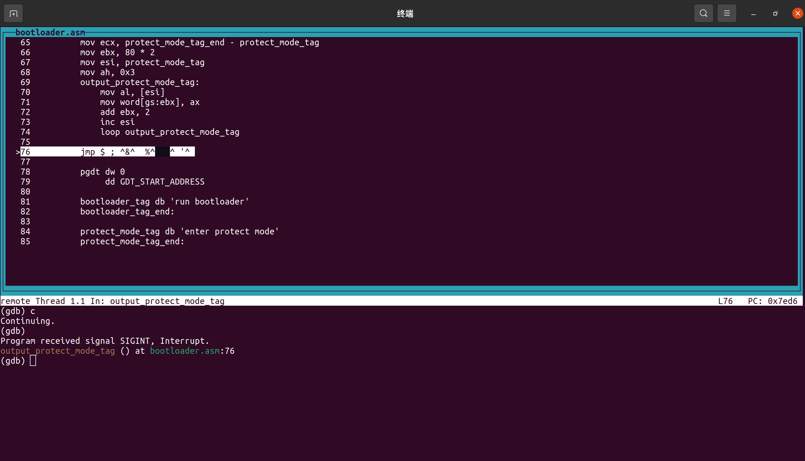

我们查看`GDT`的5个段描述符的内容。

```
x/5xg 0x8800
```

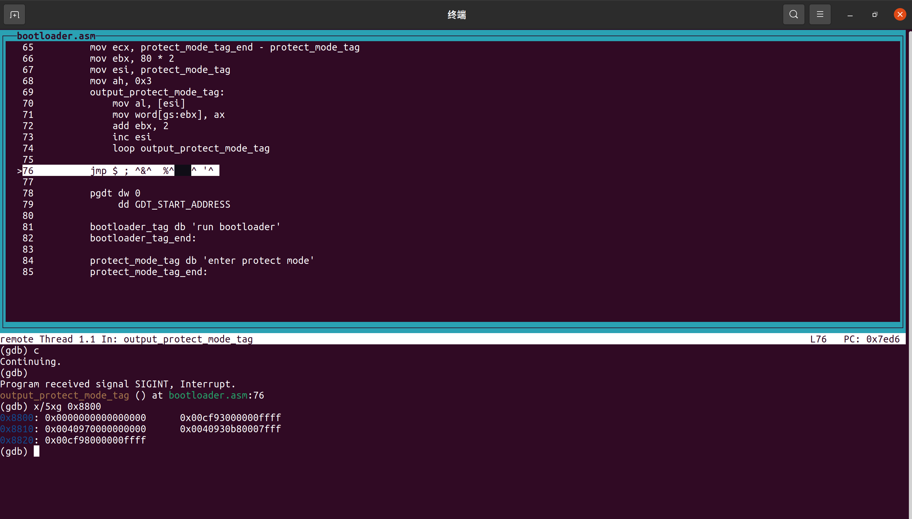

可以看到GDT的内容和我们的设置相吻合。

至此，我们已经学习完使用gdb的debug过程。

# 配合Makefile使用

如果要使用gdb，则会涉及更多的命令。在大多数情况下，我们编写的程序不一定会一次就成功，需要反复多次地debug。如果我们每做一次调整，就要输入上面一大堆命令，这无疑会大大降低我们的开发效率。那么，有没有可能输入尽可能少的命令就能达到相同的效果呢？答案是有的，就是把上面的命令都写入到一个文件中，然后使用命令`make`就能让系统顺序执行预先定义的命令。这个文件被称为Makefile，Makefile在后面将成为编译我们操作系统代码的强有力工具，能够大大提高我们的开发效率。同学们已经在lab2-assignment 3中已经用过了makefile。关于makefile的学习，同学们可以参考[(http://c.biancheng.net/makefile/]。

此时，上面的例子对应的makefile的简单示例如下。

```makefile
run:
	@qemu-system-i386 -hda hd.img -serial null -parallel stdio 
debug:
	@qemu-system-i386 -s -S -hda hd.img -serial null -parallel stdio &
	@sleep 1
	@gnome-terminal -e "gdb -q -x gdbinit"
build:
	@nasm -g -f elf32 mbr.asm -o mbr.o
	@ld -o mbr.symbol -melf_i386 -N mbr.o -Ttext 0x7c00
	@ld -o mbr.bin -melf_i386 -N mbr.o -Ttext 0x7c00 --oformat binary
	@nasm -g -f elf32 bootloader.asm -o bootloader.o
	@ld -o bootloader.symbol -melf_i386 -N bootloader.o -Ttext 0x7e00
	@ld -o bootloader.bin -melf_i386 -N bootloader.o -Ttext 0x7e00 --oformat binary
	@dd if=mbr.bin of=hd.img bs=512 count=1 seek=0 conv=notrunc
	@dd if=bootloader.bin of=hd.img bs=512 count=5 seek=1 conv=notrunc
clean:
	@rm -fr *.bin *.o

```

在Terminal输入不同的make命令的执行结果不同，如下所示。

+ `make`或`make run`。使用qemu启动`hd.img`，在此命令执行前应该执行`make build`。
+ `make debug`。启动qemu并开启gdb调试。
+ `make build`。编译代码并写入`hd.img`。
+ `make clean`。清除当前文件夹下以编译时生产的中间文件。

值得注意的是，gdb的命令也可以预先写入到文件中，在启动gdb后自动加载执行，例如我们把gdb的初始化命令写入文件`gdbinit`中，如下所示。

```
target remote:1234
set disassembly-flavor intel
add-symbol-file mbr.symbol 0x7c00
add-symbol-file bootloader.symbol 0x7c00
```

gdb启动后会自动执行上述命令。

此时，我们先编译代码。

```
make build
```

然后运行

```
make debug
```

结果如下。

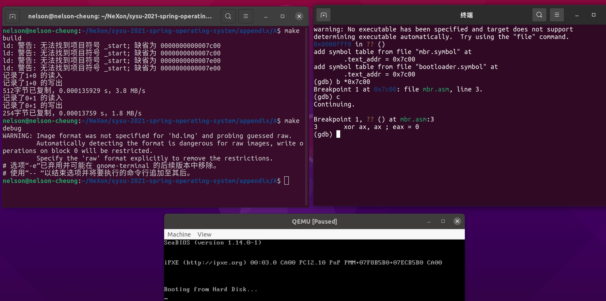

ld会输出warning但不需要理会，众所周知，只有error才是错误，具体原因见第三章。

> 悬崖边上挂了块写着warning的告示牌，只有程序员掉了下去。

# C/C++ 代码

基本过程和汇编代码类似，这里便不再赘述。