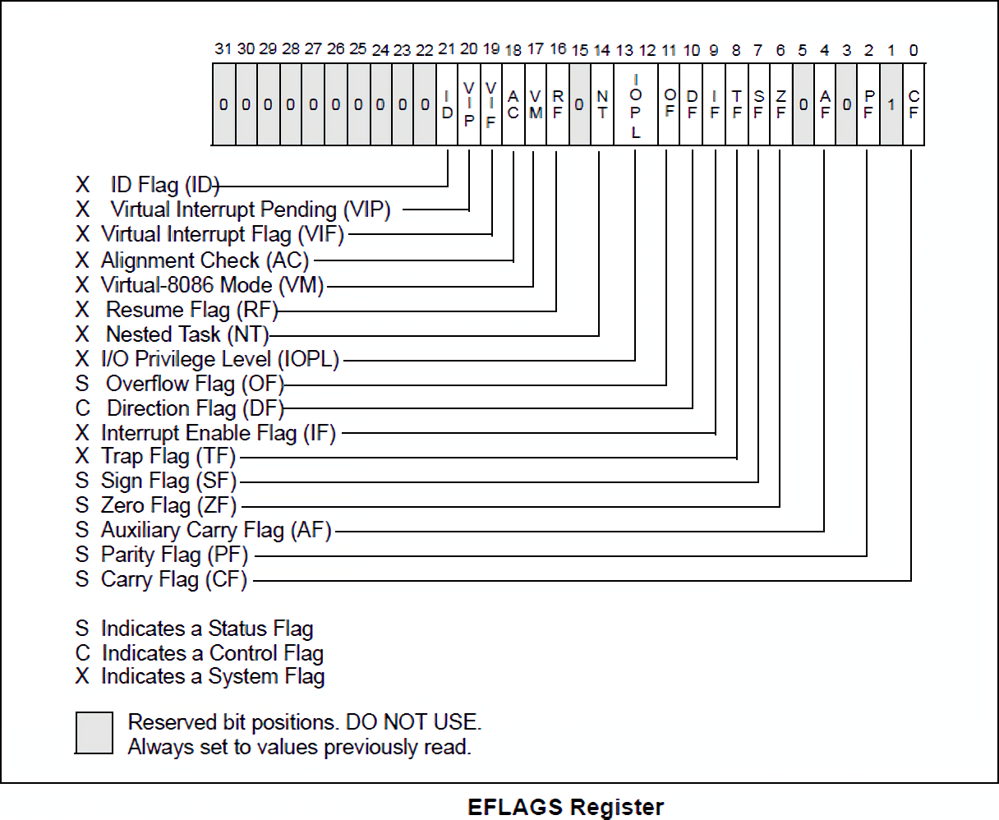
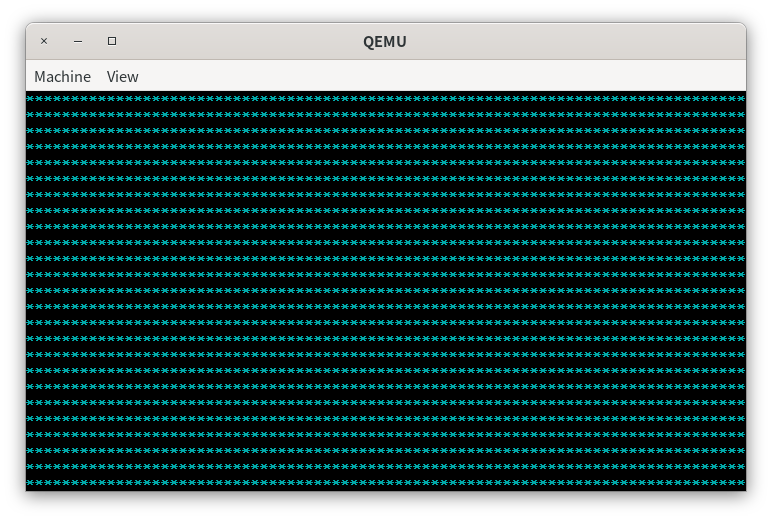
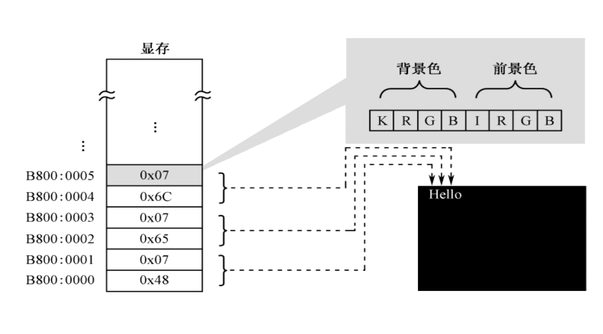
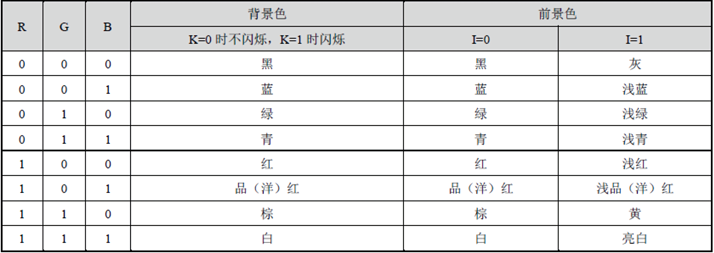
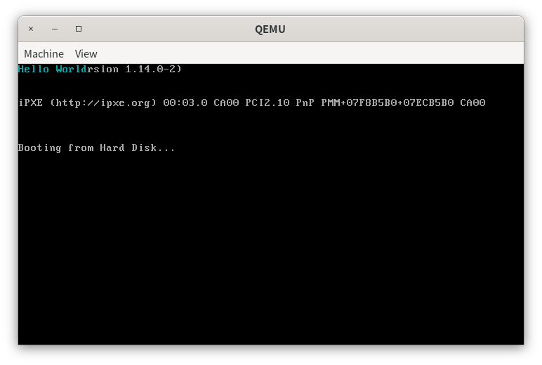
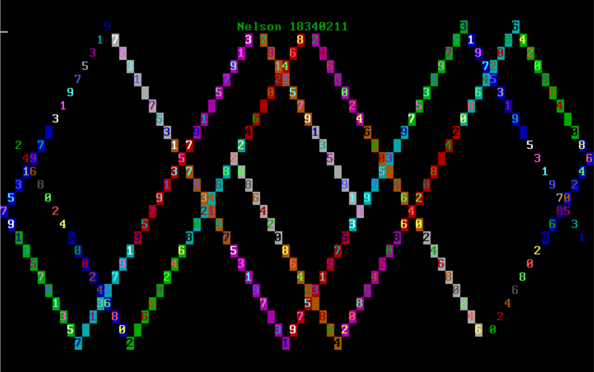

# 第二章 实验入门

> + 这个世界上有10种人，其中有些是能理解二进制的，有些则不懂。
> + 这个世界上有10种人，其中有些是能理解三进制的，有些不懂，有些则把它和二进制弄混淆了。
> + 这个世界上有10种人，其中有些是能够理解二进制和三进制的，有些不懂，有些则开始怀疑十进制了。

# 实验概述

在第二章中，同学们将会学习到x86汇编、计算机的启动过程、IA-32处理器架构和字符显存原理。根据所学的知识，同学们能自己编写程序，然后让计算机在启动后加载运行，以此增进同学们对计算机启动过程的理解，为后面编写操作系统加载程序奠定基础。同时，同学们将学习如何使用gdb来调试程序的基本方法。

# IA-32处理器

## 一切从汇编开始

我们先从汇编语言的学习开始我们的操作系统实验之旅。

为什么需要汇编语言？我们知道，机器只能理解机器语言，机器语言是CPU所能识别的01串。但是，用01串编程显然不利于程序员对程序的理解。于是汇编语言和编译器诞生了，汇编语言提供了一些过程的语言抽象，如加法指令的01串抽象成`add`，减法指令的01串抽象成`sub`。通过这些语言抽象，也就是汇编语法，程序员可以方便地编写相对于机器语言更易于理解的程序。然后我们使用编译器将汇编代码翻译成机器语言。即便汇编代码已经隐藏了机器语言的内容，但一些条件过程`if...else`使用汇编代码表达会变得繁琐。此时，高级语言和相应的编译器诞生了，例如C和GCC。

为什么我们从汇编语言开始而不从高级语言开始呢？因为在编写操作系统的过程中，我们需要用到一些特权指令，如读写硬件端口、关/开中断等。而高级语言并未提供相应的指令，只有汇编语言才提供。同时，在程序编译的过程中，高级语言先被翻译成汇编语言，然后汇编语言再被翻译成机器语言。因此，操作系统最开始的编写只能使用汇编语言，然后基于汇编语言封装的接口，我们就能够使用高级语言来简化我们的开发过程。

汇编语言与处理器体系结构密切相关，因此在学习汇编之前，必须学习基本的处理器体系结构。我们的操作系统实验基于的是IA-32处理器。

## IA-32处理器体系结构

IA-32处理器是指从Intel 80386开始到32位的奔腾4处理器，是最为经典的处理器架构。至此，Intel 32位的处理器也被称为x86处理器。IA-32处理器其有三种基本操作模式：保护模式、实地址模式(简称实模式)、系统管理模式和虚拟8086模式。我们在操作系统实验过程中仅用到实模式和保护模式。

IA-32处理器的重要组成部分如下。

+ **地址空间**。保护模式和实模式最大的不同在于地址总线。实模式使用20位地址总线、16位寄存器；保护模式使用32位地址总线、32位寄存器。因此，实模式的寻址空间为$2^{20}=1MB$，保护模式的寻址空间为$2^{32}=4GB$。这里的地址指的是内存地址。

+ **基本寄存器**。寄存器是CPU内部的高速存储单元。IA-32处理器主要有8个通用寄存器eax, ebx, ecx, edx, ebp, esp, esi, edi、6个段寄存器cs, ss, ds, es, fs, gs、标志寄存器eflags、指令地址寄存器eip。

+ **通用寄存器**。通用寄存器有8个，分别是eax, ebx, ecx, edx, ebp, esp, esi, edi，均是32位寄存器。通用寄存器用于算术运算和数据传输。32位寄存器用于保护模式，为了兼容16位的实模式，每一个32位寄存器又可以拆分成16位寄存器和8位寄存器来访问。例如ax是eax的低16位，ah是ax高8位，al是ax的低8位。ebx，ecx，edx也有相同的访问模式。如下所示。

  | 0-31位 | 0-15位 | 8-15位 | 0-7位 |
  | ------ | ------ | ------ | ----- |
  | eax    | ax     | ah     | al    |
  | ebx    | bx     | bh     | bl    |
  | ecx    | cx     | ch     | cl    |
  | edx    | dx     | dh     | dl    |

  > eax中的e是extended的意思。

  但是，esi，edi，ebp和esp并无8位的寄存器访问方式，只有32位和16位的访问方式。如下所示。

  | 0-31位 | 0-15位 |
  | ------ | ------ |
  | esi    | si     |
  | edi    | di     |
  | esp    | sp     |
  | ebp    | bp     |

  特别注意，通用寄存器有如下特殊用法或者别名，本教程称之为约定俗成的规则。

  + eax在乘法和除法指令中被自动使用，通常称之为扩展累加寄存器。
  + 在loop指令中，ecx默认为循环计数器。
  + esp用于堆栈寻址。因此，我们绝对不可以随意使用esp来存放我们的数据。esp被称为栈指针寄存器。
  + esi被称为源指针。
  + edi被称为目的指针寄存器。
  + ebp通常在函数用来引用函数参数和局部变量。ebp被称之为帧指针寄存器。
  
  还有其他约定俗成的规则我们留到汇编语句的学习中再介绍。

> 在操作系统实验中，我们常常会看到一些约定俗成的规则。这也是造成同学们在开始操作系统实验时觉得门槛较高的原因。同学们需要了解各种各样的规则，否则程序一定会出现bug，而这些bug是无法通过逻辑推导出来。因此，debug时往往需要重新浏览一遍相关的知识。这些规则的形成是在一个特定的历史进程中完成的，例如IA-32处理器启动先进入的是16位实模式，然后由实模式跳转到32位保护模式，而arm处理器一启动便可进入32或64位的寻址模式。但是，arm处理器于90年代发布，晚于IA-32处理器20年。

我们继续介绍IA-32处理器的其他重要组成部分。

+ **段寄存器**。段寄存器有cs, ss, ds, es, fs, gs，用于存放段的基地址，段实际上就是一块连续的内存区域。

+ **指令寄存器**。指令寄存器eip存放下一条指令的地址。有些机器指令可以改变eip的地址，导致程序向新的地址进行转移，如ret指令。

+ **状态寄存器**。状态寄存器eflags存放CPU的一些状态标志位。下面提到的标志位实际上是eflags的某一个位。常用的标志位如下。
  
  + 进位标志(CF)。在无符号算术运算的结果无法容纳于目的操作数时被置1。
  + 溢出标志(OF)。在有符号算术运算的结果无法容纳于目的操作数时被置1。
  + 符号标志(SF)。在算术或逻辑运算产生的结果为负时被置1。
  + 零标志(ZF)。在算术或逻辑运算产生的结果为0时被置1。
  
  eflags的其他标志位如下所示。
  
  

## 实地址模式

> 注意，由于实模式的寄存器是16位的，因此下面出现的寄存器不带e。

在实地址模式下，IA-32处理器使用20位的地址线，可以访问$2^{20}=1MB$的内存，范围时0x0000​到0xFFFFF。但是，我们看到寄存器的访问模式只有32位，16位和8位，形如eax，ax，ah，al。那么我们如何才能使用16位的寄存器表示20位的地址空间呢？这在当时也给Intel工程师带来了极大的困扰，但是聪明的工程师想出来一种“段地址+偏移地址”的解决方案。段地址和偏移地址均为16位。此时，一个1MB中的地址，称为物理地址，按如下方式计算出来。
$$
物理地址=(段地址<<4)+偏移地址
$$
实模式下，物理地址可以记为“段地址:偏移地址”。段地址和偏移地址均用16位表示，最大值均为0xFFFF。因此，我们可以计算出每个段的最大长度
$$
2^{16}B=64KB
$$
因为段地址和偏移地址的最大值都是0xFFFF，所以实模式下的最大地址是大于$1MB$的，即大于20位地址线所能寻址的内存空间。也就是说，实模式下的寻址方式满足对0\~1MB空间中的任何一个地址寻址的要求。

段地址存放在段寄存器cs, ds, es, ss中，在编程中我们给出的地址(如下面提到的数据标号和代码标号)实际上是偏移地址，当我们要寻址时，CPU会自动根据偏移地址的类型如栈段、数据段和代码段来从对应的段寄存器中取出段地址，然后和偏移地址一起，计算出物理地址，CPU最终使用物理地址进行寻址 。

> 在操作系统实验中，我们出现的许多bug往往是由于我们访问了一个错误的地址。例如，段地址指定错误导致我们无法访问正确的变量、函数返回了一个不正确的地址等。因此，我们在编写汇编代码之前务必要弄清楚处理器的寻址方式。

段寄存器也有约定俗成的规则。一个典型的程序有3个段，数据段、代码段和堆栈段。

+ cs包含16位代码段的基地址。
+ ds包含16位数据段的基地址。
+ ss包含一个16位堆栈段的基地址。
+ es、fs和gs可以指向其他数据段的基地址。

由于段地址必须通过段寄存器给出，因此下面直接用“段寄存器”来代替“段地址”，即物理地址可表示为“段寄存器:偏移地址”。

# 汇编基础

nasm是Intel汇编代码的编译器，支持linux，windows平台。

> 同学们看到的一些汇编书籍如王爽《汇编语言》，《Intel汇编语言程序设计》使用的是MASM汇编。MASM是在MS-DOS下运行的。而NASM汇编是跨平台的，且二者语法有部份不同。但无论是NASM还是MASM，都属于x86汇编(或称为Intel汇编)的内容，关于汇编指令如mov，add，jmp等常用指令是相同的。因此，如果下面的内容和nasm无关，教程会标注为x86汇编；否则教程会标注为nasm汇编。

汇编代码一般保存在以`.S`或`.asm`为后缀的文件中。我们先从16位实模式编程开始我们的汇编之旅，基于IA-32处理器的x86汇编用到的主要寄存器如下所示。

| 寄存器 | 作用           |
| ------ | -------------- |
| ax     | 累加寄存器     |
| cx     | 计数寄存器     |
| dx     | 数据寄存器     |
| ds     | 数据段寄存器   |
| es     | 附加段寄存器   |
| bx     | 基地址寄存器   |
| si     | 源变址寄存器   |
| di     | 目的变址寄存器 |
| cs     | 代码段寄存器   |
| ip     | 指令指针寄存器 |
| ss     | 栈段寄存器     |
| sp     | 栈指针寄存器   |
| bp     | 帧指针寄存器   |
| flags  | 标志寄存器     |

## x86汇编 注释

在汇编代码中，我们使用分号`;`来实现注释。`;`之后的和`;`位于同一行的字符都会被nasm编译器当成是注释的内容。例如

```assembly
add eax, 3 ; 这是注释
```

> 在汇编代码中，一行只能写一条汇编语句且无需以任何符号结尾。

## nasm汇编 标识符

标识符是我们取的名字，用来表示变量、常量、过程或代码标号。创建标识符需要注意以下几点。

+ 标识符和包含1-247个字符。
+ 标识符大小写不敏感。
+ 标识符的第一个字符必须是字母、下划线或@，后续字符可以是数字。
+ 标识符不能与汇编器的保留字相同。

下面是一些有效的标识符。

```assembly
var1 
Count 
_main 
MAX 
open_file 
@myfile
```

## nasm汇编 标号

标号是充当指令或数据位置标记的标识符，也就是说，标号的值就是其后的指令或数据的起始地址。当然，这个地址是偏移地址，CPU寻址时会到段寄存器中找到段地址，然后按实模式寻址规则得到物理地址，最终按物理地址寻址。

数据标号。数据标号标识了变量的地址，为在代码中引用该变量提供了方便。在nasm汇编中，变量的类型有3种，如下所示。

| 数据类型 | 含义            |
| -------- | --------------- |
| db       | 一个字节        |
| dw       | 一个字，2个字节 |
| dd       | 双字，4个字节   |

数据标号的定义如下。

```assembly
count dw 100
```

在一个标号后可以定义多个相同类型的数据项，数据项之间以`,`分隔。标号实际上是这些数据项的起始地址，类似于C语言中的数组。

```assembly
array dw 1024, 2048
	 dw 4096, 8192
```

上面的数据项按1024，2048，4096，8192的顺序存放，每个数据项占2个字节。

代码标号。代码标号标识了汇编指令的起始地址，通常作为跳转指令的操作数。操作数是指令的操作对象。例如，加法指令的加数和被加数是加法指令的操作数。

```assembly
L1:
	mov ax, bx
	... ; 此处省略若干条指令
	jmp L1
```

注意，换行、空格并不会影响代码标号的值。即下面的`L1`和上面的`L1`的值相同。但代码标号后面必须要有`:`，数据标号后面不能有`:`。

```assembly
L1: mov ax, bx
	... ; 此处省略若干条指令
	jmp L1
```

## x86汇编 数据传送指令

首先约定操作数的表示形式。

| 符号    | 含义                         |
| ------- | ---------------------------- |
| \<reg\> | 寄存器，如ax，bx等           |
| \<mem\> | 内存地址，如标号var1，var2等 |
| \<con\> | 立即数，如3，9等             |

数据传送指令主要介绍`mov`指令。`mov`指令是将源操作数的内容复制到目的操作数中，用法如下。

```assembly
mov <reg>, <reg>
mov <reg>, <reg>
mov <reg>, <mem>
mov <mem>, <reg>
mov <reg>, <con>
mov <mem>, <con>
```

在Intel汇编中，如果指令的操作数有两个，则目的操作数是第一个，源操作数是第二个。例如，对于下面的一条指令。

```asm
mov eax, ebx
```

其中，源操作数是ebx，目的操作数是eax，指令是把ebx的内容复制到eax中。

在汇编指令中，我们需要注意内存地址的使用。如果对内存地址的使用不明确，则程序一定会出现bug。因此，在介绍其他指令之前，下面先介绍内存地址的寻址方式。

## nasm汇编 内存寻址方式

同学们已经在《计算机组成原理》课上学习到了许多的内存寻址方式，这里的寻址方式实际上和指令的寻址方式大致相同。寻址方式指的就是我们应该到哪里去取出我们的操作数。

寻址方式主要有以下几种。

**寄存器寻址**。寄存器寻址指的是操作数存放在寄存器中，如下所示，源操作数和目的操作数均存放在寄存器中。

```asm
mov ax, cx ; ax = cx
```

**立即数寻址**。操作数以立即数的方式出现在指令中，如下所示。

```asm
mov ax, 17 ; ax = 17
mov ax, tag ; ax = tag
```

注意，tag是一个标号，如数据标号和代码标号。前面已经讲过，标号实际上就是指令或变量的起始地址。因此，在第2条指令中，我们是将tag表示的地址存放到了寄存器ax中。

**直接寻址**。操作数存放在内存中，其偏移地址由立即数给出。例如，我们有一个16位的变量存放在起始地址为0x5c00处，其值为0xFF。我们需要将其读入到寄存器ax中，指令如下所示。

```asm
mov ax, [0x5c00] ; ax = 0xFF
```

标号是汇编地址，如果标号`tag`表示的是我们变量的起始地址，则也可以写成如下形式。

```asm
mov ax, [tag] ; ax = 0xFF
```

在根据偏移地址去取内存中的变量时，不要忘记加上`[]`，否则我们只是将变量地址放入到寄存器中。例如

```asm
mov ax, tag ; ax = tag
```

此时ax的内容是tag的值，而不是tag这个地址指向的变量的值。我们前面提到过，在实模式中，变量的实际地址称为物理地址，物理地址的计算式子如下。
$$
物理地址=段地址<<4+偏移地址
$$
但是上面我们给出的是偏移地址，那么段地址去了哪里呢？这就涉及到一些约定俗成的规则。我们指令中如果没有显式指定段地址，那么我们的代码中给出的地址是偏移地址。此时，CPU在计算线性地址时用到了默认的段寄存器，规则如下。

+ 访问数据段，使用段寄存器ds。
+ 访问代码段，使用段寄存器cs。
+ 访问栈段，使用段寄存器ss。

当然，我们也可以使用“段地址:偏移地址”的形式指定段地址，此时CPU不使用默认段寄存器的段地址，而是使用指令给出的段地址。例如，我们可以指定段地址为`es`段寄存器的内容。

```asm
mov ax, [es:tag]
```

因此，下面两条语句是等价的。

```asm
mov ax, [tag]
mov ax, [ds:tag]
```

因为上面的两条语句属于数据段，所以默认寄存器是`ds`。我们在使用跳转指令`jmp`或`call`时，若只给出偏移地址，那么默认段地址就是段寄存器`cs`的内容。如果偏移地址是由栈指针`bp`或`sp`给出的，那么默认段地址就是段寄存器`ss`的内容。

**基址寻址**。基址寻址使用基址寄存器和立即数来构成真实的偏移地址。基址寻址类似于数组的寻址，基址寄存器只能是寄存器`bx`或`bp`，然后加上立即数共同构成偏移地址。使用`bx`做基址寄存器时，段地址寄存器默认为`ds`，使用`bp`时，段寄存器默认为`ss`。如下所示。

```asm
; 使用bx做基址寄存器时，段寄存器为ds
mov [bx], ax
mov ax, [bx]
mov [bx + 3], ax
mov ax, [bx + 3]
mov [bx + 3 * 4], ax
mov ax, [bx + 3 * 4]
; 使用bp做基址寄存器时，段寄存器为ss
mov [bp], ax
mov ax, [bp]
mov [bp + 3], ax
mov ax, [bp + 3]
mov [bp + 3 * 4], ax
mov ax, [bp + 3 * 4]
```

**变址寻址**。变址寻址使用变址寄存器和立即数来构成真实的偏移地址。变址寄存器只能是`si`或`di`，默认段寄存器为`ds`。事实上，变址寻址和基址寻址类似，但很快我们可以看到，我们可以将二者结合起来寻址。变址寻址如下所示。

```asm
mov ax, [si + 4 * 4]
mov [di], 0x5
```

**基址变址寻址**。我们通过基址寄存器、变址寄存器、立即数来构成真实的偏移地址。默认段地址由基址寄存器的类型确定，即`bx`对应`ds`、`bp`对应`ss`，如下所示。

```asm
mov [bx + si + 5 * 4], ax
mov [bx + di + 5 * 4], ax
mov ax, [bx + si + 5 * 4]
mov ax, [bp + si + 5 * 4]
mov ax, [bp + di + 5 * 4]
```

至此，寻址方式已经讲述完毕。

前面已经讲过，汇编程序的许多错误实际上是由于寻址错误造成的，即CPU从一个错误的地址取了数据。若操作数存放在内存中时，同学们在寻址时千万不要漏掉`[]`，否则取出的只是数据的首地址。同时，当我们的地址没有指定段寄存器时，即`es:0x500`这种形式，那么此时这个地址是偏移地址，段地址存放在默认的段寄存器中。

基址寻址、变址寻址和基址变址寻址有一个共同点就是地址在寄存器中给出，这就给我们循环遍历数组带来方便。考虑如下一个数组。

```asm
array db 1, 2, 3, 4
```

我们希望依次将数组的4个元素放入到ax中，程序如下。

```asm
array db 1, 2, 3, 4
mov cx, 4
mov bx, 0
visit_array:
	mov ax, [bx + array]
	add bx, 1
	loop visit_array
```

我们重点看`mov ax, [bx + array]`。`bx`每次循环都会加1，初始值为0，则ax被依次`mov`的值为1,2,3,4。上面这个程序告诉我们，基址寻址、变址寻址和基址变址寻址在循环访问数组等场景非常方便。注意，基址寄存器和变址寄存器是约定俗成的。因此下面这条语句是无法通过nasm汇编器编译的。

```asm
mov ax, [cx]
```

## x86汇编 算术和逻辑指令

算术和逻辑指令主要如下。

add指令是将两个操作数相加，并将相加后的结果保存到第一个操作数中，语法如下。

```asm
add <reg>, <reg>
add <reg>, <mem>
add <mem>, <reg>
add <reg>, <con>
add <mem>, <con>
; e.g.
add ax, 10 ; eax := eax + 10
add byte[tag], al
```

sub指令是第一个操作数减去第二个操作数，并将相减后的值保存在第一个操作数，语法如下。

```asm
sub <reg>, <reg>
sub <reg>, <mem>
sub <mem>, <reg>
sub <reg>, <con>
sub <mem>, <con>
; e.g.
sub al, ah ; al := al - ah
sub ax, 126
```

imul是整数相乘指令，它有两种指令格式，一种为两个操作数，将两个操作数的值相乘，并将结果保存在第一个操作数中，第一个操作数必须为寄存器；第二种格式为三个操作数，其语义为：将第二个和第三个操作数相乘，并将结果保存在第一个操作数中，第一个操作数必须为寄存器。其语法如下所示。

```assembly
imul <reg>, <reg>
imul <reg>, <mem>
imul <reg>, <reg>, <con>
imul <reg>, <mem>, <con>
; e.g.
imul eax, [var] ; eax = eax * [var]
imul esi, edi, 25 ; esi = edi * 25
```

idiv完成整数除法操作，idiv只有一个操作数，此操作数为除数，而被除数则为`edx:eax`中的内容（一个64位的整数），操作的结果有两部分：商和余数，其中商放在eax寄存器中，而余数则放在edx寄存器中。其语法如下所示。

```assembly
idiv <reg>
idiv <mem>
; e.g.
idiv ebx
idiv dword[var]
```

inc，dec指令分别表示自增1或自减1，语法如下。

```asm
inc <reg>
inc <mem>
dec <reg>
dec <mem>
; e.g.
dec ax
inc byte[tag]
```

and, or, xor分别表示将两个操作数逻辑与、逻辑或和逻辑异或后放入到第一个操作数中，语法如下。

```asm
and <reg>, <reg>
and <reg>, <mem>
and <mem>, <reg>
and <reg>, <con>
and <mem>, <con>

or <reg>, <reg>
or <reg>, <mem>
or <mem>, <reg>
or <reg>, <con>
or <mem>, <con>

xor <reg>, <reg>
xor <reg>, <mem>
xor <mem>, <reg>
xor <reg>, <con>
xor <mem>, <con>
```

not表示对操作数每一位取反，语法如下。

```asm
not <reg>
not <mem>
; e.g.
not ax
not word[tag] ; 取反一个字,2个字节
not byte[tag] ; 取反一个字节
not dword[tag] ; 取反一个双字，4个字节
```

neg表示取负，语法如下。

```asm
neg <reg>
neg <mem>
```

shl,shr表示逻辑左移和逻辑右移，即空出的位补0，语法如下。

```asm
; cl是寄存器ecx的低8位寄存器

shl <reg>, <con>
shl <mem>, <con>
shl <reg>, cl
shl <mem>, cl

shr <reg>, <con>
shr <mem>, <con>
shr <reg>, cl
shr <mem>, cl
```

## x86汇编 控制转移指令

我们知道，程序是顺序执行的。但是有时候我们的程序需要处理条件分支逻辑if...else或循环逻辑while等，此时，我们就需要改变程序的顺序执行逻辑。计算机每次都会从eip中取出下一条指令的地址，然后按地址取指令执行。因此，如果我们需要改变程序的执行逻辑，实际上就是改变eip寄存器的内容。但是，CPU并不允许直接修改eip寄存器的内容，我们需要通过控制转移指令来完成eip寄存器的修改。

jmp指令是无条件跳转指令，跳转到代码标号\<label\>的指令处执行，语法如下。

```asm
jmp <label>
```

jcondition是有条件跳转指令的统称，其根据机器状态寄存器eflags的内容来判断时候执行跳转，语法如下。一般来说，在jcondition语句之前都会紧邻一个cmp指令。

```asm
je <label>   ; jump when equal
jne <label>  ; jump when not equal
jz <label>   ; jump when last result was zero
jg <label>   ; jump when greater than
jge <label>  ; jump when greater than or equal to
jl <label>   ; jump when less than
jle <label>  ; jump when less than or equal to
```

cmp指令是将第一个操作数减去第二个操作数，并根据减去的结果来设置机器状态寄存器eflags中的条件码，用法如下。

```asm
cmp <reg>,<reg>
cmp <reg>,<mem>
cmp <mem>,<reg>
cmp <reg>,<con>
```

一般来说，jcondition指令是和cmp指令搭配使用的，而且上面对jcondition的解释也是在cmp和jcondition搭配使用的环境下给出的直观解释，考虑下面这个用法。

```asm
cmp byte[tag], 10
jeq label
sub ax, 10
label: add ax, 10
```

这个用法的意思是说，比较标号tag处的变量和10，如果不等于，则跳转到标号`label`处执行，即执行语句`add ax, 10`；否则，先执行`sub ax, 10`，然后再执行`add ax, 10`。

从上面的例子我们可以看到，在`jcondition`指令和`cmp`指令搭配使用的环境下，我们可以不用去关心cmp指令是如何根据结果来设置eflags的，以及eflags的具体内容是什么。此时，程序的跳转逻辑就是`jcondition`的字面含义，如本例的”jeq”的字面含义是“不等于就跳转”。条件跳转语句的用法需要同学们仔细体会。

## x86汇编 栈操作指令

栈是一种后进先出的数据结构，在x86汇编中，栈的增长方式是从高地址向低地址增长。栈的操作指令有以下4条。

push指令是将操作数压入内存的栈中。

```asm
push <reg>
push <mem>
push <con>
```

pop指令将栈顶的数据放入到操作数中。

```asm
pop <reg>
pop <mem>
```

pushad指令是将ax, cx, dx, bx, sp, bp, si, di 依次压入栈中。由于栈是从高地址向增长地址，因此ax的数据位于高地址，di的数据位于低地址。

```asm
pushad ; 无操作数
```

`popad`指令是对栈指令一系列的pop操作，pop出的数据放入到di, si, bp, sp, bx, dx, cx, ax中。

```asm
popad ; 无操作数
```

我们已经知道，sp被称为栈指针。这是因为我们执行栈操作命令时，实际上是对sp寄存器及其保存的地址进行操作，例如。

```asm
; 下面语句等价于 push ax
sub sp, 2      ; 从高地址向低地址增长，16位实模式
mov [sp], ax
;---------------------------
; 下面语句等价于 pop ax
mov ax, [sp]
add sp, 2
```

## x86汇编 过程调用

call和ret指令是用来实现子过程(或者称函数，过程，意思相同)调用和返回。call指令首先将当前eip的内容入栈，然后将操作数的内容放入到eip中。ret指令将栈顶的内容弹出栈，放入到eip中。用法如下所示。

```asm
call my_function
add ax, 10
jmp $ 
; $在nasm汇编中表示当前地址，即jmp $指令开始的地址
; 因此这条语句实际上是在做死循环，程序到这里就不会往下执行了

my_function:
	sub ax, 10
	sub bx, 10
	ret
```

第1行使用call指令将eip的内容压栈后跳转到`my_function`标号表示的地址处执行，然后执行第8，9, 10行的语句，执行完ret指令后，栈顶的内容即call压栈的内容被传送到eip中。此时，程序执行call指令的下一条指令，即第2行的指令，最后程序在第3行做死循环。

实际上过程调用后，进入到子过程时，我们首先需要对子过程将要用到的寄存器进行压栈，最后在ret之前通过pop指令进行恢复。这样做的目的是让子过程不会对调用者造成任何影响。如果在子过程中不对子过程用到的寄存器进行进入压栈，退出弹栈的操作，那么子过程返回调用者时，调用者使用的就是子过程修改过的数据，这是非常危险的。因此，上面的程序修改如下。

```asm
call my_function
add ax, 10
jmp $ 
; $在nasm汇编中表示当前地址，即jmp $指令开始的地址
; 因此这条语句实际上是在做死循环，程序到这里就不会往下执行了

my_function:
	push ax
	push bx
	
	sub ax, 10
	sub bx, 10
	; 后进先出
	pop bx
	pop ax
	
	ret
```

> 进入压栈一定要记得退出弹栈，否则ret指令弹出的栈顶内容将不会是call指令压入的返回地址。并且弹栈是切记后进先出的顺序。

# 计算机开机启动过程

同学们小时候可能会看过一部名为《猪猪侠》的动漫，在其中一集中，猪猪侠被一位大力士抓住了。大力士力大无比，自认为能举起宇宙中任何一件东西。于是大力士告诉猪猪侠，如果猪猪侠能告诉大力士世界上有什么东西是大力士举不起来的，那么大力士就放了猪猪侠，否则就要吃掉猪猪侠。猪猪侠想了想说：“你不能举起你自己！”大力士听了后为自己的狂妄而感到羞愧，于是便放了猪猪侠。

计算机是一个大力士，自认为能够运行任何程序。但是，计算机的启动需要程序加载，而计算机不启动则无法运行程序。也就是计算机这个大力士需要将自己举起来。于是聪明的工程师在早期想尽各种办法，把一小段程序装进内存，然后计算机才能正常运行。直到后面ROM(Read-Only memory)的发明才真正解决了这个问题。

经典的计算机的启动分为以下步骤。

> 经典的启动方式是指下面的计算机启动过程是x86架构下的计算机BIOS启动过程，而UEFI启动或在arm架构下则是另外一种启动方式。

1. **加电开机**。按下电源的开关，电源马上开始向主板和其它的设别开始供电。此时的电压还不是很稳定，主板上的控制芯片组会向CPU发出并保持一个reset（重置）信号，让CPU内部自动恢复到初始状态下。当芯片组检测到电源已经开始稳定的供电了，芯片组则开始撤去reset信号。此时，CPU马上开始从0xFFFF0处执行指令。这个地址位于系统的BIOS的地址范围内，其实放在这里的只是一条跳转指令，指向BIOS中真正的启动代码地方。BIOS，基本输入输出系统（Basic Input Output System），是一组固化到计算机内主板上一个ROM（Read-Only Memory）只读存储器。BIOS保存着计算机最重要的基本输入输出的程序、系统设置信息、开机上电自检程序和系统启动自检程序。
2. **BIOS启动**。BIOS启动后，第一件事情就是执行POST(Power-On-self-test)自检阶段，主要针对系统的一些关键设备是否存在或者是功能是否正常，如：内存、显卡等。如果在POST过程中系统设备存在致命的问题，BIOS将会发出声音来报告检测过程中出现的错误，声音的长短及次数对应着系统的错误类型。POST过程会非常快速，对用户几乎感觉不出来。
3. **加载MBR**。BIOS按照设定好的启动顺序，将控制权交给排在第一位的存储设备，即设备的首扇区512字节，称为MBR(Master Boot Record, 主引导扇区)，并且将这512字节复制到放在0x7c00的内存地址中运行。存储设备一般分为若干个固定大小的块来访问，这个固定大小的块被称为扇区，而第1个扇区被称为首扇区。但在复制之前，计算机会根据MBR判断设备是不是可启动的，即有无操作系统。判断依据是检查MBR最后两个字节是否为0x55,0xAA。
4. **硬盘启动**。MBR只有512字节大小，程序可处理的逻辑有限。因此MBR会从存储设备中加载bootloader(启动管理器)，bootloader并无大小限制。bootloader的作用是初始化环境，然后从存储设备加载kernel(操作系统内核)到内存中。
5. **内核启动。**kernel加载入内存后，bootloader跳转到kernel处执行。至此，计算机启动完毕。

我们需要编写的内容是MBR，bootloader和kernel，而BIOS启动，POST，MBR被加载到0x7c00的过程由计算机自动完成。

> 为什么MBR是被加载到0x7c00，而不是加载到0x0000？有兴趣的同学可以参考[Why BIOS loads MBR into 0x7C00 in x86 ?](https://www.glamenv-septzen.net/en/view/6)

# 操作系统的启动 Hello World

纸上得来终觉浅，绝知此事要躬行。我们现在终于可以开始为我们的操作系统编写代码了。我们的第一个任务是启动操作系统，并输出一些信息，具体任务如下。

> 在MBR被加载到内存地址0x7c00后，向屏幕输出蓝色的Hello World。

在输出字符之前，我们需要了解计算机是如何将字符显示在屏幕上的。

## 字符显示的原理

我们已经知道，只要将我们的程序放入存储设备首扇区后，那么当计算机在加电启动时，计算机就会自动加载首扇区的512字节到内存地址0x7c00处执行，即加载MBR，然后从MBR的第一条指令处开始执行。因此，我们现在关心的问题就是在MBR被加载后，我们如何才能向屏幕输出字符。

我们的qemu显示屏实际上是按25x80个字符来排列的矩阵，如下所示。



上面这张图是用`*`填满了qemu模拟的显示屏中各个显示位置而产生的。可以看到，25x80个字符的显示矩阵指的是横向80个字符，纵向25个字符。我们不妨记$(x,y)$为显示矩阵中的一个点，则有
$$
x=0,1,\cdots,24
$$
$$
y=0,1,\cdots,79
$$

如果我们想在第7行，第17列输出字符时，我们只需要将字符放入到显示矩阵的$(7,17)$这个点即可。那么接下来的问题是我们如何将字符放入显示矩阵。

为了便于控制显示，IA-32处理器将显示矩阵映射到内存地址0xB8000\~0xBFFFF处，这段地址称为显存地址。在文本模式下，控制器的最小可控制单位为字符。每一个显示字符自上而下，从左到右依次使用0xB8000\~0xBFFFF中的两个字节表示。在这两个字节中，低字节表示显示的字符，高字节表示字符的颜色属性，如下所示。



字符的颜色属性的字节高4位表示背景色，低4位表示前景色，如下所示。



在上面的对显示矩阵的点的描述中，我们使用的是二维的点，但对应到显存是一维的，因此我们需要进行维度的转换。显示矩阵的点$(x,y)$对应到显存的起始位置如下所示。
$$
\text{显存起始位置}=\text{0xB8000}+2\cdot(80\cdot x+y)
$$
其中，$(x,y)$表示第x行第y列，公式中乘2的原因是每个显示字符使用两个字节表示。

我们来看个具体例子，在上面输出“Hello”的图中，我们在第0行第1列输出了背景色为黑色，前景色为白色的字符e，那么对应到显示矩阵的点是$(0,1)$，此时显存的起始位置如下所示。
$$
\text{显存起始位置}=\text{0xB8000}+2\cdot(80\cdot 0+1)=\text{0xB8002}
$$
由于背景色是黑色且不闪烁，则表示颜色属性的字节的高4位是0x0；前景色为白色，则表示颜色属性的字节的低4位是0x7，因此颜色属性字节是0x07。此时，我们将字符e放入地址0xB8002，将颜色属性0x07放入地址0xB8003。然后，我们就可以在屏幕上看到背景色为黑色，前景色为白色的字符e了。

## 编写MBR

> 代码放置在`src`下。

现在，我们来正式编写MBR的代码，在MBR被加载到内存地址0x7c00后，向屏幕输出青色的Hello World，代码如下所示。

```asm
org 0x7c00
[bits 16]
xor ax, ax ; eax = 0
; 初始化段寄存器, 段地址全部设为0
mov ds, ax
mov ss, ax
mov es, ax
mov fs, ax
mov gs, ax

; 初始化栈指针
mov sp, 0x7c00
mov ax, 0xb800
mov gs, ax


mov ah, 0x01 ; 青色
mov al, 'H'
mov [gs:2 * 0], ax

mov al, 'e'
mov [gs:2 * 1], ax

mov al, 'l'
mov [gs:2 * 2], ax

mov al, 'l'
mov [gs:2 * 3], ax

mov al, 'o'
mov [gs:2 * 4], ax

mov al, ' '
mov [gs:2 * 5], ax

mov al, 'W'
mov [gs:2 * 6], ax

mov al, 'o'
mov [gs:2 * 7], ax

mov al, 'r'
mov [gs:2 * 8], ax

mov al, 'l'
mov [gs:2 * 9], ax

mov al, 'd'
mov [gs:2 * 10], ax

jmp $ ; 死循环

times 510 - ($ - $$) db 0
db 0x55, 0xaa
```

第1、2行的`org 0x7c00`和`[bits 16]`是汇编伪指令，不是实际的指令。`org 0x7c00`是告诉编译器代码中的代码标号和数据标号从`0x7c00`开始。也就是说，这些标号的地址会在编译时加上`0x7c00`。如果没有这一句，标号的值就默认是标号从代码开始处的偏移地址。此时，如果我们引用标号就会出错。`[bits 16]`告诉编译器按16位代码格式编译代码。

指令实际上是从第3行的`xor ax, ax`开始执行。我们先将ax置为0，然后借助于ax将段寄存器清0。由于汇编不允许使用立即数直接对段寄存器赋值，所以我们需要借助于ax。

段寄存器初始化后，我们开始对显存地址赋值。由于显存地址是从`0xB8000`开始，而16位的段寄存器最大可表示`0xFFFF`，因此我们需要借助于段寄存器来寻址到`0xB8000`处的地址。于是我们将段寄存器`gs`的值赋值为`0xB800`。注意我们赋值的是`0xB800`而不是`0xB8000`，同学们可以自行思考下原因。

然后我们依次对显存地址赋值来实现在显示屏上输出`Hello World`。根据显存的显示原理，一个字符使用两个字节表示。因此，我们将ax的高字节部份ah赋值为颜色属性0x01，低字节部份赋值为对应的字符，然后依次放置到显存地址的对应位置。我们在对显存地址赋值时指定了段寄存器gs，因此CPU不会使用默认的段寄存器来计算物理地址。例如，我们想在第0行第1列输出蓝色字符e。

```asm
mov al, 'e'
mov [gs:2 * 1], ax
```

此时的物理地址的计算过程如下。
$$
物理地址=\text{gs}<<4+2*1=\text{0xB800}<<4+2 * 1=\text{0xB8002}
$$
恰好是对应的显存地址。依次输出字符后，我们还没有实现下一步的工作——使用bootloader加载内核。因此这里就在做死循环。代码的最后的`times`指令是汇编伪指令，表示重复执行指令若干次。`$`表示当前汇编地址，`$$`表示代码开始的汇编地址。`times 510 - ($ - $$) db 0`表示填充字符0直到第510个字节。最后我们填充0x55，0xaa表示这512字节是MBR。特别注意，如果没有0x55, 0xaa，qemu会报no bootable device错误。

写完代码后我们使用nasm汇编器来将代码编译成二进制文件。

```shell
nasm -f bin mbr.asm -o mbr.bin
```

其中，`-f`参数指定的是输出的文件格式，`-o`指定的是输出的文件名。`mbr.bin`中保存的是机器可以识别的机器指令。同学们可以使用命令`xxd`查看其中的内容。

生成了MBR后，我们将其写入到硬盘的首扇区。我们首先创建一个“硬盘”，这个“硬盘”并不是一个真实的硬盘，实际上是一个预先指定大小的文件而已，又被称为“虚拟磁盘”。硬盘的创建使用的是`qemu-img`，如下所示。

```shell
qemu-img create filename [size]
```

`[]`表示这一项是可选项，也就是说可以不写；`filename`是生成的硬盘的文件名。我们创建一个10m的磁盘`hd.img`。

```shell
qemu-img create hd.img 10m
```

然后将MBR写入`hd.img`的首扇区，写入的命令使用的是linux下的`dd`命令。

```shell
dd if=mbr.bin of=hd.img bs=512 count=1 seek=0 conv=notrunc
```

参数的解释如下。

+ `if`表示输入文件。
+ `of`表示输出文件。
+ `bs`表示块大小，以字节表示。
+ `count`表示写入的块数目。
+ `seek`表示越过输出文件中多少块之后再写入。
+ `conv=notrunc`表示不截断输出文件，如果不加上这个参数，那么硬盘在写入后多余部份会被截断。

写入MBR后我们就可以启动qemu来模拟计算机启动了，命令如下。

```shell
qemu-system-i386 -hda hd.img -serial null -parallel stdio 
```

+ `-hda hd.img`表示将文件`hd.img`作为第0号磁盘映像。
+ `-serial dev`表示重定向虚拟串口到空设备中。
+ `-parallel stdio `表示重定向虚拟并口到主机标准输入输出设备中。

> qemu其他的参数可以参考qemu的文档[https://qemu-project.gitlab.io/qemu/system/invocation.html]

启动后的效果如下。可以看到第一行已经输出“Hello World”。



至此，我们的工作已经完成了。

## debug

同学们自己在写程序的时候一般不会一次便运行成功，此时便需要一些debug手段。我们这里使用gdb来配合qemu来进行debug。

为了使得gdb能够找到debug信息，我们需要生成符号表。注意，生成符号表的时候需要将`mbr.asm`开头的`org`伪指令删去。

```
nasm -o mbr.o -g -f elf32 mbr.asm 
ld -o mbr.symbol -melf_i386 -N mbr.o -Ttext 0x7c00
```

为了使qemu支持gdb来进行debug，我们需要向qemu的启动命令中加入`-s -S`参数，如下所示。

```
qemu-system-i386 -hda hd.img -s -S -parallel stdio -serial null
```

然后在另外一个Terminal进入gdb。

```
gdb
```

使用gdb连上qemu即可，注意以下命令是在进入gdb后输入的。

```
target remote:1234
```

我们加载符号表，打开代码显示窗口。

```
add-symbol-file mbr.symbol 0x7c00
layout src
```

接着，在`0x7c00`处设置断点。

```
b *0x7c00
```

输入命令`c`后就可以执行到断点，并且我们可以看到源代码。然后我们就可以开始debug了。

同学们可以从gdb教程http://c.biancheng.net/view/8123.html中学习到gdb的常用调试命令，但对于本次实验来说，用到的命令大多数是下面几个。

| gdb指令                      | 含义                                     |
| ---------------------------- | ---------------------------------------- |
| b *address                   | 在内存地址address中设置断点              |
| r                            | 运行程序                                 |
| c                            | 继续运行                                 |
| p *addr                      | 打印地址的值                             |
| info registers               | 查看寄存器                               |
| x/10i $pc                    | 显示从程序计数器的地址开始的10条汇编指令 |
| set disassembly-flavor intel | 设置gdb反汇编的语法为intel风格           |

同学们注意体会在MBR处debug和在gdb教程中给出的debug的过程的区别。在每次启动过程中，我们都需要手动的打开qemu、gdb窗口，然后再在gdb窗口中输入一大堆的初始化命令，非常麻烦。那么，我们是否可以仅使用一条命令就可以自动上述过程呢？然后我们便可以开始debug。答案是有的，秘诀就是使用makefile和将gdb命令写到一个文件中。至于怎么做的，同学们可以自行探索，我们在`appendix/debug_with_gdb_and_qemu`中揭晓。

# 课后思考题

1. 请你谈谈对多层语言模型的理解，即为什么需要有机器语言、汇编语言和高级语言三层？

2. 请你描述下IA-32处理器的种类和用法，例如eax又可以分为哪几个寄存器来访问？esp的用途是什么？

3. 请查阅相关资料，说说eflags的各个位有什么含义？

4. 什么是线性地址？实模式的寻址模式是什么？地址空间大小如何？

5. nasm汇编中的内存寻址方式有哪些？语法是什么？请分别描述。

6. 在什么情况下会使用默认寄存器`cs`，`ds`，`ss`？如何避免CPU在计算线性地址时使用默认寄存器？

7. 我们已经知道，`push ax`等价于下面的语句。

   ```asm
   ; 下面语句等价于 push ax
   sub sp, 2      ; 从高地址向低地址增长，16位实模式
   mov [sp], ax
   ```

   请问为什么不是等价于下面的语句？

   ```asm
   ; 下面语句等价于 push ax
   mov [sp], ax
   sub sp, 2      ; 从高地址向低地址增长，16位实模式
   ```

   为什么不是等价于下面的语句？

   ```asm
   ; 下面语句等价于 push ax
   sub sp, 2      ; 从高地址向低地址增长，16位实模式
   mov sp, ax
   ```

8. `jmp`指令和`call`指令有什么不同之处？

9. 请写出下列伪代码对应的汇编语句。其中，ax，bx，cx是寄存器。

   ```
   if ax == 16 then
   	bx = 17
   else
   	cx = bx
   ```

10. 请写出`pushad`、`popad`对应的汇编语句。

11. 下面的代码是否有错？如有错请指出，并描述程序最终的执行结果是什么。

    ```asm
    call my_function
    add ax, 10
    jmp $ 
    ; $在nasm汇编中表示当前地址，即jmp $指令开始的地址
    ; 因此这条语句实际上是在做死循环，程序到这里就不会往下执行了
    
    my_function:
    	push ax
    	push bx
    	
    	sub ax, 10
    	sub bx, 10
    	; 后进先出
    	pop ax
    	
    	ret
    ```

12. 下面的代码是否有错，如有错请指出，并描述程序最终的执行结果是什么。

    ```asm
    call my_function
    add ax, 10
    jmp $ 
    ; $在nasm汇编中表示当前地址，即jmp $指令开始的地址
    ; 因此这条语句实际上是在做死循环，程序到这里就不会往下执行了
    
    my_function:
    	push bx
    	push ax
    	
    	sub ax, 10	
    	sub bx, 10
    	; 后进先出
    	pop bx
    	pop ax
    	
    	ret
    ```

13. 下面的代码是否有错，如有错请指出，并描述程序最终的执行结果是什么。

    ```asm
    call my_function
    add ax, 10
    jmp $ 
    ; $在nasm汇编中表示当前地址，即jmp $指令开始的地址
    ; 因此这条语句实际上是在做死循环，程序到这里就不会往下执行了
    
    my_function:
    	push bx
    	push ax
    	
    	sub ax, 10	
    	sub bx, 10
    	; 后进先出
    	pop ax
    	pop bx
    	
    	ret
    ```

14. 字符弹射程序。请编写一个字符弹射程序，其从点$(2,0)$处开始向右下角45度开始射出，遇到边界反弹，反弹后按45度角射出，方向视反弹位置而定。同时，你可以加入一些其他效果，如变色，双向射出等。注意，你的程序应该不超过510字节，否则无法放入MBR中被加载执行。静态示例效果如下。动态效果见视频`assignment/assignment-4-example.mp4`。

    

15. 下面的例子也是输出“Hello World”，而且比示例更加简单。但是，代码无法输出我们想要的结果。为此，同学们需要做出改进。同学们需要完成的任务如下。

    + **请指出问题出现的原因并想出两种不同的修改方法**。注意，修改方法不包括直接将字符输出到对应的内存，而是要通过标号`string`来获取相应的字符，循环打印。(tips: 数据(包括string)和代码都会被加载到0x7c00处执行)。
    + 请解释寄存器`cx`除了用在了`mov`指令中，还在哪里被使用了。
    + 判断代码中`[si + string]`和`[gs:bx]`的内存访问方式，并指出对应的段寄存器、偏移地址和线性地址的计算公式。

    ```assembly
    [bits 16]
    xor ax, ax ; eax = 0
    ; 初始化段寄存器, 段地址全部设为0
    mov ds, ax
    mov ss, ax
    mov es, ax
    mov fs, ax
    mov gs, ax
    
    ; 初始化栈指针
    mov sp, 0x7c00
    mov ax, 0xb800
    mov gs, ax
    
    mov ah, 0x01 ;蓝色
    mov cx, 11  ; 11是'hello world'的长度
    mov si, 0
    mov bx, 0
    
    print_hello_world:
        mov al, [si + string]
        mov [gs:bx], ax
        inc si
        add bx, 2
        loop print_hello_world
    
    jmp $ ; 死循环
    
    string db 'Hello World'
    
    times 510 - ($ - $$) db 0
    db 0x55, 0xaa
    
    ```

16. 实模式中断

    参考资料如下。

    - [OSDev 关于 BIOS 的介绍](https://wiki.osdev.org/BIOS)
    - [BIOS 中断表](http://www.ctyme.com/rbrown.htm)
    - [VIDEO - WRITE CHARACTER ONLY AT CURSOR POSITION](http://www.ctyme.com/intr/rb-0100.htm)
    - [VIDEO - WRITE CHARACTER AND ATTRIBUTE AT CURSOR POSITION](http://www.ctyme.com/intr/rb-0099.htm)
    - [VIDEO - WRITE STRING (AT and later,EGA)](http://www.ctyme.com/intr/rb-0210.htm)
    - [VIDEO - GET CURSOR POSITION AND SIZE](http://www.ctyme.com/intr/rb-0088.htm)
    - [10h中断](https://zh.wikipedia.org/wiki/INT_10H)

    16.1和16.2使用的都是实模式中断`int 10h`，由于功能号不同，执行的结果也就不同。在`int 10h`中断的资料 https://zh.wikipedia.org/wiki/INT_10H 中，其只给出10h中断下各个功能号的用途，并未给出实际的用法。因此，同学们可能一开始会感觉不知所云，教程下面给出同学们完成本次实验需要用到的功能号。

    | 功能                       | 功能号 | 参数                                         | 返回值                                           |
    | -------------------------- | ------ | -------------------------------------------- | ------------------------------------------------ |
    | 设置光标位置               | AH=02H | BH=页码，DH=行，DL=列                        | 无                                               |
    | 获取光标位置和形状         | AH=03H | BX=页码                                      | AX=0，CH=行扫描开始，CL=行扫描结束，DH=行，DL=列 |
    | 在当前光标位置写字符和属性 | AH=09H | AL=字符，BH=页码，BL=颜色，CX=输出字符的个数 | 无                                               |

    注意，“页码”均设置为0。

    一般地，中断的调用方式如下。

    ```
    将参数和功能号写入寄存器
    int 中断号
    从寄存器中取出返回值
    ```
    
    1. 请探索实模式下的光标中断，**利用中断实现光标的位置获取和光标的移动**。说说你是怎么做的，并将结果截图。
    2. 请修改Hello World的代码，**使用实模式下的中断来输出你的学号**。说说你是怎么做的，并将结果截图。
    3. 在1和2的知识的基础上，探索实模式的键盘中断，**利用键盘中断实现键盘输入并回显**，可以参考<https://blog.csdn.net/deniece1/article/details/103447413>。关于键盘扫描码，可以参考<http://blog.sina.com.cn/s/blog_1511e79950102x2b0.html>。说说你是怎么做的，并将结果截图。
    
17. 汇编代码的编写

    > + 寄存器请使用32位的寄存器。
    > + 首先执行命令`sudo apt install gcc-multilib g++-multilib`安装相应环境。
    > + 你需要实现的代码文件在`assignment/student.asm`中。
    > + 编写好代码之后，在目录`assignment`下使用命令`make run`即可测试，不需要放到mbr中使用qemu启动。
    > + `a1`、`if_flag`、`my_random`等都是预先定义好的变量和函数，直接使用即可。
    > + 你可以修改`test.cpp`中的`student_setting`中的语句来得到你想要的`a1,a2`。
    > + 最后附上`make run`的截图，并说说你是怎么做的。

    1. 分支逻辑的实现。请将下列伪代码转换成汇编代码，并放置在标号`your_if`之后。

       ```
       if a1 < 12 then
       	if_flag = a1 / 2 + 1
       else if a1 < 24 then
       	if_flag = (24 - a1) * a1
       else
       	if_flag = a1 << 4
       end
       ```

    2. 循环逻辑的实现。请将下列伪代码转换成汇编代码，并放置在标号`your_while`之后。

       ```
       while a2 >= 12 then
       	call my_random        // my_random将产生一个随机数放到eax中返回
       	while_flag[a2 - 12] = eax
       	--a2
       end
       ```

    3. 函数的实现。请编写函数`your_function`并调用之，函数的内容是遍历字符数组`string`。

       ```
       your_function:
       	for i = 0; string[i] != '\0'; ++i then
       		pushad
       		push string[i] to stack
       		call print_a_char
       		pop stack
       		popad
       	end
       	return
       end
       ```


​    

​    

