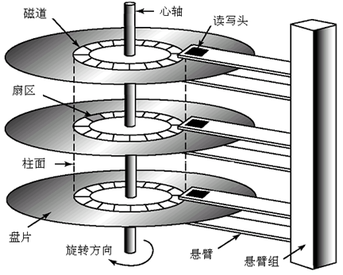
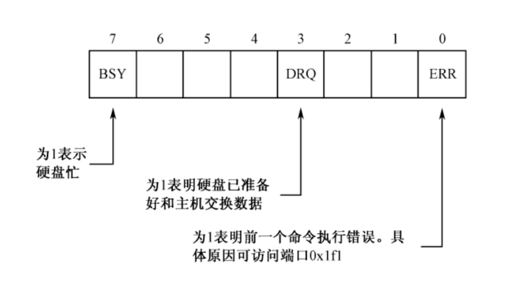
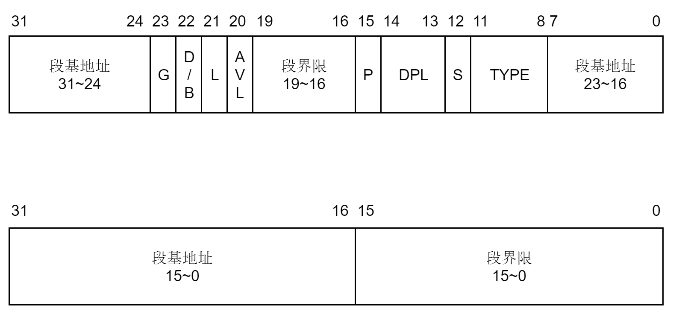
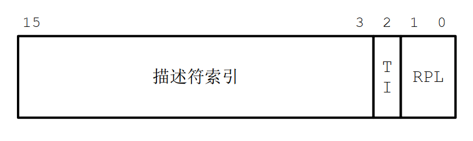
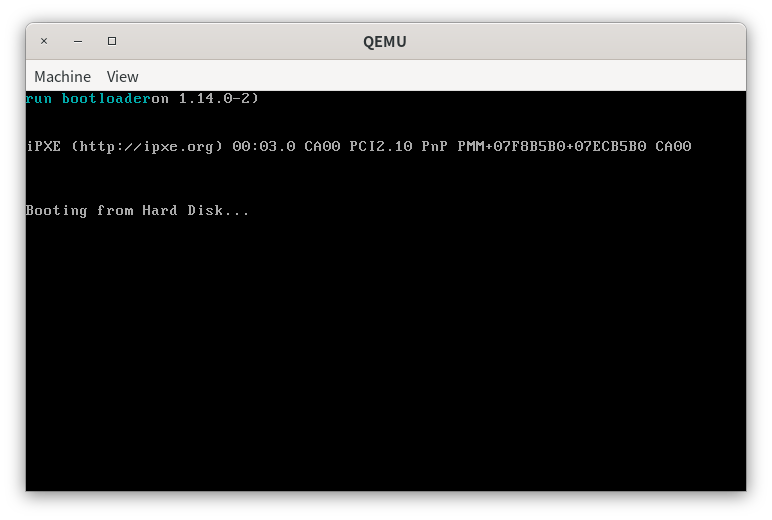
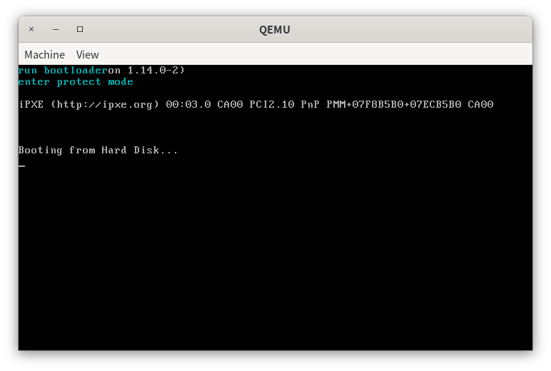
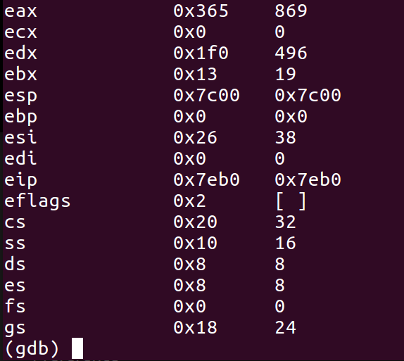

# 第三章 从实模式到保护模式

> 世上只有两种编程语言：一种是总是被人骂的，一种是从来没人用的。

# 实验概述

在上一节中，同学们已经学习了x86汇编的相关内容、初步了解计算机的启动过程并在16位的实模式环境下进行编程。

在本节中，同学们将会学习到如何从16位的实模式跳转到32位的保护模式，然后在平坦模式下运行32位程序。同时，同学们将学习到如何使用I/O端口和硬件交互，为后面保护模式编程打下基础。

# 突破512字节的限制

计算机在启动的最后只会自动加载MBR（512字节）到内存中运行。然而，512字节能够完成的工作非常有限，因此在实际的应用中，MBR只是负责定义了一些基本信息如磁盘大小、扇区大小等。

在运行操作系统前，我们需要将操作系统内核程序从外存加载到内存中。显然，MBR无法胜任这项工作。为了突破512字节的限制，在操作系统内核加载前，我们的MBR不再是输出“Hello World”，而是将一段程序从外存加载到内存中。此时，这段程序的大小并无512字节的限制。也就是说，在内存富余的前提下，这段程序可以尽可能地大。我们通过这段程序来完成MBR无法完成的工作，例如从实模式跳转到保护模式、加载操作系统内核等。由于这段程序是为了加载操作系统内核而服务的，因此被称为bootloader（启动加载器）。

无论是MBR还是bootloader，其最开始都是存放在磁盘上的，也就是外存。而MBR和bootloader只有被加载到内存中才可以被执行，除了MBR外，计算机是不会去外存找程序执行的。MBR是在计算机启动时被计算机自动加载到0x7C00处执行。此后，计算机的任何行为都由我们的程序来控制。也就是说，我们需要自己从外存中加载程序到内存中运行。因此，我们首先来学习如何读写硬盘。

# LBA方式读写硬盘

## 读写I/O端口

硬盘是外围设备的一种，处理器和外围设备的交换是通过I/O端口进行的。实际上，I/O端口是一些寄存器，位于I/O接口电路中。当我们需要和外围设备进行数据交换时，我们首先需要将命令和数据放入到指定的I/O端口，待外围设备处理完成后，我们再从指定的I/O端口取出外围设备的处理结果。同时，当外围设备正在处理时，我们也可以从指定的端口获取外围设备的状态。

> 这里教程多次使用“指定的”的字眼是想提醒同学们数据交换的I/O端口是已经被预先规定好了。

每一个端口在I/O电路中都会被统一编址。例如，主硬盘分配的端口地址是0x1f0\~0x1f7，从硬盘分配的端口地址是0x170\~0x177，我们的实验只会用到主硬盘。因为端口是独立编址的，因此我们无法使用mov指令来对端口赋值，我们使用的是in,out指令。读端口使用in指令，写端口使用out指令，in/out指令的操作数有严格规定，如下所示。

```asm
; in指令
in al, 0x21 ; 表示从0x21端口读取一字节数据到al
in ax, 0x21 ; 表示从端口地址0x21读取1字节数据到al，从端口地址0x22读取1字节到ah

mov dx,0x379
in al, dx  ; 从端口0x379读取1字节到al

; out指令
out 0x21, al ; 将al的值写入0x21端口
out 0x21, ax ; 将ax的值写入端口地址0x21开始的连续两个字节
mov dx, 0x378
out dx, ax  ; 将ah和al分别写入端口0x379和0x378
```

正如上面所示，in指令的源操作数只能是立即数或dx，目的操作数只能是ax和al；out指令的源操作数只能是al或ax，目的操作数只能是立即数或dx。

## 读写硬盘

了解了从I/O端口读写数据的指令后，我们现在来看看如何通过LBA来读取硬盘。硬盘也被称为块设备，顾名思义，硬盘的读写是以块为单位的。“块”在硬盘中也被称为扇区，一般的扇区大小为512字节。

LBA的全称是Logical Block Addressing, 逻辑块寻址模式。对于一个硬盘，其物理结构包括磁头（Heads）、扇区（Sectors）和柱面（Cylinder），简称CHS，我们通过CHS就可以定位磁盘上的数据。因此，本来我们在访问硬盘时需要手动指定磁头、磁道和柱面，如下所示。



但是，这样转换比较繁琐，且有时候难以理解。有没有一种易于理解的访问方式呢？答案是有的，就是LBA模式。在LBA模式下，磁盘的地址空间被划分一个个的逻辑块。当我们访问磁盘时，我们只要指定磁盘地址对应的逻辑块即可，无需知道逻辑块对应的CHS具体是什么。例如，我们的bootloader放在磁盘的第1\~5块上(第0块是MBR)，为了加载MBR，我们就要读取磁盘的第1\~5块。这里的“第1\~5块”指的是逻辑扇区，实际上在访问硬盘时，计算机会自动地将我们给出的逻辑块转换成对应的磁头、磁道和柱面，最后使用计算出来的磁头、磁道和柱面来访问。

> 在实模式下，还有利用BIOS中断来读取硬盘的方式，称为CHS模式。此时，我们就需要手动将逻辑扇区号转化为磁盘对应的磁头、磁道和柱面，比较麻烦。这里不使用BIOS中断的原因是因为BIOS中断是16位程序，在保护模式下无法使用。有兴趣的同学可以自行探索“通过BIOS中断读取硬盘”

使用LBA读取硬盘的方式如下。

1. **设置起始的逻辑扇区号**。由于扇区的读写是连续的，因此只要给出第一个扇区的编号就可以了。由于我们这里使用的是LBA28（28表示使用28位来表示逻辑扇区的编号）的方式读取硬盘，没有一个IO端口能够容纳下28位的地址。因此，逻辑扇区号是被分成4段写入端口的。其中，逻辑扇区的0\~7位被写入0x1F3端口，8\~15位被写入0x1F4端口，16\~23位被写入0x1F5端口，最后4位被写入0x1F6端口的低4位。0x1F6的8个位的含义有点特殊，如下所示。

   

   前面讲过，我们使用的是LBA模式，只使用主硬盘。因此0x1f6的高4位应该是0xE。

2. **将要读取的扇区数量写入0x1F2端口**。由于这是一个8位端口，因此每次最多只能读写255个扇区。

3. **向0x1F7端口写入0x20，请求硬盘读**。

4. **等待其他读写操作完成**。我们在第3步请求硬盘读的时候，可能硬盘在处理其他操作。因此我们需要等待其他读写操作完成后才能开始本次读写操作。硬盘的状态可以从0x1F7读入，读到的8个状态位如下所示。

   

   其他操作完成的标志是第7位为0，第3位为1，第0位为0。

5. **若在第4步中检测到其他操作已经完成，那么我们就可以正式从硬盘中读取数据**。我们从0x1F0中连续读入一个扇区的数据。0x1F0是硬盘接口的数据端口，16位。

将上述读取硬盘的过程写成汇编代码如下。

```asm
asm_read_hard_disk:                           
; 从硬盘读取一个逻辑扇区

; 参数列表
; ax=逻辑扇区号0~15位
; cx=逻辑扇区号16~28位
; ds:bx=读取出的数据放入地址

; 返回值
; bx=bx+512

    mov dx, 0x1f3
    out dx, al    ; LBA地址7~0

    inc dx        ; 0x1f4
    mov al, ah
    out dx, al    ; LBA地址15~8

    mov ax, cx

    inc dx        ; 0x1f5
    out dx, al    ; LBA地址23~16

    inc dx        ; 0x1f6
    mov al, ah
    and al, 0x0f
    or al, 0xe0   ; LBA地址27~24
    out dx, al

    mov dx, 0x1f2
    mov al, 1
    out dx, al   ; 读取1个扇区

    mov dx, 0x1f7    ; 0x1f7
    mov al, 0x20     ;读命令
    out dx,al

    ; 等待处理其他操作
  .waits:
    in al, dx        ; dx = 0x1f7
    and al,0x88
    cmp al,0x08
    jnz .waits                         
    

    ; 读取512字节到地址ds:bx
    mov cx, 256   ; 每次读取一个字，2个字节，因此读取256次即可          
    mov dx, 0x1f0
  .readw:
    in ax, dx
    mov [bx], ax
    add bx, 2
    loop .readw
      
    ret
```

标号前面加点表示一个标号下的子标号，这是为了防止标号命名冲突。注意，`asm_read_hard_disk`是一个过程(又称函数)，使用了寄存器作为参数传递。但是在C/C++中，函数的参数是通过堆栈传递的，我们后面再详细探讨这个问题，这里简单地使用寄存器来实现参数传递也足够了。

# 保护模式

## 概述

保护模式，是一种在80286系列之后，基于x86架构的CPU操作模式。在80286及以后，保护模式的引入使得内存地址增加到32位。因此，程序至少可以访问到$2^{32}=4G$的内存空间。保护模式与实模式相比，主要有以下差别。

+ 保护模式提供了段间的保护机制，防止程序间随意访问地址带来的问题。
+ 保护模式访问的内存空间变大，32位地址线最大支持4G内存空间。
+ 保护模式提供了虚拟内存的管理机制。

这些差别同学们可以在后续的编程实践当中继续体会。

## 从实模式到保护模式

段(segment)实际上是程序员人为划分的一块块连续的内存区域，或者称为地址空间。保护模式，顾名思义，就是CPU会提供保护的机制。那么CPU保护的是什么呢？在保护模式下，所有的程序都会运行在自己的段中，一旦程序错误地访问其他段的地址空间，那么CPU就会产生异常(exception, 注意和中断interrupt的区别)来阻止程序访问。因此，在这里，我们可以简单理解保护模式保护的是段地址空间，阻止程序越界访问，因此也被称为段保护。

> 当然，保护模式还有特权级保护、页保护等保护机制，我们在后面实现用户进程时再讨论。这里同学们首先要理解保护模式会检查程序是否出现越界访问的行为。

CPU需要知道当前运行中程序的段地址空间信息，然后才能执行地址保护，阻止程序越界访问。段地址空间信息是通过段描述符(segment descriptor)来给出的。段描述符中包含了段基地址(段的起始地址)、段界限(段的长度)等，共计64字节，如下所示。上面一行是高32字节、下面一行是低32字节。



我们来具体看下段描述符中各个位的具体含义。

+ **段基地址**。段基地址共32位，是段的起始地址，被拆分成三部分放置。

+ **G位**。G表示粒度， G=0表示段界限以字节为单位， G=1表示段界限以4KB为单位。

+ **D/B位**。D/B位是默认操作数的大小或默认堆栈指针的大小，在保护模式下，该位置为1，表示32位。

+ **L位**。L位是 64 位代码段标志，由于这里我们使用的是32位的代码，所以L置0。

+ **AVL**。AVL位是保留位。  

+ **段界限**。段界限表示段的偏移地址范围，我们在后面详细讨论这个问题。
  
+ **P位**。P位是段存在位， P=1表示段存在， P=0表示段不存在。  

+ **DPL**。DPL指明访问该段必须有的最低优先级，优先级从0-3依次降低，即0拥有最高优先级，3拥有最低优先级。

+ **S位**。S位是描述符类型。S=0表示该段是系统段，S=1表示该段位代码段或数据段。

+ **TYPE**。TYPE指示代码段或数据段的类型，如下所示。

  | 第11位(X) | 第10位(E) | 第9位(W) | 第8位(A) | 含义                     |
  | --------- | --------- | -------- | -------- | ------------------------ |
  | 0         | 0         | 0        | *        | 只读，向上扩展           |
  | 0         | 0         | 1        | *        | 读写，向上扩展           |
  | 0         | 1         | 0        | *        | 只读，向下扩展           |
  | 0         | 1         | 1        | *        | 读写，向下扩展           |
  | 1         | 0         | 0        | *        | 只执行，非一致代码段     |
  | 1         | 0         | 1        | *        | 执行、可读，非一致代码段 |
  | 1         | 1         | 0        | *        | 只执行，一致代码段       |
  | 1         | 1         | 1        | *        | 执行、可读、一致代码段   |

    A位表示是否被使用过，A=1表示使用，A=0表示未被使用，由CPU负责设置，因此我们不关心。一致代码段和非一致代码段的问题比较复杂，我们留到后面讲到特权级时再讨论，这里同学们们将E位置为0。

向上扩展和向下扩展指的是段的线性基地址和段的线性尾地址的大小关系。例如，对于数据段，尾地址是大于基地址的，因此是向上扩展；对于栈段，栈是从高地址向低地址增长的，因此尾地址是小于基地址的，是向下扩展。CPU通过段描述符中的段线性基地址和段界限来执行段保护，如下所示，假设寻址的地址是offset，读出或写入的长度为length。

> 实际上，除了段描述符中的地址是段基地址外，其他地址都是在某一个段中的偏移地址。

回忆一下保护模式的寻址过程，假设线性基地址是base，则线性地址如下。
$$
线性地址=base+offset
$$
计算机在寻址过程使用的是物理地址，但是，同学们在前面的文字中看到的都是线性地址，这是为什么呢？这和我们后面需要实现二级分页机制有关。

在保护模式下，我们在指令中给出的都是偏移地址，偏移地址和段线性基地址相加后得到线性地址，线性地址通过地址变换部件MMU后得到实际的物理地址。也就是说，线性地址和物理地址的关系如下。
$$
物理地址=f(线性地址)
$$
但在此时，我们并未开启分页机制，$f$因此是恒等变换，即
$$
x=f(x)
$$
此时物理地址就是线性地址。

对于一个向上扩展的段，如代码段和数据段，段界限给出的是最大的偏移量，寻址时满足下面的条件。
$$
0\le offset +length\le(段界限+1)*粒度
$$
对于一个向下扩展的段，如栈段，段界限给出的是最小的偏移量，寻址时满足如下条件。
$$
(段界限+1)*粒度\le offset-length\le\text{0xFFFFFFFF}
$$

> 关于段界限的问题开始理解起来可能有些困难，同学们如果觉得本教程讲的不清楚，可以参考书籍《从实模式到保护模式》中第12.4节“地址变换时的保护”。

在保护模式下，所有段描述符都会被集中放置，这个集中放置的区域被称为全局描述符表(Global Descriptor Table，简称GDT)，GDT其实就是一个段描述符数组。

既然内存地址扩展到了32位，原来实模式下ax，bx等16位寄存器便不再满足保护模式的需要。所以， CPU扩展了原来的 16 位寄存器为eax，ebx 等 32 位寄存器。为了保证 CPU 能够兼容原先的 16 位代码，eax，ebx等低 16 位寄存器依然称为ax，bx，并且与实模式下 16 位寄存器的使用一致。

> 简单来说，32位寄存器就是在16位寄存器的名字上加上字符e，如ax -> eax。

我们知道，由于实模式需要用16位的寄存器寻址20位的地址空间，我们不得不使用“段地址: 偏移地址”的方式来访问内存。其中，“线性地址 = 段地址 << 4 + 偏移地址”。而现在引入了保护模式，地址空间和寄存器都是32位的，我们已经可以随心所欲地寻址4G的内存空间，段寄存器看似没有再使用的必要。在上面提到，保护模式最大的特点就是引入了段间保护机制，而将内存划分为一个一个的段也方便于操作系统实现有效的内存管理和进程调度机制。所以，在保护模式下，段寄存器依然在使用。但是相较于实模式，保护模式下的段寄存器的使用发生了本质的变化。

保护模式下的段寄存器依然是 16 位，但其中保存的不再是段地址，因为段地址保存在段描述符中。段寄存器保存的内容是段选择子(segment selector)。在段选择子是用来告诉CPU寻址时使用哪个段。所有的段都会被保存在全局描述符表(GDT)中，不难想到，段选择子是全局描述符表的索引，类似数组访问`array[i]`中的`i`，但段选择子中还会包含其他信息，如下所示。



+ 第15-3位是段描述符的索引，表示选择子指向的段描述符是段描述符表中的第几个，编号从 0 开始。  
+ 第2位用来指示描述符表，0表示描述符表是 GDT。  
+ 第1-0位是请求特权级，特权级编号为 0-3，权限依次降低，0权限最高。

> TI=1表示描述符表是LDT(Local Descriptor Table，局部描述符表)，但我们不使用LDT。

保护模式下的寻址依然通过段地址和偏移地址的方式来寻址，此时线性地址 = 段地址 + 偏移地址，表示为“选择子:偏移地址”。在保护模式下，CPU先通过选择子在描述符表中找到段描述符，然后得到段线性基地址，最后将段线性基地址加上偏移地址便得到线性地址。

为了加快地址变换过程，每个段寄存器都会有一个64位的不可见的部分，这部分被称为描述符高速缓存器。当我们将选择子送入段寄存器时，CPU会自动从描述符表中加载对应的段描述符到描述符高速缓存器中。此后，当需要使用段寄存器时，CPU会直接从描述符高速缓存器中取出相应的内容，无需重新在描述符表中查找对应的段描述符。

保护模式的基本内容已经讲完，我们现在可以从实模式跳转到保护模式了。

## 进入保护模式

为了保证后续的CPU能够运行旧的CPU， CPU只能保持向下兼容。因此， 80286及以后的CPU首先进入实模式，然后通过切换机制再进入到保护模式。也就是说，在BIOS加电启动后，我们需要在实模式下的MBR中编写16位进入保护模式的代码，然后再跳转到保护模式，执行接下来的32位代码。进入保护模式的步骤如下。  

1. **准备GDT，用lgdt指令加载GDTR信息**。
2. **打开第21根地址线**。
3. **开启cr0的保护模式标志位**。
4. **远跳转，进入保护模式**。 

下面分别描述。

GDT实际上是一个段描述符数组，保存在内存中。GDT的起始位置和大小由我们来确定，保存在寄存器GDTR中，GDTR的内容如下所示。


全局描述符表边界实际上是GDT的界限，和上面的段界限的计算方法相同，即GDT的界限等于GDT的长度减1。段描述符的数量是有限的，如下所示。
$$
段描述符最大数量=\frac{2^{16}}{8}=8192
$$
每一个段描述符是64位，因此是8个字节。

当我们确定好GDTR的内容后，我们就使用lgdt指令将GDTR的内容送入GDTR。当我们在指令中显示给出段选择子时，CPU会根据GDTR的内容找到GDT在内存中的位置，然后从GDT中取出对应的段描述符。

在实模式下，第21根地址线的值恒为0，使得当访问越界超过1MB 时，自然溢出使得地址的值仍然小于 1MB，即相当于取模1MB。所以，当我们想进入保护模式时，首先需要打开第 21 根地址线。第21根地址线的开关位于南桥芯片的端口A20，使用 in，out 指令可以对主板端口进行读、写操作。代码如下。

```asm
in al, 0x92 ; 南桥芯片内的端口
or al, 0000_0010B
out 0x92, al ; 打开 A20
```

  现在我们来到了保护模式的真正开关——CR0。 CR0 是 32 位的寄存器，包含了一系列用于控制处理器操作模式和运行状态的标志位，其第0位是保护模式的开关位，称为PE（protect mode enable）位。 PE置1，CPU 进入保护模式，代码如下。 

```asm
cli        ; 保护模式下中断机制尚未建立，应禁止中断
mov eax, cr0
or eax, 1
mov cr0, eax   ; 设置 PE 位
```

 上面已经打开保护模式，我们还差最后一步，将代码段选择子送入cs寄存器。前面已经提到，段寄存器的使用保护模式与实模式不同，我们需要将代码段的选择子放入段寄存器cs才可以正确执行保护模式的代码，cs无法直接使用mov指令修改，我们需要借助于jmp指令。执行完jmp指令后，我们便正式进入了保护模式。

上面的内容知识点有些多，我们接下来通过两部分的内容来加深同学们对保护模式和进入保护模式的步骤的理解。这两部分的内容如下所示。

+ 修改MBR来加载bootloader。
+ 在bootloader中实现从实模式到保护模式的跳转。

# 加载bootloader

> 代码放置在`src/1`下。

在本节中，我们将lab2中输出Hello World部份的代码放入到bootloader中，然后在MBR中加载bootloader到内存，并跳转到bootloader的起始地址执行。

目前，我们的内存地址安排如下，bootloader被安排在MBR之后，预留5个扇区的空间。因此，我们假设bootloader的不大于5个扇区。

| name       | start  | length          | end    |
| ---------- | ------ | --------------- | ------ |
| MBR        | 0x7c00 | 0x200(512B)     | 0x7e00 |
| bootloader | 0x7e00 | 0xa00(512B * 5) | 0x8800 |

我们先新建一个文件`bootloader.asm`，然后将lab2的`mbr.asm`中输出Hello World部份的代码，放入`bootloader.asm`，`bootloader.asm`如下所示。

```asm
org 0x7e00
[bits 16]
mov ax, 0xb800
mov gs, ax
mov ah, 0x03 ;青色
mov ecx, bootloader_tag_end - bootloader_tag
xor ebx, ebx
mov esi, bootloader_tag
output_bootloader_tag:
    mov al, [esi]
    mov word[gs:bx], ax
    inc esi
    add ebx,2
    loop output_bootloader_tag
jmp $ ; 死循环

bootloader_tag db 'run bootloader'
bootloader_tag_end:
```

然后我们在`mbr.asm`处放入使用LBA模式读取硬盘的代码，然后在MBR中加载bootloader到地址0x7e00。

```asm
org 0x7c00
[bits 16]
xor ax, ax ; eax = 0
; 初始化段寄存器, 段地址全部设为0
mov ds, ax
mov ss, ax
mov es, ax
mov fs, ax
mov gs, ax

; 初始化栈指针
mov sp, 0x7c00
mov ax, 1                ; 逻辑扇区号第0~15位
mov cx, 0                ; 逻辑扇区号第16~31位
mov bx, 0x7e00           ; bootloader的加载地址
load_bootloader:
    call asm_read_hard_disk  ; 读取硬盘
    inc ax
    cmp ax, 5
    jle load_bootloader
jmp 0x0000:0x7e00        ; 跳转到bootloader

jmp $ ; 死循环

asm_read_hard_disk:                           
; 从硬盘读取一个逻辑扇区

; 参数列表
; ax=逻辑扇区号0~15位
; cx=逻辑扇区号16~28位
; ds:bx=读取出的数据放入地址

; 返回值
; bx=bx+512

    mov dx, 0x1f3
    out dx, al    ; LBA地址7~0

    inc dx        ; 0x1f4
    mov al, ah
    out dx, al    ; LBA地址15~8

    mov ax, cx

    inc dx        ; 0x1f5
    out dx, al    ; LBA地址23~16

    inc dx        ; 0x1f6
    mov al, ah
    and al, 0x0f
    or al, 0xe0   ; LBA地址27~24
    out dx, al

    mov dx, 0x1f2
    mov al, 1
    out dx, al   ; 读取1个扇区

    mov dx, 0x1f7    ; 0x1f7
    mov al, 0x20     ;读命令
    out dx,al

    ; 等待处理其他操作
  .waits:
    in al, dx        ; dx = 0x1f7
    and al,0x88
    cmp al,0x08
    jnz .waits                         
    

    ; 读取512字节到地址ds:bx
    mov cx, 256   ; 每次读取一个字，2个字节，因此读取256次即可          
    mov dx, 0x1f0
  .readw:
    in ax, dx
    mov [bx], ax
    add bx, 2
    loop .readw
      
    ret

times 510 - ($ - $$) db 0
db 0x55, 0xaa
```

由于在我们的实验中，我们假设bootloader不会超过5个扇区。但是，直接在MBR的代码中指定bootloader的大小是危险的，我们在等会再讨论这个问题。

将bootloader读取到起始位置为0x7e00的内存后，我们执行远跳转到0x7e00。注意，我们现在是在实模式下，`0x0000:0x7e00`表示段地址为0x0000, 偏移地址为0x7e00。执行这条语句实际上等价于以下过程。其中，符号`:=`表示赋值。

```
cs := 0x0000
ip := 0x7e00
```

但是，执行下面这条语句是错误的，因为这是近跳转。

```asm
jmp 0x7e00
```

等价于以下过程。实际上是跳转到距离下一条指令地址为0x7e00处的地址，不是我们期望的。

```
ip := ip + 0x7e00
cs 不变
```

然后我们编译`bootloader.asm`，写入硬盘起始编号为1的扇区，共有5个扇区。

```
nasm -f bin bootloader.asm -o bootloader.bin
dd if=bootloader.bin of=hd.img bs=512 count=5 seek=1 conv=notrunc
```

`mbr.asm`也要重新编译和写入硬盘起始编号为0的扇区。

```
nasm -f bin mbr.asm -o mbr.bin
dd if=mbr.bin of=hd.img bs=512 count=1 seek=0 conv=notrunc
```

使用qemu运行即可，示例效果如下。



# 进入保护模式

> 代码放置在`src/2`下。

本节中，我们根据前面“进入保护模式”的描述，在bootloader中进入保护模式，并在进入保护模式后在显示屏上输出“protect mode”。

在进入保护模式之前，我们继续对我们的内存地址进行规划。

| Name       | Start  | Length          | End    |
| ---------- | ------ | --------------- | ------ |
| MBR        | 0x7c00 | 0x200(512B)     | 0x7e00 |
| bootloader | 0x7e00 | 0xa00(512B * 5) | 0x8800 |
| GDT        | 0x8800 | 0x80(8B * 16)   | 0x8880 |

MBR被自动加载到0x7c00，长度512字节，因此结束于0x7e00。我们的bootloader放置在MBR之后，长度限制在5个扇区，因此结束于0x8800。虽然GDT中可放入8192个描述符，但我们并不打算定义如此多的段，实际上我们使用的段不会超过16个。

我们不妨将上述常量定义在一个独立的文件`boot.inc`中，如下所示。

```asm
; 常量定义区
; _____________Loader_____________
; 加载器扇区数
LOADER_SECTOR_COUNT equ 5
; 加载器起始扇区
LOADER_START_SECTOR equ 1
; 加载器被加载地址
LOADER_START_ADDRESS equ 0x7e00
; _____________GDT_____________
; GDT起始位置
GDT_START_ADDRESS equ 0x8800
```

其中，`equ`是汇编伪指令。例如，编译器会在编译时将`LOADER_SECTOR_COUNT`出现的地方替换成`5`，`LOADER_SECTOR_COUNT equ 5`不会对应任何的二进制指令，即不会出现在最终的bin格式文件中。

>  在操作系统内核设计的过程中，内存规划是一件令人苦恼的事情。从上面的例子可以看到，bootloader紧跟在MBR后面，GDT紧跟在bootloader后面，看起来非常紧凑。但是，只要其中一个发生变化，那么可能我们又要重新规划内存。也就是说，没有一种内存规划方案是完美的。

规划好内存后，我们就准备在bootloader中进入保护模式。回忆一下我们进入保护模式的步骤。

1. **准备GDT，用lgdt指令加载GDTR信息**。
2. **打开第21根地址线**。
3. **开启cr0的保护模式标志位**。
4. **远跳转，进入保护模式**。 

在前面，我们已经实现了bootloader的加载。现在，我们需要在bootloader中跳转到保护模式。首先，我们需要定义段描述符，我们需要定义的有代码段描述符、数据段描述符、栈段描述符和视频段描述符。

由于保护模式下的寄存器是32位寄存器，保护模式的地址线也是32位。因此，我们单纯使用偏移地址也可以访问保护模式的4GB空间。即便如此，前面已经讲过，段的存在是为了让CPU执行段保护，阻止程序越界访问。但是，我们在后面的实验中会实现二级分页机制，此时页保护也可以阻止程序越界访问。也就是说，我们并不需要将程序分为许多个的段。为了简化地址的访问，我们让所有的程序运行在同一个段中，这个段的起始地址为0，地址空间大小是4GB，也就是全部的地址空间。此时，我们让代码段描述符、数据段描述符和栈段描述符中的段线性基地址为0，那么偏移地址和线性地址就完全相同，这大大简化了编程的逻辑。这种内存访问模式被称为平坦模式。

> 使用平坦模式的另外一个原因是：C/C++在编译和链接后得到的二进制程序默认是运行在平坦模式下的，即C/C++程序从线性地址0开始，可以访问4GB的内存空间。C/C++的这种默认方式是为了方便程序重定位，我们通过地址变换部件和分页机制来将程序的线性地址变换成物理地址。当然，我们到后面再讨论这个问题。

视频段描述符是显存所在的内存区域的段描述符。注意，GDT的第0个描述符必须是全0的描述符。接着，我们在GDT中依次放入0描述符，数据段描述符、堆栈段描述符、显存段描述符和代码段描述符，代码如下。

```asm
%include "boot.inc"
org 0x7e00
[bits 16]
... ; 输出bootloader_tag代码，此处省略
;空描述符
mov dword [GDT_START_ADDRESS+0x00],0x00
mov dword [GDT_START_ADDRESS+0x04],0x00  

;创建描述符，这是一个数据段，对应0~4GB的线性地址空间
mov dword [GDT_START_ADDRESS+0x08],0x0000ffff    ; 基地址为0，段界限为0xFFFFF
mov dword [GDT_START_ADDRESS+0x0c],0x00cf9200    ; 粒度为4KB，存储器段描述符 

;建立保护模式下的堆栈段描述符      
mov dword [GDT_START_ADDRESS+0x10],0x00000000    ; 基地址为0x00000000，界限0x0 
mov dword [GDT_START_ADDRESS+0x14],0x00409600    ; 粒度为1个字节

;建立保护模式下的显存描述符   
mov dword [GDT_START_ADDRESS+0x18],0x80007fff    ; 基地址为0x000B8000，界限0x07FFF 
mov dword [GDT_START_ADDRESS+0x1c],0x0040920b    ; 粒度为字节

;创建保护模式下平坦模式代码段描述符
mov dword [GDT_START_ADDRESS+0x20],0x0000ffff    ; 基地址为0，段界限为0xFFFFF
mov dword [GDT_START_ADDRESS+0x24],0x00cf9800    ; 粒度为4kb，代码段描述符 
```

为了让CPU知道GDT的位置，我们需要设置GDTR寄存器。回忆一下GDTR寄存器，其高32位表示GDT的起始地址，低16位表示GDT的界限。所谓界限，就是GDT的长度减去1。此时，我们已经放入5个段描述符，因此，GDT的界限如下所示。
$$
界限=8*5-1=39
$$
我们在内存中使用一个48位的变量来暂时存放GDTR的内容。

```asm
pgdt dw 0 
    dd GDT_START_ADDRESS
```

然后把GDT的信息写入变量`pgdt`，把`pgdt`的内容加载进GDTR。

```asm
;初始化描述符表寄存器GDTR
mov word [pgdt], 39      ;描述符表的界限   
lgdt [pgdt]
```

然后根据段描述符的内容设置段选择子。

```asm
; _____________Selector_____________
;平坦模式数据段选择子
DATA_SELECTOR equ 0x8
;平坦模式栈段选择子
STACK_SELECTOR equ 0x10
;平坦模式视频段选择子
VIDEO_SELECTOR equ 0x18
VIDEO_NUM equ 0x18
;平坦模式代码段选择子
CODE_SELECTOR equ 0x20
```

我们以代码段选择子为例来解释段选择子的含义，段选择子的结构如下。


+ 代码段描述符是GDT中第4个描述符，因此高13位为4。
+ TI=0表示GDT，第2位为0。
+ 我们的特权级设为最高特权级，因此RPL为0。

因此代码段选择子为0x20。此时，GDT已经设置完毕，我们现在结合段描述符的结构研究下代码段的内存和具体含义，段描述符如下所示。


对于代码段描述符，描述符高32位为0x00cf9800，低32位为0x0000ffff，因此各个部分含义如下。

+ 段线性基地址。段线性基地址由三部分组成，但都是0，因此段线性基地址为0。

+ G=1，表示段界限以4KB为单位。

+ D/B=1，表示操作数大小为32位。

+ L=0，表示32位代码。

+ AVL，保留位，不关心，置0即可。

+ 段界限由两个部分组成，值为0xfffff，共20位。结合粒度和段界限，整个代码段的长度计算如下。
  $$
  长度=（段界限+1）*粒度=(\text{0xfffff}+1)*4KB=2^{20}*2^{12}B=2^{32}B=4GB
  $$
  因此整个代码段表示的范围是0x00000000\~0xffffffff。由于基地址为0，偏移地址直接表示线性地址，因此也被称为平坦模式。

+ P=1，表示段存在。

+ DPL=0，表示最高优先级。

+ S=1，表示代码段。

+ TYPE=0x8，表示只执行，非一致代码段。

其他段描述符的分析方法类似，同学们可以自行分析。注意，数据段和栈段的寻址空间都是0x00000000\~0xffffffff，线性地址也都是由偏移地址直接给出，非常方便。视频段并不是平坦模式，而是仅限于显存的表示范围。

准备好GDT后，接下来的内容就非常轻松了。

我们先打开第21根地址线。

```asm
in al,0x92                         ;南桥芯片内的端口 
or al,0000_0010B
out 0x92,al                        ;打开A20
```

设置PE位。

```asm
cli                                ;中断机制尚未工作
mov eax,cr0
or eax,1
mov cr0,eax                        ;设置PE位
```

最后一步，远跳转进入保护模式。

```asm
jmp dword CODE_SELECTOR:protect_mode_begin
```

此时，jmp指令将`CODE_SELECTOR`送入cs，将`protect_mode_begin + LOADER_START_ADDRESS`送入eip，进入保护模式。然后我们将选择子放入对应的段寄存器。

```asm
;16位的描述符选择子：32位偏移
;清流水线并串行化处理器
[bits 32]           
protect_mode_begin:                              

mov eax, DATA_SELECTOR                     ;加载数据段(0..4GB)选择子
mov ds, eax
mov es, eax
mov eax, STACK_SELECTOR
mov ss, eax
mov eax, VIDEO_SELECTOR
mov gs, eax
```

最后，我们输出“enter protect mode”。

```asm
mov ecx, protect_mode_tag_end - protect_mode_tag
mov ebx, 80 * 2
mov esi, protect_mode_tag
mov ah, 0x3
output_protect_mode_tag:
    mov al, [esi]
    mov word[gs:ebx], ax
    add ebx, 2
    inc esi
    loop output_protect_mode_tag
 ... ; 省略
protect_mode_tag db 'enter protect mode'
protect_mode_tag_end:
```

至此，我们差不多已经完成，但我们需要改造下MBR。如下所示。

```asm
%include "boot.inc"

[bits 16]
xor ax, ax ; eax = 0
; 初始化段寄存器, 段地址全部设为0
mov ds, ax
mov ss, ax
mov es, ax
mov fs, ax
mov gs, ax

; 初始化栈指针
mov sp, 0x7c00    

mov ax, LOADER_START_SECTOR
mov cx, LOADER_SECTOR_COUNT
mov bx, LOADER_START_ADDRESS   

load_bootloader: 
    push ax
    push bx
    call asm_read_hard_disk  ; 读取硬盘
    add sp, 4
    inc ax
    add bx, 512
    loop load_bootloader

    jmp 0x0000:0x7e00        ; 跳转到bootloader

jmp $ ; 死循环

; asm_read_hard_disk(memory,block)
; 加载逻辑扇区号为block的扇区到内存地址memory

asm_read_hard_disk:                           
    push bp
    mov bp, sp

    push ax
    push bx
    push cx
    push dx

    mov ax, [bp + 2 * 3] ; 逻辑扇区低16位

    mov dx, 0x1f3
    out dx, al    ; LBA地址7~0

    inc dx        ; 0x1f4
    mov al, ah
    out dx, al    ; LBA地址15~8

    xor ax, ax
    inc dx        ; 0x1f5
    out dx, al    ; LBA地址23~16 = 0

    inc dx        ; 0x1f6
    mov al, ah
    and al, 0x0f
    or al, 0xe0   ; LBA地址27~24 = 0
    out dx, al

    mov dx, 0x1f2
    mov al, 1
    out dx, al   ; 读取1个扇区

    mov dx, 0x1f7    ; 0x1f7
    mov al, 0x20     ;读命令
    out dx,al

    ; 等待处理其他操作
  .waits:
    in al, dx        ; dx = 0x1f7
    and al,0x88
    cmp al,0x08
    jnz .waits                         
    

    ; 读取512字节到地址ds:bx
    mov bx, [bp + 2 * 2]
    mov cx, 256   ; 每次读取一个字，2个字节，因此读取256次即可          
    mov dx, 0x1f0
  .readw:
    in ax, dx
    mov [bx], ax
    add bx, 2
    loop .readw
      
    pop dx
    pop cx
    pop bx
    pop ax
    pop bp

    ret

times 510 - ($ - $$) db 0
db 0x55, 0xaa
```

我们对`asm_read_hard_disk`做了修改。这里涉及到C/C++参数传递的规则，对于一个带有参数和返回值的C函数。

```c
int function(arg1, arg2, arg3);
```

将其翻译汇编代码后，在调用function前，汇编代码依次将arg3，arg2，arg1入栈，然后将eip的内容入栈作为返回地址。接着，汇编代码跳转到function的第一条指令中执行，通过ebp来引用函数在栈中的参数。当函数返回后，汇编代码将返回值放入到eax中，将之前保存的栈顶的返回地址送入eip，程序返回。当程序返回后，之前压栈的参数还保留在栈中，此时汇编代码会调整esp的内容来清除栈中的函数参数。

以上面的例子为例，我们读磁盘的函数可以如下表示。

```c
void asm_read_hard_disk(int memory, int block)
```

调用前后的代码如下。

```asm
push ax
push bx
call asm_read_hard_disk  ; 读取硬盘
add sp, 4
inc ax
add bx, 512
```

此时，ax保存的是逻辑扇区号，bx保存的是加载地址，因此ax先入栈，bx后入栈。调用完`asm_read_hard_disk`后，栈中还保留着之前的函数参数，而每个参数占2个字节(16位)，因此`add sp, 4`相当于连续pop掉两个参数。

使用和“加载bootloader”一节中相同的命令，我们编译并运行上面代码，结果如下。



在gdb下，我们使用`info registers`查看寄存器，可以看到段寄存器的内容变成了段选择子。



至此，我们已经完成了本次实验的全部内容，同学们注意仔细体会。

# 再论debug

至此，我们已经可以完全地介绍使用qemu+gdb的源码级的debug方法了，具体内容见`appendix/debug_with_gdb_and_qemu`。

# 课后思考题

1. 请你谈谈你对bootloader的理解。

2. 请指出处理器和外围设备4种交互方式，并说明使用LBA方式读取硬盘属于哪种交互方式。

3. 为什么在过程`asm_read_hard_disk`中，对端口写入不使用如下语句。

   ```asm
   out 0x1f3, al    ; LBA地址7~0
   ```

   而是使用如下语句来代替。

   ```asm
   mov dx, 0x1f3
   out dx, al    ; LBA地址7~0
   ```

5. 请用自己的话叙述下段选择子、段描述符、GDT、GDTR的作用和它们之间的关系。

5. 什么是线性地址？线性地址和物理地址的区别是什么？

8. 什么是`equ`指令。

9. 请仿照代码段描述符的例子来解释“进入保护模式”一节中的数据段描述符、栈段描述符和视频段描述符。

8. 请用自己的话从汇编的角度解释C/C++的函数调用过程。

9. 复现"加载bootloader"一节，说说你是怎么做的并提供结果截图，也可以参考Ucore、Xv6等系统源码，实现自己的LBA方式的磁盘访问。

10. 在"加载bootloader"一节中，我们使用了LBA28的方式来读取硬盘。此时，我们只要给出逻辑扇区号即可，但需要手动去读取I/O端口。然而，BIOS提供了实模式下读取硬盘的中断，其不需要关心具体的I/O端口，只需要给出逻辑扇区号对应的磁头（Heads）、扇区（Sectors）和柱面（Cylinder）即可，又被称为CHS模式。现在，同学们需要将LBA28读取硬盘的方式换成CHS读取，同时给出逻辑扇区号向CHS的转换公式。最后说说你是怎么做的并提供结果截图，参考资料如下。

    + LBA向CHS模式的转换。[https://blog.csdn.net/G_Spider/article/details/6906184]
    + int 13h中断。[https://blog.csdn.net/brainkick/article/details/7583727]

    其中，关键参数如下。

    | 参数                             | 数值 |
    | -------------------------------- | ---- |
    | 驱动器号（DL寄存器）             | 80h  |
    | 每磁道扇区数                     | 63   |
    | 每柱面磁头数（每柱面总的磁道数） | 18   |

11. 复现“进入保护模式”一节，使用gdb或其他debug工具在进入保护模式的4个重要步骤上设置断点，并结合代码、寄存器的内容等来分析这4个步骤，最后附上结果截图。gdb的使用可以参考appendix的“debug with gdb and qemu”部份。

12. 在进入保护模式后，编写并执行一个自己的32位汇编程序。