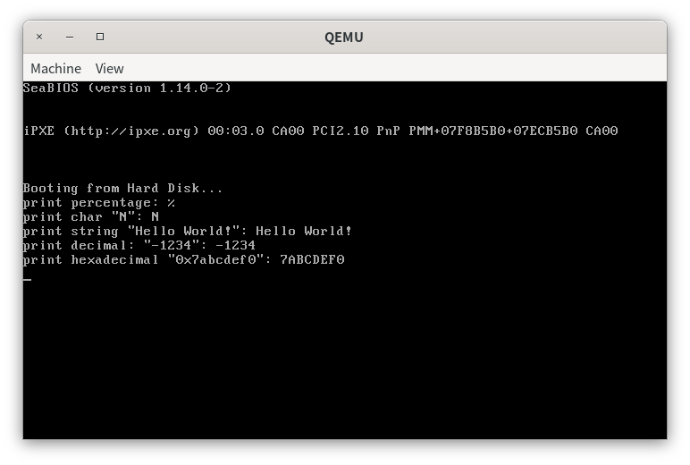
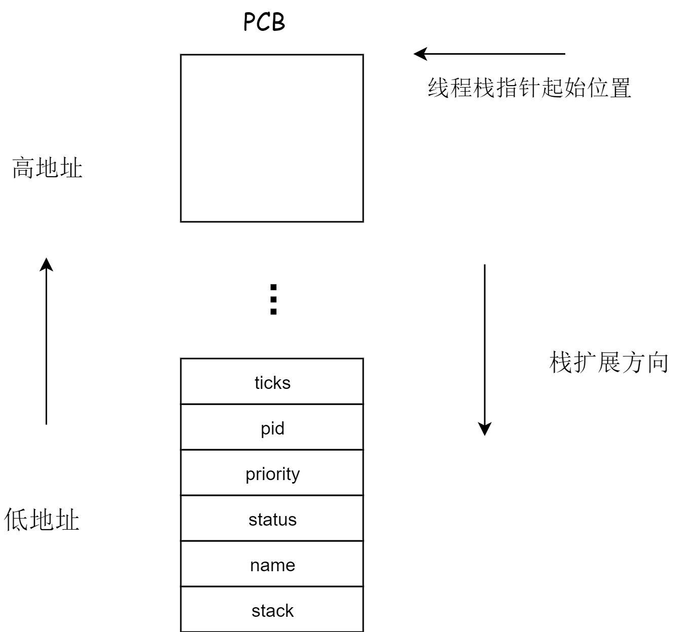
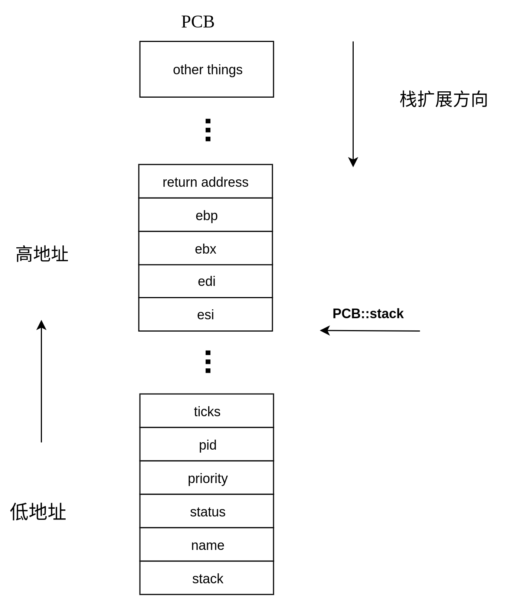
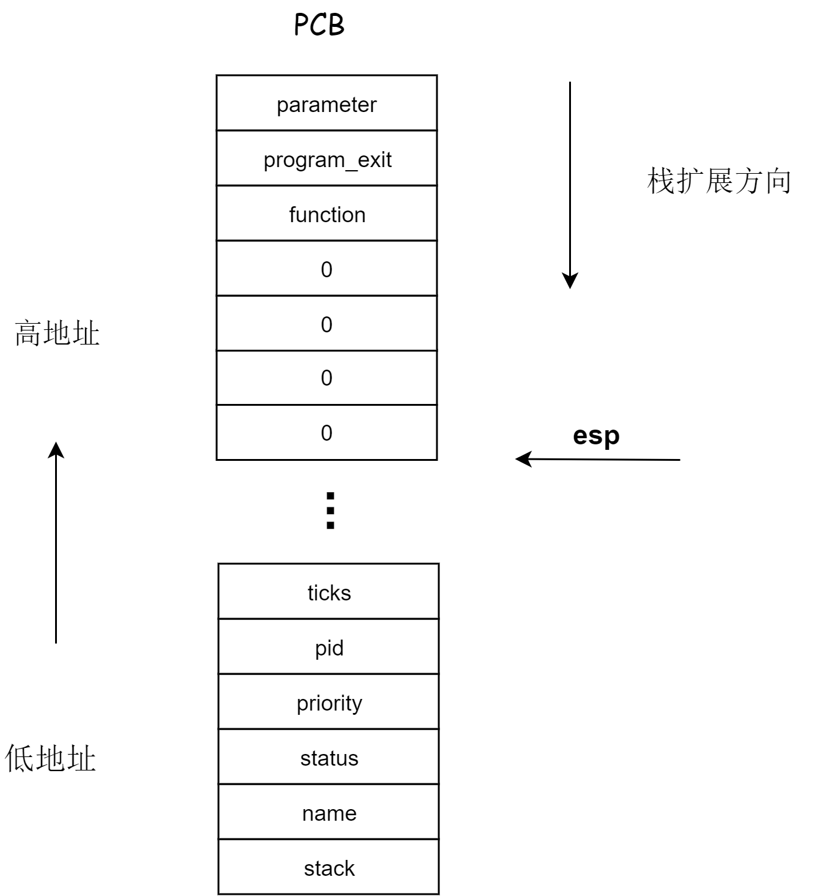
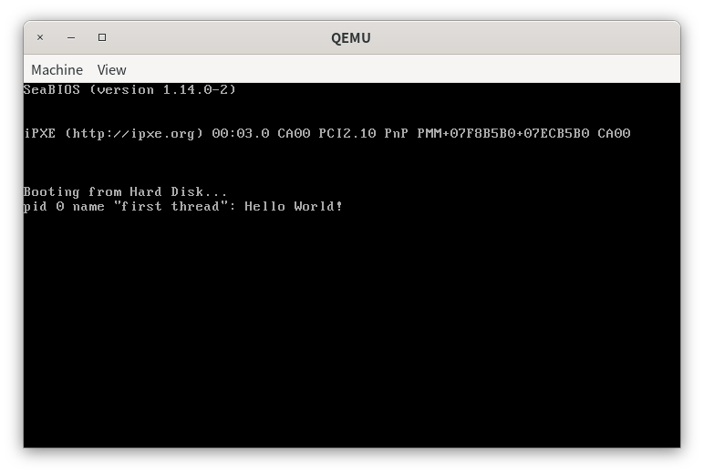

# 第四章 内核线程

> 古今之成大事者，不惟有超世之才，亦必有坚韧不拔之志。

# 实验概述

在本次实验中，我们将会学习到C语言的可变参数机制的实现方法。在此基础上，我们会揭开可变参数背后的原理，进而实现可变参数机制。实现了可变参数机制后，我们将实现一个较为简单的printf函数。此后，我们可以同时使用printf和gdb来帮助我们debug。

本次实验另外一个重点是内核线程的实现，我们首先会定义线程控制块的数据结构——PCB。然后，我们会创建PCB，在PCB中放入线程执行所需的参数。最后，我们会实现基于时钟中断的时间片轮转(RR)调度算法。在这一部分中，我们需要重点理解`asm_switch_thread`是如何实现线程切换的，体会操作系统实现并发执行的原理。

# printf的实现

在第三章中，我们已经将向屏幕输出字符的函数封装在了类`STDIO`中。相比于使用gdb，我们更倾向于简单地使用cout或printf来debug。同时，我们之前封装的函数过于简单，并且我们又不可以使用C/C++的标准库。对于debug来说，这样的输出函数显然是远远不够的。因此，我们接下来就要实现一个能够进行基本的格式化输出的printf函数。

但在实现printf之前，我们需要了解C语言的可变参数机制。

## 一个可变参数的例子

> 代码放置在`src/1`下。

对于printf这类函数来说，我们可以使用任意数量的参数来调用printf，例如

```cpp
printf("hello world");
printf("this is a int: %d", 123);
printf("int, char, double: %d, %c, %f", 123, 'a', 3.14);
```

由于printf的函数参数并不是固定的，我们因此把这类函数称为可变参数函数。但在我们平时的编程当中，我们编写的函数都需要在函数头清晰地指出函数所需要的参数，也就是说，函数的参数在声明的时候就已经被固定下来了。那么printf是如何实现参数可变的呢？这就要用到C语言的可变参数机制。

C语言允许我们使用定义可变参数函数，此时函数的参数列表分为两部分，前一部分是固定下来的参数，如`int`，`char *`，`double`等用数据类型写出来的参数，称为“固定参数”；后一部分是“可变参数”，其使用`...`来表示。例如，printf的声明如下。

```cpp
int printf(const char* const _Format, ...);
```

printf的参数分为两部分，前一部分是字符串指针，表示需要格式化输出的字符串，后一部分是可变参数。

虽然我们可以方便地使用可变参数函数，但是我们在定义可变参数时需要遵循一些规则，如下所示。

1. 对于可变参数函数，参数列表中至少有一个固定参数。
2. 可变参数列表必须放在形参列表最后，也就是说，`...`必须放在函数的参数列表的最后，并且最多只有一个`...`。

明白了这些规则之后，我们不妨定义一个具有可变参数的函数`print_any_number_of_integers`（下面简称`panoi`），如下所示。

```cpp
void print_any_number_of_integers(int n, ...);
```

`panoi`顾名思义，就是用来输出若干个整数的函数。函数的参数分为两部分，`n`是可变参数的数量，`...`是可变参数，表示若干个待输出的整数。

在实现`panoi`前，我们首先学习如何在函数内部引用可变参数列表中的参数。

为了引用可变参数列表中的参数，我们需要用到`<stdarg.h>`头文件定义的一个变量类型`va_list`和三个宏`va_start`，`va_arg`，`va_end`，这三个宏用于获取可变参数列表中的参数，用法如下面的注释所示。

```cpp
// 定义一个指向可变参数列表的指针。
va_list 

// 初始化可变参数列表指针 ap，使其指向可变参数列表的起始位置，
// 即函数的固定参数列表的最后一个参数 last_arg 的后面第一个参数。
va_start(va_list ap, last_arg)
  
// 以类型 type 返回可变参数，并使 ap 指向下一个参数。
va_arg(va_list ap, type)
    
// 清零 ap。
va_end(va_list ap)
```

为了引用可变参数列表的参数，我们需要遵守一些规则，如下所示。

+ 可变参数必须从头到尾逐个访问。如果在访问了几个可变参数之后想半途中止，这是可以的。但是，如果想一开始就访问参数列表中间的参数，那是不行的(可以把想访问的中间参数之前的参数依次读取，但是不使用，曲线救国)。
+ 这些宏是无法直接判断实际存在参数的数量。
+ 这些宏无法判断每个参数的类型，所以在使用`va_arg`的时候一定要指定正确的类型。
+ 如果在`va_arg`中指定了错误的类型，那么将会影响到后面的参数的读取。
+ 第一个参数也未必要是可变参数个数，例如`printf`的第一个参数就是字符串指针。

明白了上述规则后，我们现在来实现``panoi``，实现如下。

```cpp
void print_any_number_of_integers(int n, ...)
{
    // 定义一个指向可变参数的指针parameter
    va_list parameter;
    // 使用固定参数列表的最后一个参数来初始化parameter
    // parameter指向可变参数列表的第一个参数
    va_start(parameter, n);

    for ( int i = 0; i < n; ++i ) {
        // 引用parameter指向的int参数，并使parameter指向下一个参数
        std::cout << va_arg(parameter, int) << " ";
    }
    
    // 清零parameter
    va_end(parameter);

    std::cout << std::endl;
}
```

第4行，我们首先定义一个指向可变参数列表的指针`parameter`，`parameter`会帮助我们引用可变参数列表的参数。但是，此时`parameter`并未指向`function`的可变参数列表，我们需要使用`va_start`来初始化`parameter`，使其指向可变参数列表的第一个参数。为什么我们一定要指定一个固定参数呢？回想起第3章反复强调的C/C++函数调用规则——在函数调用前，函数的参数会被从右到左依次入栈。

无论参数数量有多少，这些参数都被统一地按函数调用给出的顺序放到了栈上，只不过使用可变参数的函数并不知道这些栈上的参数具体含义。因此我们才需要使用`va_arg`来指定参数的类型后才能引用函数的可变参数。也就是说，只有到了函数的实现这一步，函数才会知道可变参数放置的是什么内容。注意到栈的增长方式是从高地址向低地址增长的，因此函数的参数从左到右，地址依次增大。固定参数列表的最后一个参数的作用就是告诉我们可变参数列表的起始地址，如下所示。
$$
可变参数列表的起始地址=固定参数列表的最后一个参数的地址+这个参数的大小
$$
`va_start`就是实现了上面这条公式。

初始化了`parameter`后，我们就使用`parameter`和`va_arg`来引用可变参数。可变参数的函数并不知道每一个可变参数的类型和具体含义，它只是在调用前把这些参数放到了栈上。而我们人为地在`<stdarg.h>`中定义了一些访问栈地址的宏。我们可以指定这些参数的具体类型和使用这些宏来取出参数，这就是访问可变参数的实现思想。这也是为什么我们需要在`va_arg`中指明`parameter`指向的参数类型，因为只有函数实现者才知道函数想要的参数是什么。

从本质上来说，`parameter`就是指向函数调用栈的一个指针，类似`esp`、`ebp`，`va_arg`按照指定的类型来返回`parameter`指向的内容。注意，在`va_arg`返回后，`parameter`会指向下一个参数，无需我们手动调整。

访问完可变参数后，我们需要使用`va_end`对`parameter`进行清零，这是防止后面再使用`va_arg`和`parameter`来引用栈中的内容，从而导致错误。

然后我们来使用这个函数，如下所示。

```cpp
#include <iostream>
#include <stdarg.h>

void print_any_number_of_integers(int n, ...);

int main()
{
    print_any_number_of_integers(1, 213);
    print_any_number_of_integers(2, 234, 2567);
    print_any_number_of_integers(3, 487, -12, 0);
}

void print_any_number_of_integers(int n, ...)
{
    // 定义一个指向可变参数的指针parameter
    va_list parameter;
    // 使用固定参数列表的最后一个参数来初始化parameter
    // parameter指向可变参数列表的第一个参数
    va_start(parameter, n);

    for ( int i = 0; i < n; ++i ) {
        // 引用parameter指向的int参数，并使parameter指向下一个参数
        std::cout << va_arg(parameter, int) << " ";
    }
    
    // 清零parameter
    va_end(parameter);

    std::cout << std::endl;
}
```

编译运行。

```shell
g++ main.cpp -o main.out && ./main.out
```

输出如下结果。

```
213
234 2567
487 -12 0
```

学习完上面这个例子，我们对可变参数的机制已经有所了解，接下来我们就要实现可变参数的3个宏`va_start`、`va_arg`、`va_end`。

## 可变参数机制的实现

> 代码放置在`src/2`下。

可变参数并不神秘，从本质上来说，C语言首先提供我们定义可变参数列表需要的符号`...`，有了这个符号后，我们可以任意地改变函数的形式参数，这些函数的参数都按顺序会被放到栈上面。此时，`<stdarg.h>`提供了3个访问栈中的参数的宏。而这些可变参数的具体意义是什么，需要我们在使用这些宏的时候人为规定。这便是可变参数的本质，我们现在就来实现它。

首先，`va_list`是指向可变参数列表的指针，其实就是字节类型的指针，而`char`类型就是1个字节，如下所示。

```cpp
typdef char * va_list;
```

然后，我们定义`va_start`，`va_start`用于初始化一个指向可变参数列表起始地址的指针`ap`，需要用到固定参数列表的最后一个变量`v`，如下所示。

```cpp
#define _INTSIZEOF(n) ( (sizeof(n)+sizeof(int)-1) & ~(sizeof(int)-1) )
#define va_start(ap,v) ( ap = (va_list)&v + _INTSIZEOF(v) )
```

在保护模式下，栈中的push和pop的变量都是32位的，也就是4个字节。无论是`char`、`short`还是`int`，这些变量在栈中都是以4字节对齐的形式保存的。4字节对齐的意思是找到第一个不小于变量的长度且为4的倍数的整数。例如，`char`放在栈中时，虽然`char`是1个字节，但是栈使用4个字节来保存它。而ap是指向栈的，因此ap需要4个字节对齐，也就是ap的值需要是4的倍数。

对于一个整数$n$，其进行4字节对齐后得到的整数是$n'$，则有
$$
n'=(n+4-1)\div4\times4
$$
注意，上面的除法是整数除法。对于上面的公式，如果$n=2$，则有
$$
n'=(2+4-1)\div4\times4
=5\div4\times4
=1\times4
=4
$$
如果$n=4$，则有
$$
n'=(4+4-1)\div4\times4
=7\div4\times4
=1\times4
=4
$$
`_INTSIZEOF(n)`返回的是n的大小进行4字节对齐的结果。注意到，4的倍数在二进制表示中的低2位是0，而任何地址和`0xfffffffc`(`~(sizeof(int)-1)`)相与后得到的数的低2位为0，也就是4的倍数，即相当于上面公式除4再乘以4的过程。但是，直接拿一个数和`0xfffffffc`相与得到的结果是向下4字节对齐的，为了实现向上对齐，我们需要先加上`(sizeof(int)-1)`后再和`0xfffffffc`相与，此时得到的结果就是向上4字节对齐的。

`va_arg`的作用是返回`ap`指向的，`type`类型的变量，并同时使`ap`指向下一个参数，如下所示。

```cpp
#define va_arg(ap, type) ( *(type *)((ap += _INTSIZEOF(type)) - _INTSIZEOF(type)))
```

最后，`va_end`的作用是将`ap`清零，如下所示。

```cpp
#define va_end(ap) ( ap = (va_list)0 )
```

至此，可变参数的机制已经实现完毕，结合可变参数机制的实现过程，同学们应该能够对可变参数的使用有了进一步的理解。下面我们就使用我们实现的宏来引用可变参数，如下所示。

```cpp
#include <iostream>

typedef char *va_list;
#define _INTSIZEOF(n) ((sizeof(n) + sizeof(int) - 1) & ~(sizeof(int) - 1))
#define va_start(ap, v) (ap = (va_list)&v + _INTSIZEOF(v))
#define va_arg(ap, type) (*(type *)((ap += _INTSIZEOF(type)) - _INTSIZEOF(type)))
#define va_end(ap) (ap = (va_list)0)


void print_any_number_of_integers(int n, ...);

int main()
{
    print_any_number_of_integers(1, 213);
    print_any_number_of_integers(2, 234, 2567);
    print_any_number_of_integers(3, 487, -12, 0);
}

void print_any_number_of_integers(int n, ...)
{
    // 定义一个指向可变参数的指针parameter
    va_list parameter;
    // 使用固定参数列表的最后一个参数来初始化parameter
    // parameter指向可变参数列表的第一个参数
    va_start(parameter, n);
    
    for (int i = 0; i < n; ++i)
    {
        // 引用parameter指向的int参数，并使parameter指向下一个参数
        std::cout << va_arg(parameter, int) << " ";
    }

    // 清零parameter
    va_end(parameter);

    std::cout << std::endl;
}
```

编译运行。

```shell
g++ main.cpp -m32 -std=c++98 -o main.out && ./main.out
```

得到相同的结果。

```
213
234 2567
487 -12 0
```

此时，我们并未引入头文件`<stdarg.h>`，这说明了我们已经成功实现了可变参数机制。

如果发生错误，请安装`gcc-multilib`和`g++-multilib`。例如，在ubuntu下，使用如下命令安装

```
sudo apt install gcc-multilib g++-multilib
```

借助于我们实现的可变参数机制，我们接下来实现`printf`。

## 实现printf

> 代码放置在`src/3`下。

学会了可变参数后，printf的实现便不再困难。在实现printf前，我们首先要明白printf的作用。printf的作用是格式化输出，并返回输出的字符个数，其定义如下。

```cpp
int printf(const char *const fmt, ...);
```

在格式化输出字符串中，会包含`%c,%d,%x,%s`等来实现格式化输出，对应的参数在可变参数中可以找到。明白了printf的作用，printf的实现便迎刃而解，实现思路如下。

printf首先找到fmt中的形如`%c,%d,%x,%s`对应的参数，然后用这些参数具体的值来替换`%c,%d,%x,%s`等，得到一个新的格式化输出字符串，这个过程称为fmt的解析。最后，printf将这个新的格式化输出字符串即可。然而，这个字符串可能非常大，会超过函数调用栈的大小。实际上，我们会定义一个缓冲区，然后对fmt进行逐字符地解析，将结果逐字符的放到缓冲区中。放入一个字符后，我们会检查缓冲区，如果缓冲区已满，则将其输出，然后清空缓冲区，否则不做处理。

在实现printf前，我们需要一个能够输出字符串的函数，这个函数能够正确处理字符串中的`\n`换行字符。这里，有同学会产生疑问，`\n`不是直接输出就可以了吗？其实`\n`的换行效果是我们人为规定的，换行的实现需要我们把光标放到下一行的起始位置，如果光标超过了屏幕的表示范围，则需要滚屏。因此，我们实现一个能够输出字符串的函数`STDIO::print`，声明和实现分别放在`include/stdio.h`和`src/kernel/stdio.cpp`中，如下所示。

```cpp
int STDIO::print(const char *const str)
{
    int i = 0;

    for (i = 0; str[i]; ++i)
    {
        switch (str[i])
        {
        case '\n':
            uint row;
            row = getCursor() / 80;
            if (row == 24)
            {
                rollUp();
            }
            else
            {
                ++row;
            }
            moveCursor(row * 80);
            break;

        default:
            print(str[i]);
            break;
        }
    }

    return i;
}
```

> 在程序设计中，命名是一件令人苦恼的事情，而借助于C++的函数重载，我们可以将许多功能类似的函数用统一的名字来表示。

我们实现的printf比较简单，只能解析如下参数。

| 符号 | 含义             |
| ---- | ---------------- |
| %d   | 按十进制整数输出 |
| %c   | 输出一个字符     |
| %s   | 输出一个字符串   |
| %x   | 按16进制输出     |

按照前面描述的过程，printf的实现如下。

```cpp
int printf(const char *const fmt, ...)
{
    const int BUF_LEN = 32;

    char buffer[BUF_LEN + 1];
    char number[33];

    int idx, counter;
    va_list ap;

    va_start(ap, fmt);
    idx = 0;
    counter = 0;

    for (int i = 0; fmt[i]; ++i)
    {
        if (fmt[i] != '%')
        {
            counter += printf_add_to_buffer(buffer, fmt[i], idx, BUF_LEN);
        }
        else
        {
            i++;
            if (fmt[i] == '\0')
            {
                break;
            }

            switch (fmt[i])
            {
            case '%':
                counter += printf_add_to_buffer(buffer, fmt[i], idx, BUF_LEN);
                break;

            case 'c':
                counter += printf_add_to_buffer(buffer, va_arg(ap, int), idx, BUF_LEN);
                break;

            case 's':
                buffer[idx] = '\0';
                idx = 0;
                counter += stdio.print(buffer);
                counter += stdio.print(va_arg(ap, const char *));
                break;

            case 'd':
            case 'x':
                int temp = va_arg(ap, int);

                if (temp < 0 && fmt[i] == 'd')
                {
                    counter += printf_add_to_buffer(buffer, '-', idx, BUF_LEN);
                    temp = -temp;
                }

                temp = itos(number, temp, (fmt[i] == 'd' ? 10 : 16));

                for (int j = temp - 1; j >= 0; --j)
                {
                    counter += printf_add_to_buffer(buffer, number[j], idx, BUF_LEN);
                }
                break;

            }
        }
    }

    buffer[idx] = '\0';
    counter += stdio.print(buffer);

    return counter;
}
```

首先我们定义一个大小为`BUF_LEN`的缓冲区`buffer`，`buffer`多出来的1个字符是用来放置`\0`的。由于我们后面会将一个整数转化为字符串表示，`number`使用来存放转换后的数字字符串。由于保护模式是运行在32位环境下的，最大的数字字符串也不会超过32位，因此number分配33个字节也就足够了。

接着我们开始对`fmt`进行逐字符解析，对于每一个字符`fmt[i]`，如果`fmt[i]`不是`%`，则说明是普通字符，直接放到缓冲区即可。注意，将`fmt[i]`放到缓冲区后可能会使缓冲区变满，此时如果缓冲区满，则将缓冲区输出并清空，我们不妨上述过程写成一个函数来实现，如下所示。

```cpp
int printf_add_to_buffer(char *buffer, char c, int &idx, const int BUF_LEN)
{
    int counter = 0;

    buffer[idx] = c;
    ++idx;

    if (idx == BUF_LEN)
    {
        buffer[idx] = '\0';
        counter = stdio.print(buffer);
        idx = 0;
    }

    return counter;
}
```

如果`fmt[i]`是`%`，则说明这可能是一个格式化输出的参数。因此我们检查`%`后面的参数，分为如下情况分别处理。

+ `%%`。输出一个`%`。
+ `%c`。输出`ap`指向的字符。
+ `%s`。输出`ap`指向的字符串的地址对应的字符串。
+ `%d`。输出`ap`指向的数字对应的十进制表示。
+ `%x`。输出`ap`指向的数字对应的16进制表示。
+ 其他。不做任何处理。

对于`%d`和`%x`，我们需要将数字转换为对应的字符串。一个数字向任意进制表示的字符串的转换函数如下所示，声明放置在`include/stdlib.h`中，实现放置在`src/utils/stdlib.cpp`中。

```cpp
/*
 * 将一个非负整数转换为指定进制表示的字符串。
 * num: 待转换的非负整数。
 * mod: 进制。
 * numStr: 保存转换后的字符串，其中，numStr[0]保存的是num的高位数字，以此类推。
 */

void itos(char *numStr, uint32 num, uint32 mod);
```

```cpp
void itos(char *numStr, uint32 num, uint32 mod) {
    // 只能转换2~26进制的整数
    if (mod < 2 || mod > 26 || num < 0) {
        return;
    }

    uint32 length, temp;

    // 进制转换
    length = 0;
    while(num) {
        temp = num % mod;
        num /= mod;
        numStr[length] = temp > 9 ? temp - 10 + 'A' : temp + '0';
        ++length;
    }

    // 特别处理num=0的情况
    if(!length) {
        numStr[0] = '0';
        ++length;
    }

    // 将字符串倒转，使得numStr[0]保存的是num的高位数字
    for(int i = 0, j = length - 1; i < j; ++i, --j) {
        swap(numStr[i], numStr[j]);
    }
    
    numStr[length] = '\0';
}
```

其中，`swap`函数也是声明在`include/stdlib.h`，实现在`src/utils/stdlib.cpp`中。

```cpp
template<typename T>
void swap(T &x, T &y);
```

```cpp
template<typename T>
void swap(T &x, T &y) {
    T z = x;
    x = y;
    y = z;
}
```

上述函数比较简单，我们不再赘述。

由于`itos`转换的是非负整数，对于`%d`的情况，如果我们输出的整数是负数，那么就要使用`itos`转换其相反数，在输出数字字符串前输出一个负号。

最后，当我们逐字符解析完`fmt`后，`buffer`中可能还会有未输出的字符，我们要将缓冲区的字符全部输出，返回输出的总字符`counter`。

接下来我们测试这个函数，我们在`setup_kernel`中加入对应的测试语句。

```cpp
#include "asm_utils.h"
#include "interrupt.h"
#include "stdio.h"

// 屏幕IO处理器
STDIO stdio;
// 中断管理器
InterruptManager interruptManager;


extern "C" void setup_kernel()
{
    // 中断处理部件
    interruptManager.initialize();
    // 屏幕IO处理部件
    stdio.initialize();
    interruptManager.enableTimeInterrupt();
    interruptManager.setTimeInterrupt((void *)asm_time_interrupt_handler);
    //asm_enable_interrupt();
    printf("print percentage: %%\n"
           "print char \"N\": %c\n"
           "print string \"Hello World!\": %s\n"
           "print decimal: \"-1234\": %d\n"
           "print hexadecimal \"0x7abcdef0\": %x\n",
           'N', "Hello World!", -1234, 0x7abcdef0);
    //uint a = 1 / 0;
    asm_halt();
}

```

然后修改makefile。

```makefile
...

RUNDIR = ../run
BUILDDIR = build
INCLUDE_PATH = ../include


KERNEL_SOURCE = $(wildcard $(SRCDIR)/kernel/*.cpp)
CXX_SOURCE += $(KERNEL_SOURCE)
CXX_OBJ += $(KERNEL_SOURCE:$(SRCDIR)/kernel/%.cpp=%.o)

UTILS_SOURCE = $(wildcard $(SRCDIR)/utils/*.cpp)
CXX_SOURCE += $(UTILS_SOURCE)
CXX_OBJ += $(UTILS_SOURCE:$(SRCDIR)/utils/%.cpp=%.o)

ASM_SOURCE += $(wildcard $(SRCDIR)/utils/*.asm)
ASM_OBJ += $(ASM_SOURCE:$(SRCDIR)/utils/%.asm=%.o)

OBJ += $(CXX_OBJ)
OBJ += $(ASM_OBJ)

...
```

编译运行，输出如下结果。

```shell
make && make run
```



至此，我们实现了一个简单的`printf`函数。

> 此后，我们就可以愉快地使用printf来debug啦~

# 内核线程

## 程序、进程和线程

程序、进程和线程的区别常常令人混淆，这里我们简要地区分一下。

+ 程序是指静态的、存储在文件系统上的、尚未运行的指令代码，它是实际运行时的程序的映像。

+ 进程是指正在运行的程序，即进行中的程序，程序必须在获得运行所需要的各类资源后才可以成为进程，资源包括进程所使用的栈，寄存器等。

+ 线程实际上是函数的载体，属于创建它的进程。进程创建的所有线程共享进程所拥有的全部资源。

## 用户线程和内核线程

用户线程指线程只由用户进程来实现，操作系统中无线程机制。在用户空间中实现线程的好处是可移植性强，由于是用户级的实现，所以在不支持线程的操作系统上也可以写出完美支持线程的用户程序。但是，用户线程存在以下缺点。

+ 若进程中的某个线程出现了阻塞， 操作系统不知道进程中存在线程，因此会将整个进程挂起，导致进程中的全部线程都无法运行。
+ 对于操作系统来说，调度器的调度单元是整个进程，并不是进程中的线程，所以时钟中断只能影响进程一级的执行流。当时钟中断发生后，操作系统的调度器只能感知到进程一级的调度实体，它要么把处理器交给进程 A，要么交给进程 B，绝不可能交给进程中的某个线程  。因此，但凡进程中的某个线程开始在处理器上执行后，只要该线程不主动让出处理器，此进程中的其他线程都没机会运行。同时， 由于整个进程占据处理器的时间片是有限的， 这有限的时间片还要再分给内部的线程，所以每个线程执行的时间片非常短暂。同时，进程内部的线程调度器也会存在维护线程表、运行调度算法的时间片消耗。  

所以，为了最大地发挥线程的价值，我们选择了在内核中实现线程机制。内核线程具有以下特点。

+ 相比在用户空间中实现线程，内核提供的线程相当于让进程多占了处理器资源，比如系统中运行有进程 A和一传统型进程B（无内核线程，用户线程机制）。假设进程A中显式地创建了3个线程，这样一来，进程A加上主线程便有了4个线程，加上进程B，在内核调度器眼中便有了5个独立的执行流。尽管其中4个线程都属于进程A，但对调度器来说这4个线程和进程一样被调度，因此调度器调度完一圈后，进程A使用了 80%的处理器资源，这才是真正的提速。
+ 另一方面的优点是当进程中的某一线程阻塞后，由于线程是由内核空间实现的，操作系统认识线程，所以就只会阻塞这一个线程，此线程所在进程内的其他线程将不受影响，这又相当于提速了。
+ 用户进程需要通过系统调用陷入内核，这多少增加了一些现场保护的栈操作，这还是会消耗一些处理器时间，但和上面的大幅度提速相比，这显然是微不足道的。  

## 进程和线程的实现顺序

> 在下面的内容中，内核线程简称为线程，并且代码保存在`src/4`下。

我们已经知道，计算机先有进程，然后再有线程，但为什么我们是先实现线程再实现进程呢？这是因为进程是有自己的地址空间的，而线程是共享父进程的地址空间的。也就是说，我们至少要学习完二级分页机制后才能明白我们是如何通过分页机制来让每一个进程拥有自己的地址空间的。线程则不一样，我们后面可以看到，线程实际上执行的是某一个函数，这个函数使用的是父进程的地址空间。注意到我们创建的线程是内核线程，并且我们现在运行的环境只有内核态。因此，线程的创建和使用并不会涉及到太多的内存管理的内容。更进一步讲，从进程管理的角度来看，进程和线程都通过PCB这个结构体来描述，而我们的操作系统进行调度的单位是PCB。因此，即便我们没有实现进程，我们也能够通过实现内核线程的创建和管理来学习操作系统的进程管理的内容和思想。

接下来我们就来实现内核线程。

# 线程的描述

我们创建的线程的状态有5个，分别是创建态、运行态、就绪态、阻塞态和终止态。我们使用一个枚举类型`ProgramStatus`来描述线程的5个状态，代码放在`include/thread.h`中。

```c++
enum ProgramStatus
{
    CREATED,
    RUNNING,
    READY,
    BLOCKED,
    DEAD
};
```

线程的组成部分,，如线程栈、状态、优先级、运行时间、线程负责运行的函数和函数的参数等，被集中保存在一个结构中——PCB(Process Control Block)，如下所示，代码放在`include/thread.h`中。

```cpp
struct PCB
{
    int *stack;                      // 栈指针，用于调度时保存esp
    char name[MAX_PROGRAM_NAME + 1]; // 线程名
    enum ProgramStatus status;       // 线程的状态
    int priority;                    // 线程优先级
    int pid;                         // 线程pid
    int ticks;                       // 线程时间片总时间
    int ticksPassedBy;               // 线程已执行时间
    ListItem tagInGeneralList;       // 线程队列标识
    ListItem tagInAllList;           // 线程队列标识
};
```

我们来看PCB各成员的含义。

+ `stack`。各个内核线程是共享内核空间的，但又相对独立，这种独立性体现在每一个线程都有自己的栈。那么线程的栈保存在哪里呢？线程的栈就保存在线程的PCB中，我们会为每一个PCB分配一个页。上面的`struct PCB`只是这个页的低地址部份，线程的栈指针从这个页的结束位置向下递减，如下所示。

  

  因此，我们不能向线程的栈中放入太多的东西，否则当栈指针向下扩展时，会与线程的PCB的信息发生覆盖，最终导致错误。`stack`的作用是在线程被换下处理器时保存esp的内容，然后当线程被换上处理器后，我们用`stack`去替换esp的内容，从而实现恢复线程运行的效果。

+ `status`是线程的状态，如运行态、阻塞态和就绪态等。

+ `name`是线程的名称。

+ `priority`是线程的优先级，线程的优先级决定了抢占式调度的过程和线程的执行时间。

+ `pid`是线程的标识符，每一个线程的pid都是唯一的。

+ `ticks`是线程剩余的执行次数。在时间片调度算法中，每发生中断一次记为一个`tick`，当`ticks=0`时，线程会被换下处理器，然后将其他线程换上处理器执行。

+ `ticksPassedBy`是线程总共执行的`tick`的次数。

+ `tagInGeneralList`和`tagInAllList`是线程在线程队列中的标识，用于在线程队列中找到线程的PCB。

其中，`ListItem`是链表`List`中的元素的表示，如下所示，代码放置在`include/list.h`中。

```cpp
struct ListItem
{
    ListItem *previous;
    ListItem *next;
};
```

`List`是一个带头节点的双向链表，定义如下。

```cpp
class List
{
public:
    ListItem head;

public:
    // 初始化List
    List();
    // 显式初始化List
    void initialize();
    // 返回List元素个数
    int size();
    // 返回List是否为空
    bool empty();
    // 返回指向List最后一个元素的指针
    // 若没有，则返回nullptr
    ListItem *back();
    // 将一个元素加入到List的结尾
    void push_back(ListItem *itemPtr);
    // 删除List最后一个元素
    void pop_back();
    // 返回指向List第一个元素的指针
    // 若没有，则返回nullptr
    ListItem *front();
    // 将一个元素加入到List的头部
    void push_front(ListItem *itemPtr);
    // 删除List第一个元素
    void pop_front();
    // 将一个元素插入到pos的位置处
    void insert(int pos, ListItem *itemPtr);
    // 删除pos位置处的元素
    void erase(int pos);
    void erase(ListItem *itemPtr);
    // 返回指向pos位置处的元素的指针
    ListItem *at(int pos);
    // 返回给定元素在List中的序号
    int find(ListItem *itemPtr);
};
```

关于`List`的成员函数的实现同学们应该倒背如流，这里便不班门弄斧了，实现代码放置在`src/utils/list.cpp`中。

接着，我们在`include/program.h`中声明一个程序管理类`ProgramManager`，`ProgramManager`将用于线程和进程的创建和管理。

```cpp
#ifndef PROGRAM_H
#define PROGRAM_H

class ProgramManager
{
    
};

#endif
```

准备工作已经就绪，我们接下来创建线程。

# PCB的分配

在创建线程之前，我们需要向内存申请一个PCB。我们将一个PCB的大小设置为4096个字节，也就是一个页的大小。本来我们PCB的分配是通过页内存管理来实现的，类似于`malloc`和`free`。但是，我们并没有实现基于二级分页机制的内存管理，或者说我们现在还没有引入内存分页的概念。为了解决PCB的内存分配问题，我们实际上是在内存中预留了若干个PCB的内存空间来存放和管理PCB，如下所示，代码放置在`include/program.cpp`中。

```cpp
// PCB的大小，4KB。
const int PCB_SIZE = 4096;         
// 存放PCB的数组，预留了MAX_PROGRAM_AMOUNT个PCB的大小空间。
char PCB_SET[PCB_SIZE * MAX_PROGRAM_AMOUNT]; 
// PCB的分配状态，true表示已经分配，false表示未分配。
bool PCB_SET_STATUS[MAX_PROGRAM_AMOUNT];     
```

接着，我们在`ProgramManager`中声明两个管理PCB所在的内存空间函数。

```cpp
// 分配一个PCB
PCB *allocatePCB();
// 归还一个PCB
void releasePCB(PCB *program);
```

我们首先看`allocatePCB`的实现，如下所示，代码放置在`src/kernel/program.cpp`中。

```cpp
PCB *ProgramManager::allocatePCB()
{
    for (int i = 0; i < MAX_PROGRAM_AMOUNT; ++i)
    {
        if (!PCB_SET_STATUS[i])
        {
            PCB_SET_STATUS[i] = true;
            return (PCB *)((int)PCB_SET + PCB_SIZE * i);
        }
    }

    return nullptr;
}
```

`allocatePCB`会去检查`PCB_SET`中每一个PCB的状态，如果找到一个未被分配的PCB，则返回这个PCB的起始地址。注意到`PCB_SET`中的PCB是连续存放的，对于第$i$个PCB，`PCB_SET`的首地址加上$i\times PCB\_SIZE$就是第$i$个PCB的起始地址。PCB的状态保存在`PCB_SET_STATUS`中，并且`PCB_SET_STATUS`的每一项会在`ProgramManager`总被初始化为`false`，表示所有的PCB都未被分配。被分配的PCB用`true`来标识。

如果`PCB_SET_STATUS`的所有元素都是`true`，表示所有的PCB都已经被分配，此时应该返回`nullptr`，表示PCB分配失败。

既然有PCB的分配就有PCB的释放，如下所示。

```cpp
void ProgramManager::releasePCB(PCB *program)
{
    int index = ((int)program - (int)PCB_SET) / PCB_SIZE;
    PCB_SET_STATUS[index] = false;
}
```

`releasePCB`接受一个PCB指针`program`，然后计算出`program`指向的PCB在`PCB_SET`中的位置，然后将`PCB_SET_STATUS`中的对应位置设置`false`即可。

# 线程的创建

我们先在`ProgramManager`中放入两个`List`成员，`allPrograms`和`readyPrograms`，如下所示。

```cpp
class ProgramManager
{
public:
    List allPrograms;   // 所有状态的线程/进程的队列
    List readyPrograms; // 处于ready(就绪态)的线程/进程的队列

public:
    ProgramManager();
    void initialize();
    
    // 分配一个PCB
    PCB *allocatePCB();
    // 归还一个PCB
    // program：待释放的PCB
    void releasePCB(PCB *program);
};
```

`allPrograms`是所有状态的线程和进程的队列，其中放置的是的`PCB::tagInAllList`。`readyPrograms`是处在ready(就绪态)的线程/进程的队列，放置的是`PCB::tagInGeneralList`。

在使用`ProgramManager`的成员函数前，我们必须初始化`ProgramManager`，如下所示，代码放置在`src/program/program.cpp`中。

```cpp
ProgramManager::ProgramManager()
{
    initialize();
}

void ProgramManager::initialize()
{
    allPrograms.initialize();
    readyPrograms.initialize();
    running = nullptr;

    for (int i = 0; i < MAX_PROGRAM_AMOUNT; ++i)
    {
        PCB_SET_STATUS[i] = false;
    }
}
```

现在我们来创建线程。

线程实际上执行的是某一个函数的代码。但是，并不是所有的函数都可以放入到线程中执行的。那么线程可以执行哪些函数的代码呢？这里我们规定线程只能执行返回值为`void`，参数为`void *`的函数，其中，`void *`指向了函数的参数。我们在`include/Program.h`中将上面提到的这个函数定义为`ThreadFunction`。

```cpp
typedef void(*ThreadFunction)(void *);
```

我们在`ProgramManager`中声明一个用于创建线程的函数`executeThread`。

```cpp
class ProgramManager
{
public:
    List allPrograms;   // 所有状态的线程/进程的队列
    List readyPrograms; // 处于ready(就绪态)的线程/进程的队列
    PCB *running;       // 当前执行的线程
public:
    ProgramManager();
    void initialize();

    // 创建一个线程并放入就绪队列
    // function：线程执行的函数
    // parameter：指向函数的参数的指针
    // name：线程的名称
    // priority：线程的优先级
    // 成功，返回pid；失败，返回-1
    int executeThread(ThreadFunction function, void *parameter, const char *name, int priority);

    // 分配一个PCB
    PCB *allocatePCB();
    // 归还一个PCB
    // program：待释放的PCB
    void releasePCB(PCB *program);
};
```

我们在`src/kernel/program.cpp`中实现`executeThread`，如下所示。

```cpp
int ProgramManager::executeThread(ThreadFunction function, void *parameter, const char *name, int priority)
{
    // 关中断，防止创建线程的过程被打断
    bool status = interruptManager.getInterruptStatus();
    interruptManager.disableInterrupt();

    // 分配一页作为PCB
    PCB *thread = allocatePCB();

    if (!thread)
        return -1;

    // 初始化分配的页
    memset(thread, 0, PCB_SIZE);

    for (int i = 0; i < MAX_PROGRAM_NAME && name[i]; ++i)
    {
        thread->name[i] = name[i];
    }

    thread->status = ProgramStatus::READY;
    thread->priority = priority;
    thread->ticks = priority * 10;
    thread->ticksPassedBy = 0;
    thread->pid = ((int)thread - (int)PCB_SET) / PCB_SIZE;

    // 线程栈
    thread->stack = (int *)((int)thread + PCB_SIZE);
    thread->stack -= 7;
    thread->stack[0] = 0;
    thread->stack[1] = 0;
    thread->stack[2] = 0;
    thread->stack[3] = 0;
    thread->stack[4] = (int)function;
    thread->stack[5] = (int)program_exit;
    thread->stack[6] = (int)parameter;

    allPrograms.push_back(&(thread->tagInAllList));
    readyPrograms.push_back(&(thread->tagInGeneralList));

    // 恢复中断
    interruptManager.setInterruptStatus(status);

    return thread->pid;
}
```

我们现在逐步地分析线程创建的逻辑。

第3-5行，由于我们现在来到的多线程的环境，诸如PCB分配的工作实际上都需要进行线程互斥处理，但我们并没有实现线程互斥的工具如锁、信号量等，因此这里我们只是简单地使用关中断和开中断来实现线程互斥。为什么开/关中断有效呢？在后面可以看到，我们是在时钟中断发生时来进行线程调度的，因此关中断后，时钟中断无法被响应，线程就无法被调度，直到再次开中断。只要线程无法被调度，那么线程的工作也就无法被其他线程打断，因此就实现了线程互斥。

关中断后，我们需要在函数返回前，也就是第44行恢复中断。

开/关中断等相关的的函数定义在`include/interrupt.h`中，如下所示。

```cpp
class InterruptManager
{

    ...

    // 开中断
    void enableInterrupt();
    // 关中断
    void disableInterrupt();
    // 获取中断状态
    // 返回true，中断开启；返回false，中断关闭
    bool getInterruptStatus();
    // 设置中断状态
    // status=true，开中断；status=false，关中断
    void setInterruptStatus(bool status);
    
    ...
};
```

函数的实现比较简单，放置在`src/interrupt/interrupt.cpp`中，这里便不再赘述，现在我们回到`executeThread`。

第8行，关中断后，我们向`PCB_SET`申请一个线程的PCB，然后我们在第14行使用`memeset`将PCB清0。`memeset`的声明和定义分别在`include/stdlib.h`和`src/utils/stdlib.cpp`。

第16-25行，我们设置PCB的成员`name`、`status`、`priority`、`ticks`、`ticksPassedBy`和`pid`。这里，线程初始的`ticks`我们简单地设置为`10`倍的`priority`。`pid`则简单地使用PCB在`PCB_SET`的位置来代替。

第28行，我们初始化线程的栈。我们将栈放置在PCB中，而线程的栈是从PCB的顶部开始向下增长的，所以不会与位于PCB低地址的`name`和`pid`等变量冲突。线程栈的初始地址是PCB的起始地址加上`PCB_SIZE`。

第29-36行，我们在栈中放入7个整数值。

+ 4个为0的值是要放到ebp，ebx，edi，esi中的。
+ `thread->stack[4]`是线程执行的函数的起始地址。
+ `thread->stack[5]`是线程的返回地址，所有的线程执行完毕后都会返回到这个地址。
+ `thread->stack[6]`是线程的参数的地址。

至于这4部份的作用我们在线程的调度中统一讲解。

创建完线程的PCB后，我们将其放入到`allPrograms`和`readyPrograms`中，等待时钟中断来的时候，这个新创建的线程就可以被调度上处理器。

最后我们将中断的状态恢复，此时我们便创建了一个线程。

# 线程的调度

我们先在`ProgramManager`中放入成员`running`，表示当前在处理机上执行的线程的PCB。

```cpp
class ProgramManager
{
public:
    List allPrograms;   // 所有状态的线程/进程的队列
    List readyPrograms; // 处于ready(就绪态)的线程/进程的队列
    PCB *running;       // 当前执行的线程

    ...
};
```

修改之前的处理时钟中断函数，如下所示，代码保存在`src/kernel/interrupt.cpp`中。

```cpp
extern "C" void c_time_interrupt_handler()
{
    PCB *cur = programManager.running;

    if (cur->ticks)
    {
        --cur->ticks;
        ++cur->ticksPassedBy;
    }
    else
    {
        programManager.schedule();
    }
}
```

我们实现的线程调度算法是最简单的时间片轮转算法（Round Robin, RR）。

> round robin 来源于法语ruban rond（round ribbon），意思是环形丝带。
>
> 在17、18世纪时法国农民希望以请愿的方式抗议国王时，通常君主的反应是将请愿书中最前面的两至三人逮捕并处决，所以很自然地没有人希望自己的名字被列在前面。为了对付这种专制的报复，人们在请愿书底部把名字签成一个圈（如同一条环状的带子），这样就找不出带头大哥，于是只能对所有参与者进行同样的惩罚。
>
> 1731年，英国皇家海军最初使用了这个名词，以循环顺序签署请愿书，这样就没法找到带头大哥了。

当时钟中断到来时，我们对当前线程的`ticks`减1，直到`ticks`等于0，然后执行线程调度。线程调度的是通过函数`ProgramManager::schedule`来完成的，如下所示。

```cpp
void ProgramManager::schedule()
{
    bool status = interruptManager.getInterruptStatus();
    interruptManager.disableInterrupt();

    if (readyPrograms.size() == 0)
    {
        interruptManager.setInterruptStatus(status);
        return;
    }

    if (running->status == ProgramStatus::RUNNING)
    {
        running->status = ProgramStatus::READY;
        running->ticks = running->priority * 10;
        readyPrograms.push_back(&(running->tagInGeneralList));
    }
    else if (running->status == ProgramStatus::DEAD)
    {
        releasePCB(running);
    }

    ListItem *item = readyPrograms.front();
    PCB *next = ListItem2PCB(item, tagInGeneralList);
    PCB *cur = running;
    next->status = ProgramStatus::RUNNING;
    running = next;
    readyPrograms.pop_front();

    asm_switch_thread(cur, next);

    interruptManager.setInterruptStatus(status);
}
```

我们接下来分析`ProgramManager::schedule`的逻辑。

首先，和`ProgramManager::executeThread`一样，为了实现线程互斥，在进程线程调度前，我们需要关中断，退出时再恢复中断。

第6-9行，我们判断当前可调度的线程数量，如果`readyProgram`为空，那么说明当前系统中只有一个线程，因此无需进行调度，直接返回即可。

第12-21行，我们判断当前线程的状态，如果是运行态(RUNNING)，则重新初始化其状态为就绪态(READY)和`ticks`，并放入就绪队列；如果是终止态(DEAD)，则回收线程的PCB。

第23行，我们去就绪队列的第一个线程作为下一个执行的线程。就绪队列的第一个元素是`ListItem *`类型的，我们需要将其转换为`PCB`。注意到放入就绪队列`readyPrograms`的是每一个PCB的`&tagInGeneralList`，而`tagInGeneralList`在PCB中的偏移地址是固定的。也就是说，我们将`item`的值减去`tagInGeneralList`在PCB中的偏移地址就能够得到PCB的起始地址。我们将上述过程写成一个宏。

```cpp
#define ListItem2PCB(ADDRESS, LIST_ITEM) ((PCB *)((int)(ADDRESS) - (int)&((PCB *)0)->LIST_ITEM))
```

其中，`(int)&((PCB *)0)->LIST_ITEM`求出的是`LIST_ITEM`这个属性在PCB中的偏移地址。

第27-28行，我们从就绪队列中删去第一个线程，设置其状态为运行态和当前正在执行的线程。

最后，我们就开始将线程从`cur`切换到`next`，如下所示，代码放置在`src/utils/asm_utils.asm`中。线程的所有信息都在线程栈中，只要我们切换线程栈就能够实现线程的切换，线程栈的切换实际上就是将线程的栈指针放到esp中。

```asm
asm_switch_thread:
    push ebp
    push ebx
    push edi
    push esi

    mov eax, [esp + 5 * 4]
    mov [eax], esp ; 保存当前栈指针到PCB中，以便日后恢复

    mov eax, [esp + 6 * 4]
    mov esp, [eax] ; 此时栈已经从cur栈切换到next栈

    pop esi
    pop edi
    pop ebx
    pop ebp

    sti
    ret
```

第2-5行，我们保存寄存器`ebp`，`ebx`，`edi`，`esi`。为什么要保存这几个寄存器？这是由C语言的规则决定的，C语言要求被调函数主动为主调函数保存这4个寄存器的值。如果我们不遵循这个规则，那么当我们后面线程切换到C语言编写的代码时就会出错。

第7-8行，我们保存esp的值到线程的`PCB::statck`中，用做下次恢复。注意到`PCB::stack`在`PCB`的偏移地址是0。因此，第7行代码是首先将`cur->stack`的地址放到`eax`中，第8行向`[eax]`中写入`esp`的值，也就是向`cur->stack`中写入esp。

此时，cur指向的PCB的栈结构如下，`PCB::stack`箭头指向的位置就是保存在`PCB::stack`中的值。



第10-11行，我们将`next->stack`的值写入到esp中，从而完成线程栈的切换。此时，`next`指向的线程有两种状态，一种是刚创建还未调度运行的，一种是之前被换下处理器现在又被调度。这两种状态对应的栈结构有些不一致，对于前者，其结构如下。



接下来的`pop`语句会将4个0值放到`esi`，`edi`，`ebx`，`ebp`中。此时，栈顶的数据是线程需要执行的函数的地址`function`。执行ret返回后，`function`会被加载进eip，从而使得CPU跳转到这个函数中执行。此时，进入函数后，函数的栈顶是函数的返回地址，返回地址之上是函数的参数，符合函数的调用规则。而函数执行完成时，其执行ret指令后会跳转到返回地址`program_exit`，如下所示。

```cpp
void program_exit()
{
    PCB *thread = programManager.running;
    thread->status = ThreadStatus::DEAD;

    if (thread->pid)
    {
        programManager.schedule();
    }
    else
    {
        interruptManager.disableInterrupt();
        printf("halt\n");
        asm_halt();
    }
}
```

`program_exit`会将返回的线程的状态置为DEAD，然后调度下一个可执行的线程上处理器。注意，我们规定第一个线程是不可以返回的，这个线程的pid为0。

第二种情况是之前被换下处理器的线程现在又被调度，其栈结构如下所示。


执行4个`pop`后，之前保存在线程栈中的内容会被恢复到这4个寄存器中，然后执行ret后会返回调用`asm_switch_thread`的函数，也就是`ProgramManager::schedule`，然后在`ProgramManager::schedule`中恢复中断状态，返回到时钟中断处理函数，最后从时钟中断中返回，恢复到线程被中断的地方继续执行。

这样，通过`asm_switch_thread`中的`ret`指令和`esp`的变化，我们便实现了线程的调度。

> `asm_switch_thread`的设计比较巧妙，需要同学们结合函数的调用规则，线程栈的设计等知识综合分析。

至此，关于线程的内容我们已经实现完毕，接下来我们来编译运行。

# 第一个线程

我们创建第一个线程，并输出“Hello World”，pid和线程的name。注意，第一个线程不可以返回。代码在`src/kernel/setup.cpp`中，如下所示。

```cpp
#include "asm_utils.h"
#include "interrupt.h"
#include "stdio.h"
#include "program.h"
#include "thread.h"

// 屏幕IO处理器
STDIO stdio;
// 中断管理器
InterruptManager interruptManager;
// 程序管理器
ProgramManager programManager;

void first_thread(void *arg)
{
    // 第1个线程不可以返回
    printf("pid %d name \"%s\": Hello World!\n", 
           programManager.running->pid, programManager.running->name);
    asm_halt();
}

extern "C" void setup_kernel()
{

    // 中断管理器
    interruptManager.initialize();
    interruptManager.enableTimeInterrupt();
    interruptManager.setTimeInterrupt((void *)asm_time_interrupt_handler);

    // 输出管理器
    stdio.initialize();

    // 进程/线程管理器
    programManager.initialize();

    // 创建第一个线程
    int pid = programManager.executeThread(first_thread, nullptr, "first thread", 1);
    if (pid == -1)
    {
        printf("can not execute thread\n");
        asm_halt();
    }

    ListItem *item = programManager.readyPrograms.front();
    PCB *firstThread = ListItem2PCB(item, tagInGeneralList);
    firstThread->status = RUNNING;
    programManager.readyPrograms.pop_front();
    programManager.running = firstThread;
    asm_switch_thread(0, firstThread);

    asm_halt();
}
```

第12行，我们定义全局变量`ProgramManager`。

第36-48行，我们创建第一个线程。由于当前系统中没有线程，因此我们无法通过在时钟中断调度的方式将第一个线程换上处理器执行。因此我们的做法是找出第一个线程的PCB，然后手动执行类似`schedule`的过程，最后执行的`asm_switch_thread`会强制将第一个线程换上处理器执行。

我们编译运行，输出如下结果。



至此，本章的内容已经讲授完毕。

# 课后思考题

1. 学习可变参数机制中的4个宏`va_start`，`va_list`，`va_arg`，`va_end`的用法，然后自定义若干个使用可变参数的函数并调用之。结果截图并说说你是怎么做的。

2. 使用教程实现的可变参数的4个宏，结合gdb和1中自定义的例子，分析可变参数的4个宏是如何实现的。重点思考如下问题。

   + 调用可变参数的函数前后，栈中的内容发生了什么变化？
   + 经`va_start`初始化后，变量的内容是什么？对应于栈中的哪一个实参？
   + 对于不同长度的变量，如`char`，`int`等，`va_arg`是如何做内存对齐的？我们又是如何通过`va_arg`来获取可变参数列表中的实参的？

3. 请用自己的话说说我们是如何将一个正整数转换为任意进制对应的字符串的。

4. 在printf中，我们为什么每次都需要调用`printf_add_to_buffer`将输出的字符放入缓冲区。

5. 请用自己的话说说我们是如何通过`ListItem2PCB`找到PCB的。

6. 请用自己的话说说我们是如何创建第一个线程的。

7. 学习可变参数机制，然后实现printf，你可以在材料中的printf上进行改进，或者从头开始实现自己的printf函数，又或者参考linux下的实现方式。结果截图并说说你是怎么做的。

8. 请用自己的话说说程序、进程和线程的区别。

9. 请用自己的话说说内核线程相对于用户线程的优势。

10. 自行设计PCB，可以添加更多的属性，如优先级等，然后根据你的PCB来实现线程，演示执行结果。

11. 操作系统的线程能够并发执行的秘密在于我们需要中断线程的执行，保存当前线程的状态，然后调度下一个线程上处理机，最后使被调度上处理机的线程从之前被中断点处恢复执行。现在，同学们可以亲手揭开这个秘密。

    编写若干个线程函数，使用gdb跟踪`c_time_interrupt_handler`、`asm_switch_thread`等函数，观察线程切换前后栈、寄存器、PC等变化，结合gdb、材料中“线程的调度”的内容来跟踪并说明下面两个过程。

    + 一个新创建的线程是如何被调度然后开始执行的。
    + 一个正在执行的线程是如何被中断然后被换下处理器的，以及换上处理机后又是如何从被中断点开始执行的。

    通过上面这个练习，同学们应该能够进一步理解操作系统是如何实现线程的并发执行的。

12. 在材料中，我们已经学习了如何使用时间片轮转算法来实现线程调度。但线程调度算法不止一种，例如

    + 先来先服务。
    + 最短作业（进程）优先。
    + 响应比最高者优先算法。
    + 优先级调度算法。
    + 多级反馈队列调度算法。

    此外，我们的调度算法还可以是抢占式的。

    现在，同学们需要将线程调度算法修改为上面提到的算法或者是同学们自己设计的算法。然后，同学们需要自行编写测试样例来呈现你的算法实现的正确性和基本逻辑。最后，将结果截图并说说你是怎么做的。

    参考资料：https://zhuanlan.zhihu.com/p/97071815

    Tips：

    + 先来先服务最简单。
    + 有些调度算法的实现**可能需要**用到中断。