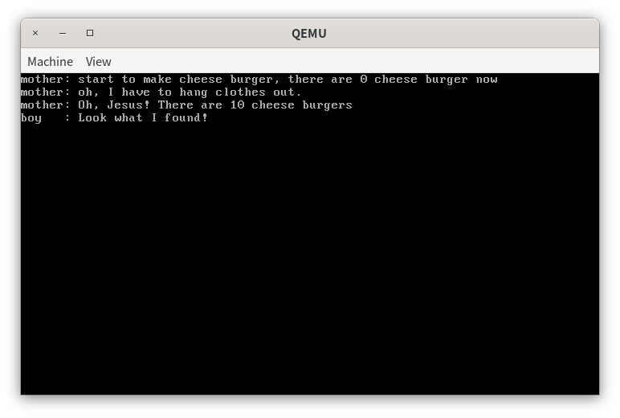

# 第五章 并发与锁机制

> 你在你的玫瑰花身上耗费的时间使得你的玫瑰花变得如此重要。

# 实验概述

在本次实验中，我们首先使用硬件支持的原子指令来实现自旋锁SpinLock，自旋锁将成为实现线程互斥的有力工具。接着，我们使用SpinLock来实现信号量，最后我们使用SpinLock和信号量来给出两个实现线程互斥的解决方案。

# 消失的芝士汉堡

> 代码放置在`src/1`下。

我们现在来看一个满足race condition的例子，考虑如下一个生活场景。

一天，一位母亲(a\_mother)学习了如何制作比金拱门更好吃的芝士汉堡(cheese\_burger)，准备在周日制作10个芝士汉堡来让全家人品尝。碰巧的是，当她制作完成后，洗衣机刚好洗完了衣服。她又不得不放下手中的汉堡去晾衣服。但是，这位母亲有一位喜欢偷吃的儿子(a\_naughty\_boy)，而今天他恰好去打羽毛球了。所以，这位母亲放心地将汉堡留在了厨房。等母亲晾完衣服回到厨房后发现，10个汉堡不翼而飞了。

```cpp
int cheese_burger;

void a_mother(void *arg)
{
    int delay = 0;

    printf("mother: start to make cheese burger, there are %d cheese burger now\n", 
           cheese_burger);
    // make 10 cheese_burger
    cheese_burger += 10;

    printf("mother: oh, I have to hang clothes out.\n");
    // hanging clothes out
    delay = 0xfffffff;
    while (delay)
        --delay;
    // done

    printf("mother: Oh, Jesus! There are %d cheese burgers\n", cheese_burger);
}
```

原来啊，在母亲晾衣服过程中，她的儿子回来了。由于儿子在和林丹打球的过程中被虐得心态爆炸，他急需吃点东西来抚慰自己受伤的心灵。此时，他惊奇地发现，厨房里竟然有10个芝士汉堡。他的内心充斥着如同哥伦布发现新大陆一般的惊喜，于是他便开始狼吞虎咽了起来。吃完10个汉堡后，他感觉浑身又充满了力量。突然间，他意识到这10个汉堡可能是母亲为全家人准备的。于是他赶紧带着球拍跑路，去找李宗伟打球了。

```cpp
void a_naughty_boy(void *arg)
{
    printf("boy   : Look what I found!\n");
    // eat all cheese_burgers out secretly
    cheese_burger -= 10;
    // run away as fast as possible
}
```

我们在`first_thread`中创建上面提到的两个线程，看看运行结果是否与我们的描述保持一致。

```cpp
void first_thread(void *arg)
{
    // 第1个线程不可以返回
    stdio.moveCursor(0);
    for (int i = 0; i < 25 * 80; ++i)
    {
        stdio.print(' ');
    }
    stdio.moveCursor(0);

    cheese_burger = 0;
    
    programManager.executeThread(a_mother, nullptr, "second thread", 1);
    programManager.executeThread(a_naughty_boy, nullptr, "third thread", 1);

    asm_halt();
}
```

在`build`文件夹下，使用如下命令编译运行。

```shell
make build && make run 
```

结果如下。


可以看到，`a_mother`线程前后读到的`cheese_burger`的值都是0，但明明`a_mother`线程在第一次读取`cheese_burger`的变量后，为`cheese_burger`加了10。那么第二次读取`cheese_burger`的值应该是第一次读到的值加上10。这个问题的原因就在于我们的操作系统中还存在另外一个线程`a_naughty_boy`，在`a_mother`线程执行下面的语句的时候

```cpp
void a_mother(void *arg)
{
...
    delay = 0xfffffff;
    while (delay)
        --delay;
...
}
```

我们执行了线程调度，将`a_naughty_boy`换上处理机执行。`a_naughty_boy`运行的时间是在`a_mother`线程对`cheese_burger`加了10之后，在第二次读取`cheese_burger`变量之前。`a_naughty_boy`此时会对共享变量`cheese_burger`减10，所以`cheese_burger`变回了原值。这就导致了`a_mother`线程前后读到的`cheese_burger`的值都是0。

问题的根本原因在于`cheese_burger`是共享的，而我们并没有采取任何措施来协调线程之间对这个共享变量的访问顺序。因此会产生和我们预期不一致的结果，或者说是race condition。这个问题的解决就在于我们需要通过一种工具来协调线程之间的对共享变量的访问顺序，这个工具就是锁。而“协调线程之间的对共享变量的访问顺序”也被称为线程的同步和互斥。

> 注意，上面提到的锁的概念是广义的，包括信号量和管程。

下面我们就来实现锁机制。

# 自旋锁

> 代码放置在`src/2`下。

## 描述

自旋锁(spin lock)是最简单的锁，是用来实现互斥的工具。

我们称“访问共用资源的代码”为临界区。自旋锁的基本思想是定义一个共享变量`bolt`，`bolt`会被初始化为0。在线程进入临界区之前，即访问共享变量之前，都需要去检查`bolt`是否为0。如果`bolt`为0，那么这个线程就会将`bolt`设置为1，然后进入临界区。待线程离开临界区后，线程会将`bolt`设置为0。如果线程在检查`bolt`时，发现`bolt`为1，说明有其他线程在临界区中。此时，这个线程就会一直在循环检查`bolt`的值（类似陀螺在原地旋转，所以被称为自旋），直到`bolt`为0，然后进入临界区。

从上面的描述中我们可以看到，同一时刻只能有一个线程在临界区中，并且线程的循环等待并不能保证有限等待的原则。因此在使用自旋锁的时候，我们假设了各个线程在临界区的时间是短暂的。

下面我们就根据上面的描述来实现自旋锁。

## 实现

我们首先在`include/sync.h`文件下定义表示自旋锁的类`SpinLock`。

```cpp
#ifndef SYNC_H
#define SYNC_H

#include "os_type.h"

class SpinLock
{
private:
    // 共享变量
    uint32 bolt;
public:
    SpinLock();
    void initialize();
    // 请求进入临界区
    void lock();
    // 离开临界区
    void unlock();
};
#endif
```

我们在`src/kernel/sync.cpp`中实现之。

在使用`SpinLock`之前，我们需要对`SpinLock`的成员变量`bolt`进行初始化为0。

```cpp
SpinLock::SpinLock()
{
    initialize();
}

void SpinLock::initialize()
{
    bolt = 0;
}
```

由于我们常常将`SpinLock`定义为一个全局变量，而全局变量的构造函数在我们的操作系统实验中不会被自动调用。所以在使用`SpinLock`的时候，我们需要手动调用`SpinLock::initialize`。

接着，我们实现线程请求进入临界区的函数`SpinLock::lock`。

```cpp
void SpinLock::lock()
{
    uint32 key = 1;

    do
    {
        asm_atomic_exchange(&key, &bolt);
    } while (key);
}
```

我们现在回忆一下线程请求自旋锁进入临界区的过程。

线程进入临界区之前，即访问共享变量之前，都需要去循环检查`bolt`是否为0。`bolt`的值为0，则退出循环，进入临界区。否则，`bolt`值为1，继续循环检查直到`bolt`的值为0。因此，我们将检查`bolt`值的函数放置在了`do...while`的结构当中。每一次检查的过程中，我们都会去交换`key`和`bolt`的值，`key`的初始值为1。所以，当其他线程在访问临界区的时候，`bolt`的值等于1，交换的结果自然是`key`等于其初始值1，而`bolt`的值也并未被改变。当`bolt`的值等于0时，表明没有线程在访问临界区。此时交换的结果是`key`等于0，`bolt`等于1，这样线程就可以退出while循环，进入临界区。同时，`bolt`的值被设置为1。

`bolt`和`key`交换的指令`asm_atomic_exchange`是一个“原子”指令。

> 特别说明，“原子”指令加上双引号表明这并不是一个真正的原子指令，需要在某些条件下才是一个原子指令。

“原子”指令保证了两个值在交换的过程中不会被中断，如下所示。

```assembly
; void asm_atomic_exchange(uint32 *register, uint32 *memeory);
asm_atomic_exchange:
    push ebp
    mov ebp, esp
    pushad

    mov ebx, [ebp + 4 * 2] ; register
    mov eax, [ebx]      ; 取出register指向的变量的值
    mov ebx, [ebp + 4 * 3] ; memory
    xchg [ebx], eax      ; 原子交换指令
    mov ebx, [ebp + 4 * 2] ; memory
    mov [ebx], eax      ; 将memory指向的值赋值给register指向的变量

    popad
    pop ebp
    ret
```

我们结合上面函数调用的语句`asm_atomic_exchange(&key, &bolt);`来分析`asm_atomic_exchange`

第7-8行，我们将`key`的值放入到`eax`中。

第9行，我们将`bolt`变量的地址放入到`ebx`中。

第10行，我们使用`xchg`指令交换内存地址`ebx`和寄存器`eax`中的值，`xchg`指令是一个真正的原子交换指令。

第11-12行，我们将`bolt`中取出并放入到`eax`的值赋值给变量`key`，完成交换。

为什么我们说`asm_atomic_exchange`不是一个原子指令呢？如果我们函数调用的语句是`asm_atomic_exchange(&bolt, &key);`，并且此时bolt的值为0，OS中有两个线程在同时检查bolt的值。那么有可能会存在这样一个调度顺序。

|      | 线程1                                                        | 线程2                                                        |
| ---- | ------------------------------------------------------------ | ------------------------------------------------------------ |
| 1    | mov ebx, [ebp + 4 * 2]<br/>mov eax, [ebx]                    |                                                              |
| 2    |                                                              | mov ebx, [ebp + 4 * 2]<br/>mov eax, [ebx]                    |
| 3    | mov ebx, [ebp + 4 * 3]<br/>xchg [ebx], eax<br/>mov ebx, [ebp + 4 * 2]<br/>mov [ebx], eax |                                                              |
| 4    |                                                              | mov ebx, [ebp + 4 * 3]<br/>xchg [ebx], eax<br/>mov ebx, [ebp + 4 * 2]<br/>mov [ebx], eax |

在1中，线程1将`bolt`的值放入eax，eax=0，而在2中，线程2也将`bolt`放入eax，而eax也等于0。那么执行的结果是线程1和2的key的值均为0，同时进入临界区，矛盾。矛盾的根源就在于CPU提供的原子指令`xchg`的操作数要么是内存地址和寄存器，要么都是寄存器，而不存在两个操作数都是内存地址的情况。这就导致了我们无法实现硬件支持的内存地址的原子交换。

**因此，我们在实现`asm_atomic_exchange`的时候作了一个重要的假设——形式参数register指向的变量不是一个共享变量**。只有满足这个条件的时候，`asm_atomic_exchange`才会是原子的。

> 从这一点我们可以看到，理论和实际还是存在差距的，但存在这些差距时，我们需要做出一些tradeoff。

当线程离开临界区的时候，我们简单地将bolt置为0即可。

```cpp
void SpinLock::unlock()
{
    bolt = 0;
}
```

此时，我们便实现了自旋锁，下面我们使用自旋锁来解决“消失的芝士汉堡”问题。

# 自旋锁解决方案

> 代码放置在`src/2`下。

我们现在时光倒流，回到母亲制作芝士汉堡前。母亲预感到芝士汉堡有被偷吃的风险，于是向中山大学操作系统课程组求助。在课程组的不懈努力下，我们研制出第一代锁——SpinLock。在母亲制作芝士汉堡会为其加上锁，在晾完衣服并检查芝士汉堡后，才释放锁。

```cpp
void a_mother(void *arg)
{
    aLock.lock();
    
    int delay = 0;

    printf("mother: start to make cheese burger, there are %d cheese burger now\n", 
           cheese_burger);
	 ...
    printf("mother: Oh, Jesus! There are %d cheese burgers\n", cheese_burger);
    
    aLock.unlock();
}
```

儿子回来后，他企图使用手中的天斧100zz打开SpinLock，未遂。殊不知，SpinLock乃是万年玄铁所铸。坚固异常，故非常人之所及也。所以他也只能在原地等待母亲晾完衣服。

```cpp
void a_naughty_boy(void *arg)
{
    aLock.lock();
    printf("boy   : Look what I found!\n");
    // eat all cheese_burgers out secretly
    cheese_burger -= 10;
    // run away as fast as possible
    aLock.unlock();
}
```

在使用`SpinLock`之前，我们需要初始化。

```cpp
void first_thread(void *arg)
{
    // 第1个线程不可以返回
	...
    aLock.initialize();
	...
}
```

我们编译运行，输出如下结果。


可以看到，`a_mother`线程前后读取的`cheese_burger`的值和预期一致。说明我们成功地使用`SpinLock`来协调线程对共享变量的访问。

# 信号量

## 描述

SpinLock会存在如下缺点。

+ 忙等待，消耗处理机时间。
+ 可能饥饿。
+ 可能死锁。

为此，我们寻求更好的解决机制——信号量。

我们首先定义一个非负整数counter表示临界资源的个数。

当线程需要申请临界资源时，线程需要执行P操作。P操作会检查counter的数量，如果counter大于0，表示临界资源有剩余，那么就将一个临界资源分配给请求的线程；如果counter等于0，表示没有临界资源剩余，那么这个线程会被阻塞，然后挂载到信号量的阻塞队列当中。当线程释放临界资源时，线程需要执行V操作。V操作会使counter的数量递增1，然后V操作会检查信号量内部的阻塞队列是否有线程，如果有，那么就将其唤醒。

从上面的描述可以看到，counter和阻塞队列是共享变量，需要实现互斥访问。目前，我们实现互斥工具只有SpinLock，因此，我们实际上使用SpinLock去实现信号量。

## 定义

我们首先在`include/sync.h`下定义信号量`Semaphore`。

```cpp
class Semaphore
{
private:
    uint32 counter;
    List waiting;
    SpinLock semLock;

public:
    Semaphore();
    void initialize(uint32 counter);
    void P();
    void V();
};
```

`Semaphore`的实现放置在`src/kernel/sync.cpp`下。在使用`Semaphore`之前，我们需要对其进行初始化。

```cpp
Semaphore::Semaphore()
{
    initialize(0);
}

void Semaphore::initialize(uint32 counter)
{
    this->counter = counter;
    semLock.initialize();
    waiting.initialize();
}
```

我们实现P操作。

```cpp
void Semaphore::P()
{
    PCB *cur = nullptr;

    while (true)
    {
        semLock.lock();
        if (counter > 0)
        {
            --counter;
            semLock.unlock();
            return;
        }

        cur = programManager.running;
        waiting.push_back(&(cur->tagInGeneralList));
        cur->status = ProgramStatus::BLOCKED;

        semLock.unlock();
        programManager.schedule();
    }
}
```

P操作的主体是一个while循环，这是由我们的唤醒机制决定的，我们后面再讨论这个问题。

第7行，由于我们需要对`counter`和`waiting`实现互斥访问，第7行首先加上锁。

第8-13行，我们检查counter是否大于0，如果大于0，表示有临界资源可供分配。我们对counter递减1，然后释放锁，返回。

第15-17行，此时counter等于0，表示没有临界资源可供分配，我们将当前线程的状态设置为阻塞态，然后放到`waiting`中。

第19-20行，由于当前线程被阻塞，我们调度下一个线程上处理机执行，但在此之前，我们需要释放锁。

线程的阻塞是怎么实现的呢？注意到当前线程的状态已经被设置为阻塞态，而`ProgramManager::schedule`只有当前线程的状态为运行态的时候，才会将其放入到就绪队列当中，其他情况不做处理。因此在`programManager.schedule()`执行后，被放入到`waiting`的线程不会出现在`programManager`的就绪队列当中，后面自然也就不会被调度执行，从而实现了线程的阻塞。

然后我们实现V操作。

```cpp
void Semaphore::V()
{
    semLock.lock();
    ++counter;
    if (waiting.size())
    {
        PCB *program = ListItem2PCB(waiting.front(), tagInGeneralList);
        waiting.pop_front();
        semLock.unlock();
        programManager.MESA_WakeUp(program);
    }
    else
    {
        semLock.unlock();
    }
}
```

第3行，我们首先加锁。

第4行，我们对counter递增1，表示释放资源。

第5-10行，当waiting中存在阻塞的线程时，我们需要将其唤醒。我们从`waiting`的队头中取出一个阻塞的线程，然后释放锁，调用`ProgramManager::MESA_WakeUp`来唤醒之。

第12-15行，当前没有线程在等待临界资源，所以释放锁，返回即可。

线程的唤醒的实现在`src/kernel/program.cpp`下。

```cpp
void ProgramManager::MESA_WakeUp(PCB *program) {
    program->status = ProgramStatus::READY;
    readyPrograms.push_front(&(program->tagInGeneralList));
}
```

我们只要简单地将`program`的状态设置为就绪态，然后放入就绪队列即可。

实际上线程的唤醒有三种方式。

+ **MESA模型**：阻塞队列中的阻塞线程被唤醒后，不会立即执行而是放入到就绪队列，等待下一次的调度运行。而正在运行的线程会继续执行，直到程序执行完毕。

+ **Hasen 模型**：阻塞队列中的阻塞线程被唤醒后，会在当前线程执行完成后立即运行刚被唤醒的阻塞线程。

+ **Hoare 模型**：阻塞队列中的阻塞线程被唤醒后，当前线程会立即中断，并运行刚刚被唤醒的阻塞线程，等阻塞线程完成再回来运行。

我们实现的是最简单的MESA模型。现在，我们来看P操作中为什么需要将counter的判断放入到循环体中。当线程执行V操作唤醒一个阻塞的线程时，这个线程会被放入到就绪队列中，不会被立即执行。而线程释放一个资源就会唤醒一个线程，也就是说，被唤醒的线程是和被释放资源的数量相同。但是不是线程被唤醒后就一定有资源呢？实际上并不是，如果被唤醒的线程在就绪队列中等待调度时，我们又新加入了几个新的线程。那么此时请求资源的线程是大于被释放的资源的。因此，线程被唤醒后不一定会有资源，需要再做一次判断。

现在，我们使用信号量来解决“消失的芝士汉堡”问题。

# 信号量解决方案

现在，中山大学操作系统课程组研制出第二代锁——Semaphore。时光再次倒流，母亲赶紧用了第二代锁。

```cpp
void a_mother(void *arg)
{
    semaphore.P();
    int delay = 0;

	 ...
        
    printf("mother: Oh, Jesus! There are %d cheese burgers\n", cheese_burger);
    semaphore.V();
}
```

儿子回来后，发现钟爱的cheese burger被锁上了，加上打球又被虐到心态爆炸，只好回到房间休息了，等母亲喊他吃饭。

```cpp
void a_naughty_boy(void *arg)
{
    semaphore.P();
    printf("boy   : Look what I found!\n");
    // eat all cheese_burgers out secretly
    cheese_burger -= 10;
    // run away as fast as possible
    semaphore.V();
}
```

在使用`Semaphore`之前，由于我们需要对`cheese_burger`进行互斥访问，我们需要将临界资源的数量初始化为1。

```cpp
void first_thread(void *arg)
{
    // 第1个线程不可以返回
	...
    semaphore.initialize(1);
	...
}
```

最后我们编译运行，输出如下结果。



可以发现，我们成功地使用信号量实现了线程互斥。

# 课后思考题

1. 在本章中，我们已经实现了自旋锁和信号量机制。现在，同学们需要复现教程中的自旋锁和信号量的实现方法，并用分别使用二者解决一个同步互斥问题，如消失的芝士汉堡问题。最后，将结果截图并说说你是怎么做的。
2. 我们使用了原子指令`xchg`来实现自旋锁。但是，这种方法并不是唯一的。例如，x86指令中提供了另外一个原子指令`bts`和`lock`前缀等，这些指令也可以用来实现锁机制。现在，同学们需要结合自己所学的知识，实现一个与本教程的实现方式不完全相同的锁机制。最后，测试你实现的锁机制，将结果截图并说说你是怎么做的。
3. 同学们可以任取一个生产者-消费者问题，然后在本教程的代码环境下创建多个线程来模拟这个问题。在本问中，我们不会使用任何同步互斥的工具。因此，这些线程可能会产生冲突，进而无法产生我们预期的结果。此时，同学们需要将这个产生错误的场景呈现出来。最后，将结果截图并说说你是怎么做的。
4. 使用信号量解决3中你提出的生产者-消费者问题。最后，将结果截图并说说你是怎么做的。
5. 同学们需要在本教程的代码环境下，创建多个线程来模拟哲学家就餐问题的场景。然后，同学们需要结合信号量来实现理论课教材中给出的关于哲学家就餐问题的方法。最后，将结果截图并说说你是怎么做的。
6. 虽然教材中给出的解决方案保证了两个邻居不能同时进食，但是它可能导致死锁。现在，同学们需要想办法将死锁的场景演示出来。然后，提出一种解决死锁的方法并实现之。最后，将结果截图并说说你是怎么做的。
7. 请用自己的话说说在实现`atomic_exchange`的函数时，我们为什么需要做出“形式参数register指向的变量不是一个共享变量”这一重要假设。
8. 请根据自己的理解，说说在实现信号量中，我们是实现线程阻塞和唤醒的基本思路。
9. 请仿照MESA模型的实现，根据Hasen或Hoare模型的描述来实现你自己的线程唤醒机制。
10. 请尝试实现管程，并使用管程解决一个多线程同步和互斥问题，例如生产者消费者问题、哲学家就餐问题等。结果截图并说说你是怎么做的。
11. 在单核CPU中，我们可以通过开/关中断的方式来实现自旋锁，而不需要使用原子指令。现在，同学们需要修改自旋锁的实现代码，使用开/关中断的方式来实现自旋锁。最后，将结果截图并说说你是怎么做的。
12. 请用自己的话说说为什么在多核CPU中，我们不可以使用开/关中断的方式来实现锁机制。
13. 请用自己的话说说相比较于原子指令，使用开/关中断的方式来实现锁机制有什么优点和缺点。