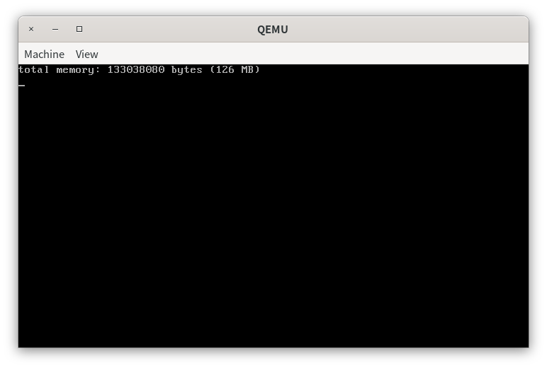
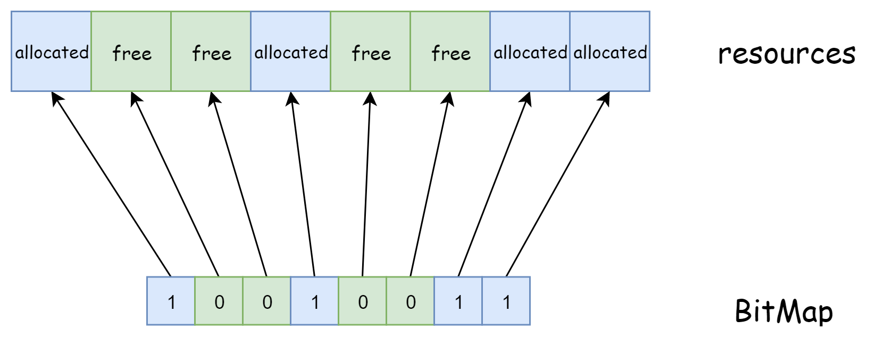
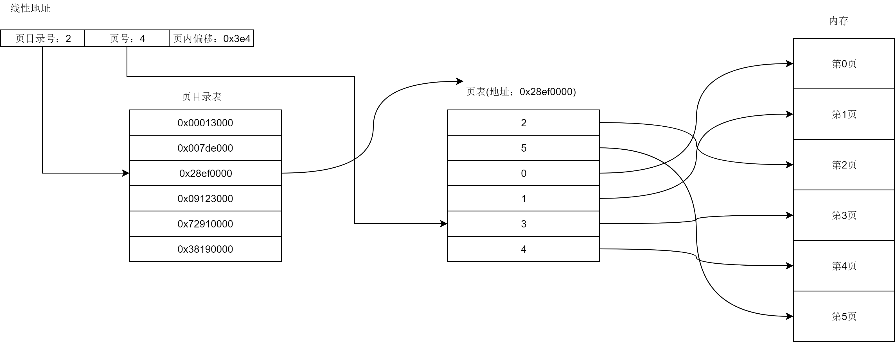
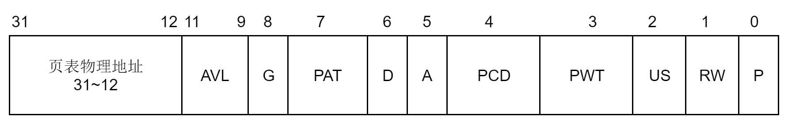
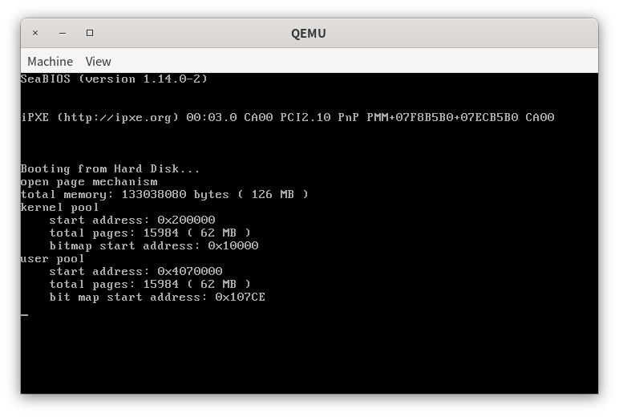
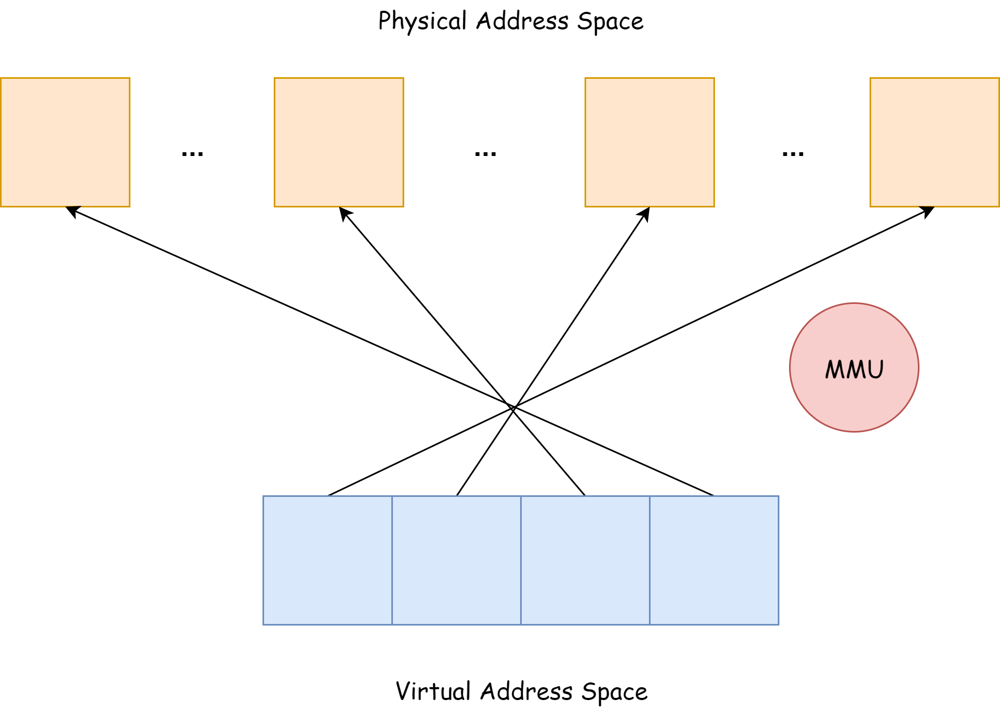

# 第六章 内存管理

> 仰之弥高，钻之弥坚。瞻之在前，忽焉在后。

# 实验概述

在本次实验中，我们首先学习如何使用位图和地址池来管理资源。然后，我们将实现在物理地址空间下的内存管理。接着，我们将会学习并开启二级分页机制。在开启分页机制后，我们将实现在虚拟地址空间下的内存管理。

本次实验最精彩的地方在于分页机制。基于分页机制，我们可以将连续的虚拟地址空间映射到不连续的物理地址空间。同时，对于同一个虚拟地址，在不同的页目录表和页表下，我们会得到不同的物理地址。这为实现虚拟地址空间的隔离奠定了基础。但是，本实验最令人困惑的地方也在于分页机制。开启了分页机制后，程序中使用的地址是虚拟地址。我们需要结合页目录表和页表才能确定虚拟地址对应的物理地址。而我们常常会忘记这一点，导致了我们不知道某些虚拟地址表示的具体含义。

# 内存的探查

> 代码放置在`src/1`下。

在进行内存管理之前，我们的首要任务是获取操作系统中可管理的内存的容量。在实模式下，我们可以通过`15h`中断来获取机器的内存大小。资料“获取内存容量”中介绍了3种获取机器内存的方法，我们这里选取了功能号为`0xe801`的`15h`中断来获取内存。

此方法相较于另外两种方法较为简单，调用这个功能只需要在ax寄存器中存入功能号0xe801即可，无需其他的输入数据。但是，此方法最多只能获取到4GB的内存空间。

中断返回结果是内存的大小，结果保存在寄存器中。返回结果分为两部分存储，ax寄存器中存放的是0\~15MB的内存大小，单位是1KB，bx寄存器中存放的是16MB\~4GB的内存大小，单位是64KB。因此，内存总容量为
$$
内存总容量=(\text{ax}\cdot 1024+\text{bx}\cdot64\cdot1024)\ \text{bytes}
$$
在bootloader中，我们从实模式跳转到了保护模式。上面提到的`15h`中断是实模式下的中断，在保护模式下无法使用。因此，我们无法在保护模式下使用`15h`中断来获取内存大小。同时，我们在保护模式下执行内存管理的代码。在不知道内存大小的情况下，我们也无法实现内存管理。这就产生了矛盾。矛盾的解决方法也非常简单，我们可以在实模式下调用中断获取内存大小，然后将内存大小写入一个固定的地址，最后在保护模式下建立内存管理时，我们从这个固定的地址中读出内存大小即可。下面我们来实现这一解决方法。

我们首先修改`src/boot/mbr.asm`的代码。在跳转到bootloader前，我们调用中断获取内存的大小，然后将存储中断返回结果的ax和bx寄存器的内容写入地址0x7c00。

```assembly
...

load_bootloader: 
    push ax
    push bx
    call asm_read_hard_disk  ; 读取硬盘
    add sp, 4
    inc ax
    add bx, 512
    loop load_bootloader

    ; 获取内存大小
    mov ax, 0xe801
    int 15h
    mov [0x7c00], ax
    mov [0x7c00+2], bx

    jmp 0x0000:0x7e00        ; 跳转到bootloader
    
...
```

接着，我们在`first_thread`中读取内存大小。

```assembly
...

void first_thread(void *arg)
{
	...
	
    int memory = *((uint32 *)MEMORY_SIZE_ADDRESS);
    // ax寄存器保存的内容
    int low = memory & 0xffff;
    // bx寄存器保存的内容
    int high = (memory >> 16) & 0xffff;
    memory = low * 1024 + high * 64 * 1024;
    printf("total memory: %d bytes (%d MB)\n", memory, memory / 1024 / 1024);

    asm_halt();
}

...
```

其中，`MEMORY_SIZE_ADDRESS`定义在`include/os_constant.h`下。

```c++
#define MEMORY_SIZE_ADDRESS 0x7c00
```

第7行，我们从0x7c00处读入了获取中断的结果。

第8-11行，根据写入时的顺序，`memory`的低16位是ax保存的内容，高16位是bx保存的内容。

第12行，根据上面提到的内存容量的计算公式，我们可以得到内存的容量。

上面的代码运行结果如下。



从结果中可以看到，我们可管理的内存大小是126MB。得到了内存的大小后，我们来学习如何实现简单的内存管理。

# 位图

> 代码放置在`src/2`下。

## 概念

在很多时候，我们总是需要对一组资源的状态进行管理。例如，我们需要知道哪些资源是已经被分配的，哪些是未被分配的。为了尽可能地降低我们管理资源的开销，我们可以使用1位来表示资源的状态。我们把用来标识资源状态的位的集合称为位图。

位图，BitMap，是用于资源管理的一种数据结构。BitMap使用一位来和一个资源单元建立映射关系，例如，我们可以使用1表示资源单元已经被分配，使用0表示资源单元空闲，如下所示。



BitMap以较小的代价实现了对资源的管理。对于4GB的内存，在分页机制下，我们将资源单元定为一个物理页，大小为4KB。因此，使用BitMap来对该内存进行管理时，BitMap的大小为
$$
\frac{4GB}{8\times 4KB}=128KB.
$$
其内存占比为
$$
\frac{128KB}{4GB}\times 100\text.
$$
可见使用BitMap来对资源管理时，其空间效率较高。下面我们来实现BitMap。

## BitMap的实现

从代码层面上去考察BitMap时，BitMap的成员包括

+ 一块存放BitMap的内存区域。
+ BitMap管理的资源单元数量。
+ 单独存取位和批处理存取位的方法。

如下所示，BitMap的定义放置在`include/bitmap.h`中。

```c++
class BitMap
{
public:
    // 被管理的资源个数，bitmap的总位数
    int length;
    // bitmap的起始地址
    char *bitmap;
public:
    // 初始化
    BitMap();
    // 设置BitMap，bitmap=起始地址，length=总位数(被管理的资源个数)
    void initialize(char *bitmap, const int length);
    // 获取第index个资源的状态，true=allocated，false=free
    bool get(const int index) const;
    // 设置第index个资源的状态，true=allocated，false=free
    void set(const int index, const bool status);
    // 分配count个连续的资源，若没有则返回-1，否则返回分配的第1个资源单元序号
    int allocate(const int count);
    // 释放第index个资源开始的count个资源
    void release(const int index, const int count);
    // 返回Bitmap存储区域
    char *getBitmap();
    // 返回Bitmap的大小
    int size() const;
private:
    // 禁止Bitmap之间的赋值
    BitMap(const BitMap &) {}
    void operator=(const BitMap&) {}
};
```

为什么我们需要从外界向BitMap提供存储区域呢？这是因为我们使用BitMap来实现内存管理，所以我们无法使用动态内存分配来在BitMap的初始化函数中分配一个存储区域。在后面的实现中可以看到，我们会在内存中手动划分出一块区域来存储BitMap用来标识资源分配情况的位。

注意，BitMap的成员是有指针的。一般情况下，成员涉及指针的对象的赋值都需要使用动态内存分配获得一个新的指针，但我们还没有实现动态内存分配。所以，我们将`copy constructor`和`operator=`定义为private，以禁止BitMap之间的直接赋值。这也是为什么我们在BitMap的初始化函数`initialize`中需要提供BitMap的存储区域。

根据BitMap的描述，我们不难实现BitMap的成员函数，如下所示，代码放置在`src/utils/bitmap.cpp`中。

```cpp
BitMap::BitMap()
{
    initialize(nullptr, 0);
}

void BitMap::initialize(char *bitmap, const int length)
{
    this->bitmap = bitmap;
    this->length = length;

    int bytes = ceil(length, 8);
    memset(bitmap, 0, bytes);

}

bool BitMap::get(const int index) const
{
    int pos = index / 8;
    int offset = index % 8;

    return (bitmap[pos] & (1 << offset));
}

void BitMap::set(const int index, const bool status)
{
    int pos = index / 8;
    int offset = index % 8;

    // 清0
    bitmap[pos] = bitmap[pos] & (~(1 << offset));

    // 置1
    if (status)
    {
        bitmap[pos] = bitmap[pos] | (1 << offset);
    }
}

int BitMap::allocate(const int count)
{
    if (count == 0)
        return -1;

    int index, empty, start;

    index = 0;
    while (index < length)
    {
        // 越过已经分配的资源
        while (index < length && get(index))
            ++index;

        // 不存在连续的count个资源
        if (index == length)
            return -1;

        // 找到1个未分配的资源
        // 检查是否存在从index开始的连续count个资源
        empty = 0;
        start = index;
        while ((index < length) && (!get(index)) && (empty < count))
        {
            ++empty;
            ++index;
        }

        // 存在连续的count个资源
        if (empty == count)
        {
            for (int i = 0; i < count; ++i)
            {
                set(start + i, true);
            }

            return start;
        }
    }

    return -1;
}

void BitMap::release(const int index, const int count)
{
    for (int i = 0; i < count; ++i)
    {
        set(index + i, false);
    }
}

char *BitMap::getBitmap()
{
    return (char *)bitmap;
}

int BitMap::size() const
{
    return length;
}
```

上面的代码逻辑比较清晰，因此这里只说明BitMap如何找到资源单元对应的状态位。

当我们使用指针来访问BitMap的存储区域时，最小的访问单元是字节，而资源单元的状态是使用一个位来表示的。因此，给定一个资源单元的序号$i$，我们无法通过`bitmap[i]`的方式来直接修改资源单元的状态。我们的做法是先定位到存储第$i$个资源单元的字节序号$pos$，然后再确定第$i$个资源单元的状态位在第$pos$字节中的偏移位置$offset$，最后使用位运算来修改该位即可，如下所示。
$$
i=8\cdot pos+offset,\ 0 \le offset<8
$$
注意，$offset$是从最低位开始算起的。

# 地址池

> 代码放置在`src/2`下。

在开启分页机制之后，我们的内存就会被划分为一个个的固定长度的块，这个块被称为页。在保护模式下，一个页的大小是4KB。在程序设计的过程中，我们常常需要进行动态内存分配。我们会使用malloc来分配任意字节大小的内存，使用free来释放已经被分配的内存。从我们目前的进度来看，实现以字节为粒度的内存管理方法并不怎么现实。但是，假如我们强制要求每次分配的内存大小只能是一个页，每次释放的内存大小也是一个页。这样的内存管理实现起来是简单的，因为我们只需要记录下内存中哪些页是已经被分配的，哪些页是空闲的就可以了。这种内存管理方法被称为页内存管理。在后面的章节中，我们将会学习如何使用页内存管理来实现以字节为粒度的内存管理，从而实现我们的malloc和free。这里，我们只需要实现页内存管理即可。

为了实现页内存分配，我们需要使用一种结构来标识地址空间中的哪些页是已经被分配的，哪些是未被分配的。这种结构被称为地址池。当需要页内存分配时，我们可以从地址池中取出一个空闲页。然后地址池便会标识该空闲页已被分配，最后计算并返回该空闲页对应的地址。空闲页只要没有被释放，就不会被再次分配。

注意到BitMap可用于资源的管理，地址池实际上使用了BitMap来对其地址空间进行管理。

从代码层面上来看，地址池的定义如下所示，代码放置在`include/address_pool.h`中。

```cpp
class AddressPool
{
public:
    BitMap resources;
    int startAddress;
public:
    AddressPool();
    // 初始化地址池
    void initialize(char *bitmap, const int length,const int startAddress);
    // 从地址池中分配count个连续页，成功则返回第一个页的地址，失败则返回-1
    int allocate(const int count);
    // 释放若干页的空间
    void release(const int address, const int amount);
};
```

第4-5行，地址池是对连续的若干个页进行管理的数据结构。所以我们会使用`resources`来标识地址池中哪些页是空闲的，哪些页是被分配的。我们使用`startAddress`来记录地址池管理的页的共同起始地址。假设每一页的大小为$PAGE\_SIZE$，那么地址池中的第$i$页的起始地址$address$为
$$
address=startAddress+i\times PAGE\_SIZE
$$
`AddressPool`的实现放在`src/utils/address_pool.cpp`中，如下所示。

```cpp
AddressPool::AddressPool()
{
}

// 设置地址池BitMap
void AddressPool::initialize(char *bitmap, const int length, const int startAddress)
{
    resources.initialize(bitmap, length);
    this->startAddress = startAddress;
}

// 从地址池中分配count个连续页
int AddressPool::allocate(const int count)
{
    uint32 start = resources.allocate(count);
    return (start == -1) ? -1 : (start * PAGE_SIZE + startAddress);
}

// 释放若干页的空间
void AddressPool::release(const int address, const int amount)
{
    resources.release((address - startAddress) / PAGE_SIZE, amount);
}
```

代码逻辑较为简单，这里便不再赘述。

# 物理页内存管理

> 代码放置在`src/3`下。

对于我们的物理内存，我们将其划分为两部分。第一部分是内核空间，第二部分是用户空间。实际上，我们现在编写的所有代码都是运行在内核空间下的。用户空间的概念需要等到我们实现了进程后才会理解。但为了便于我们理解这样划分的目的，我们还是在这里简单地梳理一下二者的区别。

到目前为止，我们在`0x7c00`处放入了MBR，在MBR之后放入了bootloader。在bootloader之后放入了我们的操作系统的代码。现在我们看到的内存安排和存放的内容实际上都是属于内核空间。从另外一个角度来看，我们现在编写的代码的功能包括进程管理、IO管理、中断管理等。显然，这部分代码属于特权代码，只能运行在内核空间下。

对于我们在操作系统上执行的程序，例如hello.cpp

```cpp
#include <stdio.h>

int main() {
    printf("Hello World\n");
}
```

我们首先会编译这段代码

```shell
g++ hello.cpp -o hello.out
```

然后执行

```shell
./hello.out
```

此时，我们的操作系统会为可执行文件`hello.out`创建一个进程，这个进程会执行`hello.out`的代码，`hello.out`的数据存放在操作系统为进程分配的空间中，`hello.out`的代码、数据和栈等存放的空间就是用户空间。

每一个程序都有一个独立的用户空间，例如`hello.out`，并且用户空间都是从0开始的。所以，每一时刻，我们操作系统中会存在一个内核空间和若干个用户空间。这些空间为什么不会造成冲突呢？这得益于分页机制。事实上，开启了分页机制后，我们在代码中使用的地址就不再是实际的物理地址，而是虚拟地址（又称线性地址）。CPU会根据虚拟地址和MMU（Memory Manage Unit）来自动地将虚拟地址转换为物理地址，最终CPU访问的地址是物理地址。通过分页机制，我们可以将同一个虚拟地址映射到不同的物理地址中。而进程和内核都有自己的页目录表和页表，所以我们就可以通过分页机制来保证这些空间不会产生冲突。

为了有效隔离内核和用户程序的物理地址空间。我们将整个物理地址空间划分为两部分，内核空间和用户空间。内核需要的物理页只会从内核空间中分配，用户程序需要的物理页也只会从用户空间中分配。

在我们的操作系统实现当中，我们会使用两个地址池来对这两部分物理地址进行管理。代码放置在`include/memory.h`下，我们使用类`MemoryManager`来执行内存管理。

```cpp
enum AddressPoolType
{
    USER,
    KERNEL
};

class MemoryManager
{
public:
    // 可管理的内存容量
    int totalMemory;
    // 内核物理地址池
    AddressPool kernelPhysical;
    // 用户物理地址池
    AddressPool userPhysical;

};
```

接着，我们向`MemoryManager`中加入初始化和分配释放物理内存的函数。

```cpp
class MemoryManager
{
public:
    // 可管理的内存容量
    int totalMemory;
    // 内核物理地址池
    AddressPool kernelPhysical;
    // 用户物理地址池
    AddressPool userPhysical;

public:
    MemoryManager();

    // 初始化地址池
    void initialize();

    // 从type类型的物理地址池中分配count个连续的页
    // 成功，返回起始地址；失败，返回0
    int allocatePhysicalPages(enum AddressPoolType type, const int count);

    // 释放从paddr开始的count个物理页
    void releasePhysicalPages(enum AddressPoolType type, const int paddr, const int count);

    // 获取内存总容量
    int getTotalMemory();

};
```

我们接下来看物理内存管理是如何实现的。

首先，在进行物理内存管理之前，我们需要进行初始化。

```cpp
MemoryManager::MemoryManager() {
    initialize();
}

void MemoryManager::initialize()
{
    this->totalMemory = 0;
    this->totalMemory = getTotalMemory();

    // 预留的内存
    int usedMemory = 256 * PAGE_SIZE + 0x100000;
    if(this->totalMemory < usedMemory) {
        printf("memory is too small, halt.\n");
        asm_halt();
    }
    // 剩余的空闲的内存
    int freeMemory = this->totalMemory - usedMemory;

    int freePages = freeMemory / PAGE_SIZE;
    int kernelPages = freePages / 2;
    int userPages = freePages - kernelPages;

    int kernelPhysicalStartAddress = usedMemory;
    int userPhysicalStartAddress = usedMemory + kernelPages * PAGE_SIZE;

    int kernelPhysicalBitMapStart = BITMAP_START_ADDRESS;
    int userPhysicalBitMapStart = kernelPhysicalBitMapStart + ceil(kernelPages, 8);

    kernelPhysical.initialize((char *)kernelPhysicalBitMapStart, kernelPages, kernelPhysicalStartAddress);
    userPhysical.initialize((char *)userPhysicalBitMapStart, userPages, userPhysicalStartAddress);

    printf("total memory: %d bytes ( %d MB )\n", 
            this->totalMemory, 
            this->totalMemory / 1024 / 1024);

    printf("kernel pool\n"
           "    start address: 0x%x\n"
           "    total pages: %d ( %d MB )\n"
           "    bitmap start address: 0x%x\n",
           kernelPhysicalStartAddress, 
           kernelPages, kernelPages * PAGE_SIZE / 1024 / 1024,
           kernelPhysicalBitMapStart);

    printf("user pool\n"
           "    start address: 0x%x\n"
           "    total pages: %d ( %d MB )\n"
           "    bit map start address: 0x%x\n",
           userPhysicalStartAddress, 
           userPages, userPages * PAGE_SIZE / 1024 / 1024,
           userPhysicalBitMapStart);
}
```

第7-8行，我们读取之前在实模式下使用中断获取的内存大小，读入内存大小的函数如下。

```cpp
int MemoryManager::getTotalMemory()
{

    if(!this->totalMemory)
    {
        int memory = *((int *)MEMORY_SIZE_ADDRESS);
        // ax寄存器保存的内容
        int low = memory & 0xffff;
        // bx寄存器保存的内容
        int high = (memory >> 16) & 0xffff;

        this->totalMemory = low * 1024 + high * 64 * 1024;
        
    }

    return this->totalMemory;
}
```

第11行，我们在内存中预留了部分内存。0x00000000\~0x00100000存放的是我们的内核，在预留内存中，1MB以上的剩余部分存放内核页表。

第19-21行，前面我们已经提到，为了简便起见，我们实现的内存管理是页内存管理。并且我们将物理内存空间划分为两部分，内核物理地址空间和用户物理地址空间。这里，我们的划分方式是等分，即两个物理地址空间的大小相同。

第23-24行，我们计算两个物理地址空间的起始地址，用户物理地址空间紧跟在内核物理地址空间后面。

第26-27行，我们在1MB以下的空间处人为划分了存放位图的区域，用来存放内核空间和用户空间的位图（BitMap）。

第29-30行，我们对两部分空间的地址池进行初始化。

第32-50行，我们将内存管理的基本信息打印出来。

初始化了`MemoryManager`后，我们便可以实现物理内存管理，如下所示。

```cpp
int MemoryManager::allocatePhysicalPages(enum AddressPoolType type, const int count)
{
    int start = -1;

    if (type == AddressPoolType::KERNEL)
    {
        start = kernelPhysical.allocate(count);
    }
    else if (type == AddressPoolType::USER)
    {
        start = userPhysical.allocate(count);
    }

    return (start == -1) ? 0 : start;
}

void MemoryManager::releasePhysicalPages(enum AddressPoolType type, const int paddr, const int count)
{
    if (type == AddressPoolType::KERNEL)
    {
        kernelPhysical.release(paddr, count);
    }
    else if (type == AddressPoolType::USER)
    {

        userPhysical.release(paddr, count);
    }
}
```

代码比较简单，这里便不再赘述。接下来，我们开始实现操作系统中最精彩的部分——开启分页机制。

# 二级分页机制

> 代码放置在`src/4`下。

## 分页机制的缘由

虽然计算机的内存容量在不断增大，容量也从原先的B级发展为今天的GB级，但是，我们依然无法将所有的程序放入内存中执行。因此，我们要确定哪些程序是可以放入内存的，哪些程序是暂时放在外存。除此之外，当我们实现了多线程和多进程后，我们希望这些线程和进程在运行时互不干扰，即它们无法访问对方的地址空间，从而实现了内存保护。

上面实际上提到了两个问题。

+ 程序是如何装入内存的。
+ 内存的保护是如何实现的。

我们首先来学习程序是如何装入内存的内容。在第二章中，我们已经了解到，一份C代码需要经过编译、链接后才能形成可执行程序。但是，这个可执行程序是放在外存中的，也就是磁盘，它需要被加载到内存中才能被执行。程序从外存加载到内存的执行过程被称为程序的装入。

特别注意，程序在被编译后，其起始地址默认是从0开始的。但是，在绝大部份情况下，我们的程序并不是加载到地址为0处运行。例如，我们的bootloader是被加载到`0x7e00`处执行的。如果我们直接将编译后的bootloader加载到`0x7e00`处执行，也就是说，我们没有加上`org`伪指令，或者使用`ld`来指定起始地址。

```asm
; bootloader
org 0x7e00
...
```

此时，对于下面的语句，我们无法正确地跳转到标号`protect_mode_begin`指定的地址后执行。

```asm
; bootloader
...
;以下进入保护模式
jmp dword CODE_SELECTOR:protect_mode_begin  
...
```

在我们没有指定代码的起始地址之前，默认的起始地址为0。此时，标号`protect_mode_begin`表示的是相对于代码起始位置的偏移地址，假设这个偏移地址是`0x200`。上面这条语句是希望跳转到标号为`protect_mode_begin`的代码处执行。当我们执行到上面这条语句时，我们实际上会跳转到`0x200`处执行(`CODE_SELECTOR`对应的段描述符的基地址从0开始)，从而发生了错误。

由于bootloader是被加载到`0x7e00`的，`0x7e00+0x200`才是`protect_mode_begin`真正所在的地址。因此，我们需要加上`org`伪指令，或者使用`ld`来指定起始地址。这样做之后，`protect_mode_begin`的值就变成了`0x7e00+0x200`，符合我们的预期。

对于C语言也是如此，我们的内核是使用C语言写的，C语言的全局变量(如`stdio`，函数名等)的地址也都是偏移地址，而kernel是被加载到`0x20000`处执行的。所以，我们在使用`ld`链接的时候，加上了`-Ttext 0x00020000`参数。此时，`ld`会修改程序中所有的标号的地址，为其加上`0x20000`，这就是运行不会出错的原因。

> 对于局部变量，C语言翻译成的汇编代码是使用ebp和esp来访问的，因此不会出错。

我们在编译在kernel后使用ld为其加上了起始地址，然后放入磁盘，最后再加载到约定的起始地址处执行。这个过程被称为程序的绝对装入。实际上，绝对装入只是程序装入内存的3种方式的一种，如下所示。

+ 绝对装入。在链接时，若知道程序将驻留在内存的某个地址，则链接程序将根据实际运行的地址来修改程序的标号的地址，使其和实际运行使用的地址保持一致。例如`ld`中的`-Ttext 0x00020000`，此时直接将程序加载到预先确定的位置便可运行。但是，当加载位置变化后，链接时的地址也要发生变化，否则必定发生错误。
+ 静态重定位。在装入时，我们根据程序被加载位置来修改程序的指令和数据地址。这和绝对装入类似，但还是有区别，区别在于修改地址的时间。对于绝对装入，程序的地址就是实际的使用的地址，而对于静态重定位，程序的地址依旧是从0开始，只有在被加载到内存时才会被修改。
+ 动态重定位。被装入内存后的程序起始地址依旧是从0开始。地址的转换被推迟到寻址的时候。此时，我们需要MMU(内存管理单元，Memory Management Unit)来完成转换。我们可以改变MMU的内容来实现不同的变换方式，也就是说，即使对于相同的线性地址，在不同的变换方式下，得到的物理地址就会不同，这就是被称为动态重定位的原因。二级分页机制就是典型的动态重定位。

在后面的学习中我们可以进一步地体会到，二级分页机制能够有效地帮助我们来进行程序的动态重定位。

在第二章中，我们接触到了虚拟地址和物理地址的概念。虚拟地址是程序使用的地址，物理地址是CPU用来寻址的地址。在开启分页机制之前，二者是相同的。我们在上面的论述中可以看到，我们后面会实现进程，进程是程序运行时的映像。同时，不同的进程的虚拟地址都是从0开始一直到4GB。但是这些进程却不会发生冲突。原因在于每一个进程都会有一个独立的地址空间和页表，通过不同的地址映射机制，即不同的页表和页目录表，我们可以将相同的虚拟地址变换到不同的物理地址，从而解决了冲突。

在实现分页机制之前，我们接下来首先看一下什么是分页机制。

## 一级页表

在分页机制下，内存被划分为大小相等的内存块，称为页（Page），如下所示。


在我们的操作系统实验中，一个页的大小为4KB。我们知道，CPU最终会使用物理地址来访问程序的代码和数据。在开启分页机制前，物理地址=段地址+偏移地址（保护模式）。而开启了分页机制后，分段机制依然在发挥作用，只不过段地址+偏移地址不再是实际的物理地址，而是被称为虚拟地址。虚拟地址需要经过转换才能变为物理地址，负责这一转换过程的部件称为MMU。MMU集成在CPU中，程序的运行过程虽然给出的是虚拟地址，但是CPU能够通过页部件将其自动地转换为物理地址。

一级页表先通过虚拟地址在页表中找到对应的页表项，然后再根据页表项给出的页地址和页内偏移找到实际的物理地址。页的大小是4KB，因此一个页内的偏移地址使用地址的低12位来表示（$4K=2^{12}$）。我们知道，保护模式下的地址是4个字节，32位。地址的高20位用来确定页表中的页表项，所以页表中的页表项一共有$2^{20}=1M$项。每一个页表项占4字节，页表项里面保存的是物理页的起始地址，这个地址是物理地址。因此，1M个页表项恰好可以表示$1M*4KB=4GB$的内存，也就是32位的地址空间。

综合上述分析，一级页表的虚拟地址到物理地址的转换关系如下。

+ 先取虚拟地址的高20位，高20位的数值表示的是页表项在页表中的序号。而每一个页表项占4字节，所以高20位的数值乘4后才是对应的页表项的地址。
+ 从页表项中读出页地址后，由于低12位是页内偏移，使用物理页地址+低12位即可得出需要访问的物理地址。

我们看下面这个例子。考虑虚拟地址`0x43e4`。


虚拟地址到物理地址的变换过程如下所示。

虚拟地址的高20位是`0x4`，因此我们到页表中去找第`0x4`个页表项，页表项的内容为3，表示虚拟地址所在的物理页是第3个物理页。虚拟地址的低12位表示的是页内偏移，因此虚拟地址`0x43e4`对应的地址是第3个物理页中偏移地址为`0x3e4`的地址。由于一个物理页的大小为4KB，虚拟地址对应的物理地址是`0x33e4`，实际上就是用物理页号去替换虚拟地址中的页号。

明白了一级分页机制的基本思想后，我们便不难将分页机制的概念扩展，从而得到二级页表分页机制。

## 二级页表

我们已经看到，一级页表已经可以实现分页机制的思想。但是，问题在于一级页表中最多可容纳1M个页表项，每个页表项是4字节。如果页表项全满的话，便是4MB大小。注意到每个进程都有自己的页表，当进程数量增多时，光是页表占用的内存空间就不小了。 所以，我们不希望在一开始就创建所有的页表项，而是根据需要动态地创建页表项。借用分页机制的思想，我们也为页表创建页表。这个“页表的页表”被称为页目录表，页目录表中的每一项被称为页目录项，页目录项的内容是页表的物理地址。通过页目录表来访问页表，然后通过页表访问物理页的方式被称为二级分页机制。

在一级页表机制下，页表的大小为4MB，而在二级页表机制下，页目录表、页表、物理页的大小均为4KB。页目录项和页表项的大小均为4B。但是，这种划分方式是否足以表示4GB的内存空间呢？我们继续分析。页目录表中的页目录项为$4KB/4B=1024$，每一个页目录项对应了一个页表，因此我们有1024个页表。在每一个页表中，页表项的数目为$4KB/4B=1024$，每一个页表项的对应一个物理页。因此1024个页表会对应$1024\times1024=1M$的物理页。每一个物理页的大小为4KB，所以二级页表可表示的总内存大小为$1M*4KB=4GB$，恰好为32位的地址空间。

此时，一个32位的虚拟地址被划分为3部分。

+ 31-22，共10位，是页目录项的序号，可以表示$2^{10}=1024$个页目录项。
+ 21-12，共10位，是页表项的序号，可以表示$2^{10}=1024$个页表项。
+ 11-0，共12位，是页内偏移，可以表示$2^{12}=4KB$的物理页内的偏移地址。

综合上述分析，二级页表的虚拟地址到物理地址的转换关系如下。

1. 给定一个虚拟地址，先取31-22位，其数值乘4后得到页目录表项在页目录表的偏移地址。这个偏移地址加上页目录表的物理地址后得到页目录项的物理地址。
2. 取页目录项中的内容，得到页表的物理地址。页表的物理地址加上21-12位乘4的结果后，得到页表项的物理地址。
3. 取页表项的内容，即物理页的物理地址，加上11-0位的内容后便得到实际的物理地址。

我们通过一个例子来说明，考察虚拟地址`0x008043e4`。



1. 取31-22位，数值为2，因此在页目录表中找到第2个页目录项。
2. 取第2个页目录项的内容，得到页表的地址`0x28ef0000`。取21-12位，数值为4，因此在页表中找到第4个页表项。
3. 取第4个页表项的内容，得到物理页是第3页。取11-0位，数值为`0x3e4`，因此在第3页中找到偏移地址为`0x3e4`处的值。

虚拟地址`0x008043e4`最终被转换成物理地址`0x000033e4`，这个过程是CPU中的地址转换部件自动完成的，我们只需要提供地址转换需要用到的页目录表和页表即可。

这便是二级页表的分页机制，我们接下来就开启它。

## 开启二级页表分页机制

IA-32的CPU支持的分页机制是二级页表分页机制，所以教程下面所说的“分页机制”默认为二级页表分页机制。分页机制默认是关闭的，我们需要手动开启，启动分页机制的流程如下所示。

+ 规划好页目录表和页表在内存中的位置，然后初始化。
+ 将页目录表的地址写入cr3。
+ 将cr0的PG位置1。

我们分别来看上面的各个步骤。

**第一步，规划好页目录表和页表在内存中的位置并写入内容**。首先，我们需要明确一点，页目录表和页表是需要在内存中特意地划分出位置来存放的。所以，我们需要在内存中指定页目录表和页表存放的位置。同时，页目录表和页表的物理地址必须是4KB的整数倍，也就是低12位为0。

规定了页目录表的位置后，我们根据线性地址空间的大小来确定需要分配的页表的数量和位置，不必一开始就分配完1024个页表给页目录表。规划好了页目录表的位置后，我们向页目录表中写入页表对应的页目录项。页目录项的结构如下。



+ **31-12位**是页表的物理地址位的高20位，这也是为什么规定了页目录表的地址必须是4KB的整数倍。页目录表和页表实际上也是内存中的一个页，而内存被划分成了大小为4KB的页。自然地，这些物理页的起始就是4KB的整数倍。

+ **P位**是存在位，1表示存在，0表示不存在。

+ **RW位**，read/write。1表示可读写，0表示可读不可写。

+ **US位**，user/supervisor。若为1时，表示处于User级，任意级别（ 0、 1、 2、3）特权的程序都可以访问该页。若为0，表示处于 Supervisor 级，特权级别为3的程序不允许访问该页，该页只允许特权级别为0、1、2的程序可以访问。  

+ **PWT位**，这里置0。PWT， Page-level Write-Through，意为页级通写位，也称页级写透位。若为 1 表示此项采用通写方式，表示该页不仅是普通内存，还是高速缓存。

+ **PCD位**，这里置0。PCD， Page-level Cache Disable，意为页级高速缓存禁止位。若为 1 表示该页启用高速缓存，为 0 表示禁止将该页缓存。 

+ **A位**，访问位。1表示被访问过，0表示未被访问，由CPU自动置位。

+ **D位**，Dirty，意为脏页位。当CPU对一个页面执行写操作时，就会设置对应页表项的D位为1。此项
  仅针对页表项有效，并不会修改页目录项中的D位。  
+ **G位**，这里置0，和TLB相关。
+ **PAT**， 这里置0。Page Attribute Table，意为页属性表位，能够在页面一级的粒度上设置内存属性。

写完页目录项后便可以在页表中写页表项，页表项结构如下。


除31-12位是页的物理地址位的高20位外，其余位的意义与页目录项完全相同，这里便不再赘述。

**第二步，将页目录表的地址写入cr3。**cr3寄存器保存的是页目录表的地址，使得CPU的MMU能够找到页目录表的地址，然后自动地将线性地址转换成物理地址。我们在建立页目录表和页表后，需要将页目录表地址放到CPU所约定的地方，而这个地方是cr3。cr3又被称为页目录基址寄存器 PDBR，其内容如下。


cr3可以直接使用mov指令赋值。

**第三步，将cr0的PG位置1。**启动分页机制的开关是将控制寄存器 cr0 的 PG 位置 1，PG 位是cr0寄存器的第31位，PG位为1后便进入了内存分页运行机制。

综合上述3步骤后便可以开启分页机制，我们下面使用代码实现。

我们在内存管理器`MemoryManager`加入开启分页机制的成员函数声明，代码放在`include/memeory.h`中，如下所示。

```cpp
class MemoryManager
{
	...
    // 开启分页机制
    void openPageMechanism();

};
```

然后我们在`src/kernel/memory.cpp`中实现这个函数，如下所示。

```cpp
void MemoryManager::openPageMechanism()
{
    // 页目录表指针
    int *directory = (int *)PAGE_DIRECTORY;
    //线性地址0~4MB对应的页表
    int *page = (int *)(PAGE_DIRECTORY + PAGE_SIZE);

    // 初始化页目录表
    memset(directory, 0, PAGE_SIZE);
    // 初始化线性地址0~4MB对应的页表
    memset(page, 0, PAGE_SIZE);

    int address = 0;
    // 将线性地址0~1MB恒等映射到物理地址0~1MB
    for (int i = 0; i < 256; ++i)
    {
        // U/S = 1, R/W = 1, P = 1
        page[i] = address | 0x7;
        address += PAGE_SIZE;
    }

    // 初始化页目录项

    // 0~1MB
    directory[0] = ((int)page) | 0x07;
    // 3GB的内核空间
    directory[768] = directory[0];
    // 最后一个页目录项指向页目录表
    directory[1023] = ((int)directory) | 0x7;

    // 初始化cr3，cr0，开启分页机制
    asm_init_page_reg(directory);

    printf("open page mechanism\n");
    
}
```

其中，常量定义在`include/os_constant.h`下，如下所示。

```cpp
#define PAGE_DIRECTORY 0x100000
```

我们现在来分析上面这段代码。

第4-11行，我们打算将页目录表放在`1MB`处。在开启分页机制前，我们需要建立好内核所在地址的页目录表和页表，否则一旦置PG位=1，开启分页机制后，CPU就会出现寻址异常。由于我们的内核很小，我们假设内核只会放在0\~1MB的内存区域。

第13-20行，为了访问方便，对于0\~1MB的内存区域我们建立的是虚拟地址到物理地址的恒等映射，也就是说，虚拟地址和物理地址相同。这个时候，我们就要设置相应的页目录项和页表项。

首先，虚拟地址0\~1MB的二进制表示是0x00000000\~0x000fffff，其31-22位均为0，对应第0个页目录项。因此我们只需要初始化第0个页目录项和其对应的页表即可。第0个页目录项被放在页目录表之后，地址是`PAGE_DIRECTORY + PAGE_SIZE`。然后我们取21\~12位，范围从0x000\~0xfff，涉及256个页表项。由于我们希望线性地址经过翻译后的物理地址依然和线性地址相同。因此，这256个页表项分别指向物理页的第0页，第1页和第255页。

除了设置页表项对应的物理页地址和固定为0的位外，我们设置U/S，R/W和P位为1。

第24-29行，我们初始化页目录项。由于我们的0\~1MB的线性地址对应于第0个页目录项，我们用刚刚放入了256个页表项的页表作为第0个页目录项指向的页表。同样地，我们设置U/S，R/W和P位为1。

后面我们设置第768个页目录项和第0个页表项相同、设置最后一个页目录项指向页目录表，这是用于构造页目录项和页表项的虚拟地址而服务的。至于具体的构造方法，我们留到后面再来学习。

第32行，我们将页目录表的地址放入cr3寄存器，然后将cr0的PG位置1便可开启分页机制，如下所示。

```asm
asm_init_page_reg:
    push ebp
    mov ebp, esp

    push eax

    mov eax, [ebp + 4 * 2]
    mov cr3, eax ; 放入页目录表地址
    mov eax, cr0
    or eax, 0x80000000
    mov cr0, eax           ; 置PG=1，开启分页机制

    pop eax
    pop ebp

    ret
```

置PG=1后，开启分页机制，函数如果能正确返回，则说明CPU能够正确使用分页机制来寻址。

最后，我们在`src/kernel/setup.cpp`中开启分页机制。

```cpp
extern "C" void setup_kernel()
{
	...
    // 内存管理器
    memoryManager.openPageMechanism();
    memoryManager.initialize();

    // 创建第一个线程
	...
}
```

将上述代码编译运行后，得到结果如下。



可以看到我们已经成功开启了分页机制。

# 虚拟页内存管理

## 概述

我们已经知道，开启了分页机制后，程序使用的地址是虚拟地址，虚拟地址都需要经过二级页表转换成物理地址后CPU才可以正常访问指令和数据。由此而产生的效果是，连续的虚拟地址可以对应不连续的物理地址，这种对应关系由二级页表来维护。

由于我们同时需要处理两个地址空间（虚拟地址空间和物理地址空间）的内容，当我们进行页内存分配时，需要分别标识虚拟地址的分配状态和物理地址的分配状态，由此而产生了两种地址池——虚拟地址池和物理地址池。当我们需要进行连续的页内存分配时，我们会做如下工作。

+ **从虚拟地址池中分配连续的多个虚拟页**。注意，虚拟页之间的虚拟地址是连续的。
+ **从物理地址池中为每一个虚拟页分配相应大小的物理页**。
+ **在页目录表和页表中建立虚拟页和物理页之间的对应关系**。此时，由于分页机制的存在，物理页的地址可以不连续。CPU的MMU会在程序执行过程中将虚拟地址翻译成物理地址。

例如，我们需要4个页的内存块。所以，我们先从虚拟地址池中取出4个页的虚拟页的起始地址。此时4个页的虚拟地址是连续的。然后我们从物理地址池中先分配1个物理页，建立和第1个虚拟页的对应关系；从物理地址池中分配1个物理页，建立和第2个虚拟页的对应关系......如此进行下去，直到第4个虚拟页和物理页的对应关系被建立。显然，被分配的物理页的地址可以不连续。这就是我们一直在强调的内容——连续的虚拟地址可以对应不连续的物理地址，如下所示。



前面我们已经实现了物理页内存管理。而在开启分页机制后，我们使用的地址是虚拟地址。接下来，我们会在物理也内存管理的基础上，实现虚拟页内存管理。

## 初始化

特别注意，在开启分页机制后，程序使用的地址空间是虚拟地址空间。CPU会使用MMU来自动地将虚拟地址转换成物理地址。因此，对于程序中的一个地址，其对应的物理地址不一定等于这个地址的值。我们需要将其拆开成三部分来看待，即考察其页目录项、页表项和页内偏移。根据这三部分的内容，虚拟地址经过层层转换后才能得到我们的物理地址。通过分页机制，我们能够将连续的虚拟地址变换到不连续的物理地址。这是分页机制最精彩的地方，也是分页机制最令人困惑的地方。

开启了分页机制后，程序看到的空间不再是物理地址空间，而是虚拟地址空间。为了实现内存管理，对于虚拟地址空间中的地址，我们也需要通过一个地址池来进行管理。这个地址池被称为虚拟地址池。注意到，我们只有两个物理地址池，内核物理地址池和用户物理地址池。但是，虚拟地址池可以有多个。因为我们后面会实现用户进程，用户进程实际上是运行中的程序。我们将程序编译好之后就放在文件系统中，当我们需要执行这个程序时，我们会为这个程序创建进程，然后分配内存，建立程序的虚拟地址到内存物理地址的映射，最后再将程序复制到内存中的，由调度算法调度执行。此时，用户地址的虚拟地址是从0开始的。除了用户进程外，内核也有自己的虚拟地址空间。因此，我们将用户看到的地址空间称为用户虚拟地址空间，将内核看到的地址空间称为内核虚拟地址空间。

为什么这些虚拟地址空间不会发生冲突呢？因为用户进程有自己的页目录表和页表，即使用户进程和内核、用户进程之间的虚拟地址相同，由于映射关系不同，也可以对应到不同的物理地址。此时，我们的操作系统中会存在一个内核虚拟地址空间和若干个不同的用户虚拟地址空间。

因此，我们有4种地址空间，用户虚拟地址空间，用户物理地址空间，内核虚拟地址空间，内核物理地址空间。4种地址空间通过4种地址池来管理，用户虚拟地址池、用户物理地址池、内核虚拟地址池和内核物理地址池。但是，每一个进程都有自己的用户虚拟地址池，因此用户虚拟地址池并不是全局的，而是被放到了PCB中。内存管理器`MemoryManager`只需要关心全局的地址空间即可，即用户物理地址空间，内核虚拟地址空间，内核物理地址空间，由此而产生了3个地址池`kernelPhysical`，`kernelVirtual`和`userPhysical`。

我们在前面的`MemoryManager`的基础上加入内核虚拟地址池。

```cpp
class MemoryManager
{
public:
    // 可管理的内存容量
    int totalMemory;
    // 内核物理地址池
    AddressPool kernelPhysical;
    // 用户物理地址池
    AddressPool userPhysical;
    // 内核虚拟地址池
    AddressPool kernelVirtual;
    
public:
	...
};
```

接着，我们修改`MemoryManager::initialize`，加入初始化内核虚拟地址池`kernelVirtual`的代码。

```cpp
void MemoryManager::initialize()
{
    this->totalMemory = 0;
    this->totalMemory = getTotalMemory();

    // 预留的内存
    int usedMemory = 256 * PAGE_SIZE + 0x100000;
    if (this->totalMemory < usedMemory)
    {
        printf("memory is too small, halt.\n");
        asm_halt();
    }
    // 剩余的空闲的内存
    int freeMemory = this->totalMemory - usedMemory;

    int freePages = freeMemory / PAGE_SIZE;
    int kernelPages = freePages / 2;
    int userPages = freePages - kernelPages;

    int kernelPhysicalStartAddress = usedMemory;
    int userPhysicalStartAddress = usedMemory + kernelPages * PAGE_SIZE;

    int kernelPhysicalBitMapStart = BITMAP_START_ADDRESS;
    int userPhysicalBitMapStart = kernelPhysicalBitMapStart + ceil(kernelPages, 8);
    int kernelVirtualBitMapStart = userPhysicalBitMapStart + ceil(userPages, 8);

    kernelPhysical.initialize(
        (char *)kernelPhysicalBitMapStart,
        kernelPages,
        kernelPhysicalStartAddress);

    userPhysical.initialize(
        (char *)userPhysicalBitMapStart,
        userPages,
        userPhysicalStartAddress);

    kernelVirtual.initialize(
        (char *)kernelVirtualBitMapStart,
        kernelPages,
        KERNEL_VIRTUAL_START);

    printf("total memory: %d bytes ( %d MB )\n",
           this->totalMemory,
           this->totalMemory / 1024 / 1024);

    printf("kernel pool\n"
           "    start address: 0x%x\n"
           "    total pages: %d ( %d MB )\n"
           "    bitmap start address: 0x%x\n",
           kernelPhysicalStartAddress,
           kernelPages, kernelPages * PAGE_SIZE / 1024 / 1024,
           kernelPhysicalBitMapStart);

    printf("user pool\n"
           "    start address: 0x%x\n"
           "    total pages: %d ( %d MB )\n"
           "    bit map start address: 0x%x\n",
           userPhysicalStartAddress,
           userPages, userPages * PAGE_SIZE / 1024 / 1024,
           userPhysicalBitMapStart);

    printf("kernel virtual pool\n"
           "    start address: 0x%x\n"
           "    total pages: %d  ( %d MB ) \n"
           "    bit map start address: 0x%x\n",
           KERNEL_VIRTUAL_START,
           userPages, kernelPages * PAGE_SIZE / 1024 / 1024,
           kernelVirtualBitMapStart);
}
```

第21行、第25行和第62-68行是我们新加入的内容，我们现在重新来分析`MemoryManager::initialize`的实现。

第7行，我们假设内核很小，只放在0\~1MB的内存物理地址空间中，并且将0\~1MB的内存固定分配给内核。此时，我们已经使用了1MB的内存。但是，`256 * PAGE_SIZE`这256个页表是用来干什么的呢？注意到我们的页目录表放在了0x100000处，起始地址为0x101000的页表存放了指向物理地址0\~1MB的物理页的256个页表项。但是，除去放置在0x100000和0x101000的两个页表，另外254个页表的用途是什么？

我们已经知道，用户进程有自己的独立虚拟地址空间。但是，用户进程如果想要通信，那么这些用户进程之间就需要有一块共享的公共区域，这个共享的公共区域是内核虚拟地址空间。为此，我们将内核虚拟地址空间映射到用户虚拟地址空间的3GB\~4GB（0xc0000000\~0xffffffff）范围内。这样，每一个用户进程的3GB\~4GB范围都是共享的内核空间。

3GB\~4GB的虚拟地址空间对应的页目录项是第768\~1023个页目录项。在我们建立分页机制的时候，即在`MemoryManager::openPageMechanism`中，我们令第768个页目录项和第0个页目录项相同。所以，当我们访问3GB\~4GB的范围的虚拟地址时，我们访问的便是内核。对于进程的页目录表，我们只需要保持虚拟地址3GB\~4GB对应的页目录项和内核真正的虚拟地址对应的页目录项相同即可。此时，对于任意一个真正的内核虚拟地址`address`，虚拟地址`address+0xc0000000`和`address`具有相同的物理地址。

注意到768\~1023之间总共有256个页目录项，而第1023个页目录项指向了页目录表本身，因此只有255个页表项。为了方便，我们将这255个页目录项指向的页表安排在了页目录表之后，于是，255个页表加上1个页目录表恰好是256个页表。这便是第7行代码预留的空间的含义。

第25行，我们安排内核虚拟地址空间的位图在用户物理地址空间的位图之后。

第37-40行，由于0\~1MB的内核空间已经占据了虚拟地址`0x100000`以下的空间，因此我们定义内核虚拟地址池的起始地址是`0x100000`。但我们希望所有进程都能够共享内核分配的页内存，因此我们把起始地址加上`0xc0000000`后，就能将内核提升到3GB\~4GB的虚拟地址空间中，也就是`0xc0100000`。

```cpp
#define KERNEL_VIRTUAL_START 0xc0100000
```

此时，我们完成了内存管理器的初始化。

## 页内存分配

初始化内存管理器之后，我们就可以实现页内存分配了。由于我们使用了分页机制，我们的程序使用的是虚拟地址空间的地址，虚拟地址最终会经过分页机制变换到物理地址。也就是说，对每一个虚拟地址，我们都要通过分页机制为其指定一个对应的物理地址。

因此，页内存分配分为以下3步。

+ **从虚拟地址池中分配若干连续的虚拟页**。
+ **对每一个虚拟页，从物理地址池中分配1页**。
+ **为虚拟页建立页目录项和页表项，使虚拟页内的地址经过分页机制变换到物理页内**。

负责页内存分配的函数如下所示。

```cpp
int MemoryManager::allocatePages(enum AddressPoolType type, const int count)
{
    // 第一步：从虚拟地址池中分配若干虚拟页
    int virtualAddress = allocateVirtualPages(type, count);
    if (!virtualAddress)
    {
        return 0;
    }

    bool flag;
    int physicalPageAddress;
    int vaddress = virtualAddress;

    // 依次为每一个虚拟页指定物理页
    for (int i = 0; i < count; ++i, vaddress += PAGE_SIZE)
    {
        flag = false;
        // 第二步：从物理地址池中分配一个物理页
        physicalPageAddress = allocatePhysicalPages(type, 1);
        if (physicalPageAddress)
        {
            //printf("allocate physical page 0x%x\n", physicalPageAddress);
            
            // 第三步：为虚拟页建立页目录项和页表项，使虚拟页内的地址经过分页机制变换到物理页内。
            flag = connectPhysicalVirtualPage(vaddress, physicalPageAddress);
        }
        else
        {
            flag = false;
        }

        // 分配失败，释放前面已经分配的虚拟页和物理页表
        if (!flag)
        {
            // 前i个页表已经指定了物理页
            releasePages(type, virtualAddress, i);
            // 剩余的页表未指定物理页
            releaseVirtualPages(type, virtualAddress + i * PAGE_SIZE, count - i);
            return 0;
        }
    }

    return virtualAddress;
}
```

第32-40行，当我们在为连续的虚拟页逐个分配物理页时，若遇到无法分配物理页的情况，那么说明我们无法分配所需的内存空间，此时我们应该返回0。但是，由于我们之前已经逐步地为每一个虚拟页建立到一个物理页的映射关系，在返回前，之前成功分配的虚拟页和物理页都要释放。否则就会造成内存泄漏，这部分内存无法再被分配。内存的释放我们留到后面再分析。

从这里可以看到，我们分配的虚拟地址是连续的，但虚拟页对应的物理页可以是不连续的。通过分页机制，我们可以把连续的地址变换到不连续的地址中，这就是分页机制的精妙之处。

下面我们分别来看页内存分配的每个步骤。

**第一步，从虚拟地址池中分配若干连续的虚拟页**。虚拟页的分配通过函数`allocateVirtualPages`来实现，如下所示。

```cpp
int allocateVirtualPages(enum AddressPoolType type, const int count)
{
    int start = -1;

    if (type == AddressPoolType::KERNEL)
    {
        start = kernelVrirtual.allocate(count);
    }

    return (start == -1) ? 0 : start;
}
```

由于我们没有实现用户进程，此时能够分配页内存的地址池只有内核虚拟地址池。因此，对于其他类型的地址池，一律返回0，即分配失败。

**第二步，对每一个虚拟页，从物理地址池中分配1页**。物理页的分配通过函数`allocatePhysicalPages`来实现，这里便不再赘述。我们的物理地址池有两个，用户物理地址池和内核物理地址池，因此在分配物理页的时候也应该区别对待。

**第三步，为虚拟页建立页目录项和页表项，使虚拟页内的地址经过分页机制变换到物理页内**。建立虚拟页到物理页的映射关系通过函数`connectPhysicalVirtualPage`来实现，如下所示。

```cpp
bool MemoryManager::connectPhysicalVirtualPage(const int virtualAddress, const int physicalPageAddress)
{
    // 计算虚拟地址对应的页目录项和页表项
    int *pde = (int *)toPDE(virtualAddress);
    int *pte = (int *)toPTE(virtualAddress);

    // 页目录项无对应的页表，先分配一个页表
    if(!(*pde & 0x00000001)) 
    {
        // 从内核物理地址空间中分配一个页表
        int page = allocatePhysicalPages(AddressPoolType::KERNEL, 1);
        if (!page)
            return false;

        // 使页目录项指向页表
        *pde = page | 0x7;
        // 初始化页表
        char *pagePtr = (char *)(((int)pte) & 0xfffff000);
        memset(pagePtr, 0, PAGE_SIZE);
    }

    // 使页表项指向物理页
    *pte = physicalPageAddress | 0x7;

    return true;
}

```

在建立虚拟页到物理页的映射关系之前，我们回忆一下在二级分页机制下，虚拟地址是如何变换到物理地址的。考虑一个虚拟地址$virtual$，变换过程如下所示。

+ CPU先取虚拟地址的31-22位$virtual[31:22]$，在cr3寄存器中找到页目录表的物理地址，然后根据页目录表的物理地址在页目录表中找到序号为$virtual[31:22]$的页目录项，读取页目录项中的页表的物理地址。
+ CPU再取虚拟地址的21-12位$virtual[21:12]$，根据第一步取出的页表的物理地址，在页表中找到序号为$virtual[21:12]$的页表项，读取页表项中的物理页的物理地址$physical$。
+ 用物理页的物理地址的31-12位$physical[31:12]$替换虚拟地址的31-12位$virtual[31:12]$得到的结果就是虚拟地址对应的物理地址。

注意，只有程序才会使用虚拟地址，cr3寄存器，页目录项，页表项和CPU寻址中的地址都是物理地址。

页内存分配的主要过程可以看作是为若干个连续的虚拟页指定物理页的过程。而CPU是根据页目录表和页表的内容来找到虚拟页对应的物理页的。因此，为了给一个虚拟页指定物理页，我们只需要修改虚拟页地址对应的页表项和页目录项即可。

为了修改页目录项和页表项的物理地址，我们首先要构造出虚拟地址对应的页目录项和页表项虚拟地址。这里，同学们会有疑问——“我们已经知道了页目录表的物理地址，为什么不直接使用这个物理地址呢？”。这是因为程序使用的是虚拟地址，即便我们使用的是物理地址，但CPU还会将这个物理地址当初虚拟地址来对待。既然这个“物理地址”是虚拟地址，那么CPU在寻址的时候还是会经过找页目录项，找页表项，物理地址替换三个步骤来得到CPU认为的物理地址。显然，这样做就会出错。

这就回到了教程反复强调的问题——在开启分页机制后，对于一个地址，我们一定要想清楚是虚拟地址还是物理地址，如果是虚拟地址，则需要拆分成三部分来看待，绝对不可以当成物理地址来看待。这一点在刚开始接触的时候理解起来比较抽象。

因此，为了访问虚拟地址空间下的页目录项和页表项，我们需要根据页目录项和页表项将页目录项和页表项的虚拟地址构造出来。我们主要解决如下两个问题。

+ 根据页目录项的序号构造出页目录项的虚拟地址。
+ 根据页目录项和页表项的序号构造出页表项的虚拟地址。

对于一个虚拟地址，我们需要构造三部分的信息，页目录号$virtual[31:22]$，页号$virutal[21:12]$和偏移地址$virtual[11:0]$。

考虑虚拟地址$virtual$，我们下面首先来看$virtual$的页目录项$pde$(Page Directory Entry)的构造方法。

在开启分页机制的时候，我们设置最后一个页目录项指向了页目录表。

```cpp
void MemoryManager::openPageMechanism()
{
	...
        
    // 最后一个页目录项指向页目录表
    directory[1023] = ((int)directory) | 0x7;

    ...
}
```

这样做就是为了构造页目录项和页表项的虚拟地址。

首先，页目录项所在的物理页是页目录表，$virtual$的页目录号是$virtual[31:22]$，而每一个页目录项的大小是4个字节，因此页内偏移为
$$
pde[11:0]=4\times virtual[31:22]
$$
接下来我们构造$pde[21:12]$。$pde$是位于页目录表的，那么，在现有的页表中，哪一个页表中的哪一个页表项指向了页目录表呢？实际上，页目录表是页表的一种特殊形式，页目录表的第1023个页目录项指向了页目录表。因此我们有
$$
pde[21:12]=1111111111_2
$$
其中，下标2表示二进制，$2^{10}-1=1023$。

最后，我们来构造$pde[31:22]$。在构造$pde[21:12]$的时候，我们把页目录表当成了页表，而$pde[31:22]$是页目录项的序号，我们需要知道页目录表的哪一个页目录项指向了这个“页表”。显然，答案是第1023个页表项，因此我们有
$$
pde[31:22]=1111111111_2
$$
至此，我们已经完成了页目录项的构建。

我们现在来看一个从虚拟地址到物理地址变换的例子来加深对上述过程的理解。假设我们需要构造虚拟地址`0x2a49fe12`对应的页目录项。

我们先计算$virtual$对应的页目录项、页表项。
$$
virtual[31:22]=0xa9=169
$$

$$
virtual[21:12]=0x9f=159
$$

然后构造$pde$。
$$
pde[11:0]=4\times virutal[31:22]=4\times159=0x27c
$$

$$
pde[21:12]=0x3ff
$$

$$
pde[31:22]=0x3ff
$$

因此，$pde$的值为$0xffffff27c$，然后我们将这个虚拟地址转换到物理地址。

+ 先取虚拟地址的31-22位$pde[31:22]$，在cr3寄存器中找到页目录表的物理地址，然后根据页目录表的物理地址在页目录表中找到序号为$pde[31:22]$的页目录项，读取页目录项中的页表的物理地址。取出的页目录项是第1023个页目录项，这个页目录项指向了页目录表。
+ CPU再取虚拟地址的21-12位$pde[21:12]$，根据第一步取出的页表的物理地址，在页表中找到序号为$pde[21:12]$的页表项，读取页表项中的物理页的物理地址$physical$。此时的页表是页目录表，读取的页表项是第1023个页目录项，这个页表项指向了页目录表。
+ 用物理页的物理地址的的31-12位$physical[31:12]$替换虚拟地址的31-12位$pde[31:12]$得到的结果就是虚拟地址对应的物理地址，也就是页目录项的物理地址。

现在，我们来构建页表项$pte$（Page Table Entry）。理解了$pde$的构造就不难理解$pte$的构造。

首先，页表项所在的物理页是页表，$virtual$的页号是$virtual[21:12]$，而每一个页表项的大小是4个字节，因此我们有
$$
pte[11:0]=4\times virtual[21:12]
$$
接下来我们构造$pte[21:12]$。$pte$是位于页表的，那么，在现有的页表中，哪一个页表的哪一个页表项指向了$pte$所在的页表呢？回忆起二级分页机制的地址变换过程我们发现，页目录表的第$virutal[31:22]$个页目录项指向了这个页表，因此我们有
$$
pte[21:12]=virtual[31:22]
$$
最后，我们来构造$pde[31:22]$。我们实际上把页目录表当成了页表，而$pte[31:22]$是页目录项的序号，我们需要知道页目录表的哪一个页表项指向了这个“页表”显然，答案是第1023个页表项，因此我们有
$$
pte[31:22]=1111111111_2
$$
写成代码如下所示。

```cpp
int toPDE(const int virtualAddress)
{
    return (0xfffff000 + (((virtualAddress & 0xffc00000) >> 22) * 4));
}

int toPTE(const int virtualAddress)
{
    return (0xffc00000 + ((virtualAddress & 0xffc00000) >> 10) + (((virtualAddress & 0x003ff000) >> 12) * 4));
}
```

找到虚拟地址对应的pde和pte后，我们便可以建立虚拟页到物理页的映射。

首先，我们检查pde中是否有对应的页表。如果没有，就要先分配一个物理页，然后初始化新分配的物理页并将其地址写入pde，以作为pde指向的页表。在pde对应的物理页存在的前提下，我们将之前为虚拟页分配的物理页地址写入pte即可。

```cpp
bool MemoryManager::connectPhysicalVirtualPage(const int virtualAddress, const int physicalPageAddress)
{
    // 计算虚拟地址对应的页目录项和页表项
    int *pde = (int *)toPDE(virtualAddress);
    int *pte = (int *)toPTE(virtualAddress);

    // 页目录项无对应的页表，先分配一个页表
    if(!(*pde & 0x00000001)) 
    {
        // 从内核物理地址空间中分配一个页表
        int page = allocatePhysicalPages(AddressPoolType::KERNEL, 1);
        if (!page)
            return false;

        // 使页目录项指向页表
        *pde = page | 0x7;
        // 初始化页表
        char *pagePtr = (char *)(((int)pte) & 0xfffff000);
        memset(pagePtr, 0, PAGE_SIZE);
    }

    // 使页表项指向物理页
    *pte = physicalPageAddress | 0x7;

    return true;
}
```

此时，我们已经实现了虚拟页内存分配。

## 页内存释放

但我们在分配页内存时，如果遇到物理页无法分配的情况，之前成功分配的虚拟页和物理页都要释放。否则就会造成内存泄漏，这部分内存无法再被分配，释放页内存如下。

```cpp
void MemoryManager::releasePages(enum AddressPoolType type, const int virtualAddress, const int count)
{
    int vaddr = virtualAddress;
    int *pte, *pde;
    bool flag;
    const int ENTRY_NUM = PAGE_SIZE / sizeof(int);

    for (int i = 0; i < count; ++i, vaddr += PAGE_SIZE)
    {
        releasePhysicalPages(type, vaddr2paddr(vaddr), 1);

        // 设置页表项为不存在，防止释放后被再次使用
        pte = (int *)toPTE(vaddr);
        *pte = 0;
    }

    releaseVirtualPages(type, virtualAddress, count);
}
```

页内存的释放是页内存分配的过程，分两个步骤完成。

+ 对每一个虚拟页，释放为其分配的物理页。
+ 释放虚拟页。

我们分别来看上面两个步骤。

**第一步，对每一个虚拟页，释放为其分配的物理页**。首先，由于物理地址池存放的是物理地址，为了释放物理页，我们要找到虚拟页对应的物理页的物理地址，如下所示。

```cpp
int MemoryManager::vaddr2paddr(int vaddr)
{
    int *pte = (int *)toPTE(vaddr);
    int page = (*pte) & 0xfffff000;
    int offset = vaddr & 0xfff;
    return (page + offset);
}
```

根据分页机制，一个虚拟地址对应的物理页的地址是存放在页表项中的。因此，我们先求出虚拟地址的页表项的虚拟地址，然后访问页表项，取页表项内容的31-12位就是物理页的物理地址，最后替换虚拟地址的31-12位即可得到虚拟地址对应的物理地址。

然后我们释放物理页。释放了物理页后，我们就要将虚拟页对应的页表项置0，这是为了防止在虚拟页释放后被再次寻址。

**第二步，释放虚拟页**。释放虚拟页的函数如下所示。

```cpp
void MemoryManager::releaseVirtualPages(enum AddressPoolType type, const int vaddr, const int count)
{
    if (type == AddressPoolType::KERNEL)
    {
        kernelVirtual.release(vaddr, count);
    }
}
```

我们现在还没实现用户进程，而每一个用户进程都有自己独立的虚拟地址池，因此这里我们只处理内核虚拟地址池中的地址，等到我们实现了用户进程后再修改这部分的代码。

至此，页内存分配的实现已经完成，同学们可以自行测试。

# 课后思考题

1. 我们知道，相比于一级页表，二级页表的开销是增大的，但我们往往使用的是二级页表而不是使用一级页表。请用自己的话说说相比于一级页表，我们使用二级页表的好处。

2. 我们使用了功能号为`0xe801`的`0x15`中断来获取物理内存容量。在资料“获取内存容量”中，我们知道功能号为`0xe820`的`0x15`中断也可以用来获取内存容量。现在，同学们需要将功能号为`0xe801`的`0x15`中断更换为功能号为`0xe820`的。最后将结果截图并说说你是怎么做的。

3. 复现“物理页内存管理”一节的代码，完成如下要求。

   + 结合代码来分析位图、地址池、物理页的管理的初始化、物理页的分配和释放的实现思路。
   + 构造测试例子来分析物理页内存管理的实现是否存在bug。如果存在，则尝试修复并再次测试。否则，结合测例简要分析物理页内存管理的实现的正确性。
   + （**不做要求，对评分没有影响**）如果你有想法，可以在自己的理解的基础上，参考ucore，《操作系统真象还原》，《一个操作系统的实现》等资料来实现自己的物理页内存管理。在完成之后，你需要指明相比较于本教程，你的实现的物理页内存管理的特点所在。

   最后，将结果截图并说说你是怎么做的。

4. 复现“二级分页机制”一节的代码，结合代码来分析我们开启分页机制的三步方案。

5. 复现“虚拟页内存管理”一节的代码，完成如下要求。

   + 结合代码分析虚拟页内存分配的三步过程和虚拟页内存释放。
   + 构造测试例子来分析虚拟页内存管理的实现是否存在bug。如果存在，则尝试修复并再次测试。否则，结合测例简要分析虚拟页内存管理的实现的正确性。
   + 在pde（页目录项）和pte（页表项）的虚拟地址构造中，我们使用了第1023个页目录项。第1023个页目录项指向了页目录表本身，从而使得我们可以构造出pde和pte的虚拟地址。现在，我们将这个指向页目录表本身的页目录项放入第1000个页目录项，而不再是放入了第1023个页目录项。然后，同学们需要借助于这个第1000个页目录项，构造出第141个页目录项的虚拟地址和第891个页目录项指向的页表中的第109个页表项的虚拟地址。
   + （**不做要求，对评分没有影响**）如果你有想法，可以在自己的理解的基础上，参考ucore，《操作系统真象还原》，《一个操作系统的实现》等资料来实现自己的虚拟页内存管理。在完成之后，你需要指明相比较于本教程，你的实现的虚拟页内存管理的特点所在。

   最后将结果截图并说说你是怎么做的。

6. 请用自己的话说说我们是如何通过一个指向页目录表的页目录项来构造pde和pte的虚拟地址的。
