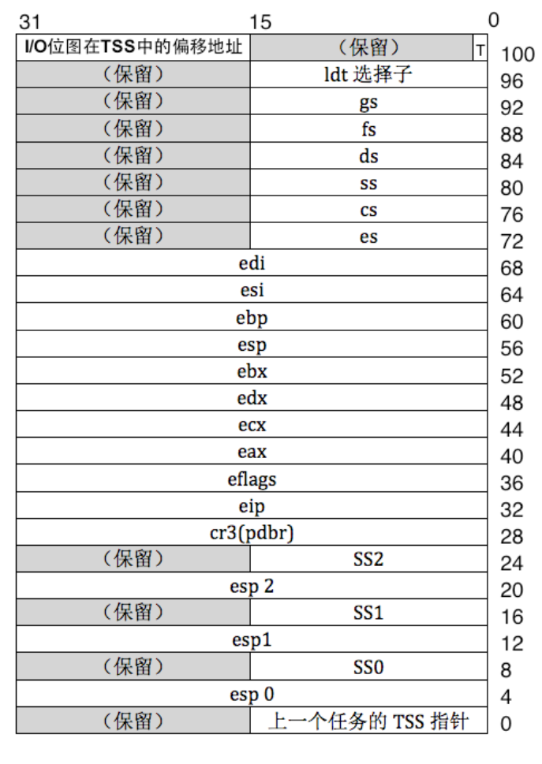
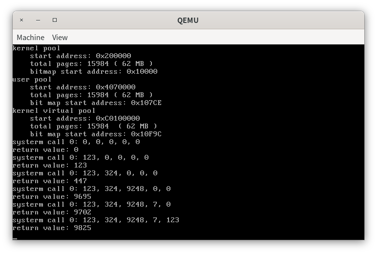
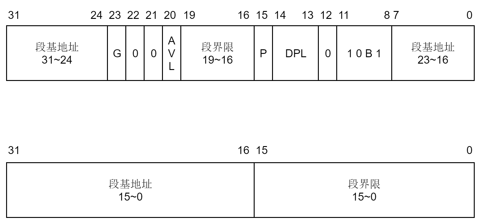
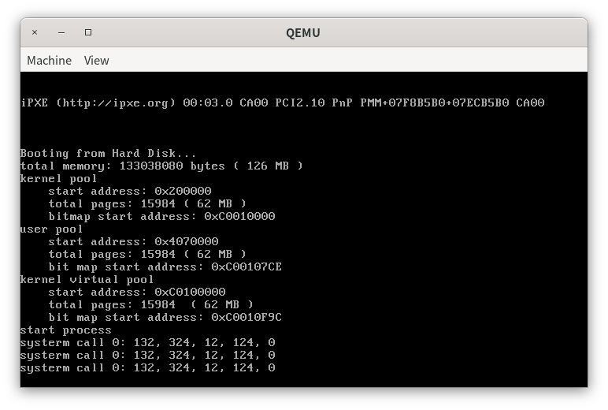
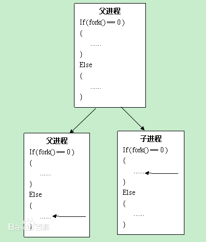
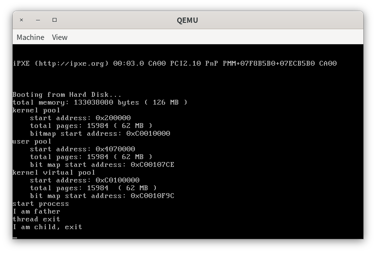
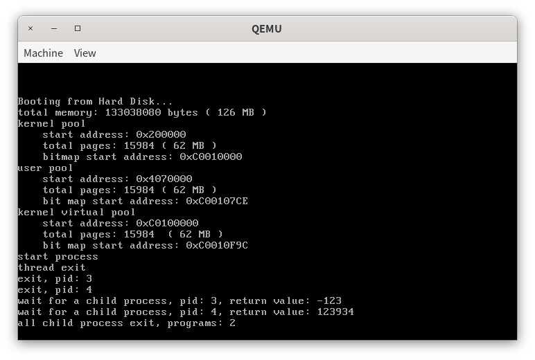

# 第七章 从内核态到用户态

> 不懂 Unix 的人注定最终还要重复发明一个蹩脚的 Unix。

# 实验概述

在本章中，我们首先会简单讨论保护模式下的特权级的相关内容。特权级保护是保护模式的特点之一，通过特权级保护，我们区分了内核态和用户态，从而限制用户态的代码对特权指令的使用或对资源的访问等。但是，用户态的代码有时不得不使用一些特权指令，如输入输出等。因此，我们介绍了系统调用的概念和如何通过中断来实现系统调用。通过系统调用，我们可以实现从用户态到内核态转移，然后在内核态下执行特权指令等，执行完成后返回到用户态。在实现了系统调用后，我们通过三步来创建了进程。这里，我们需要重点理解我们是如何通过分页机制来实现进程之间的虚拟地址空间的隔离。最后，我们介绍了fork/wait/exit的一种简洁的实现思路。

# 浅谈特权级

在本章中，我们将会实现从内核态到用户态和用户态到内核态的转移。在CPU中，CPU的特权级只有4个，分别为0，1，2，3。其中，从0到3，特权级依次降低。在本次实验中，我们只会用到两个特权级，0和3。因此，我们把CPU处在特权级0的状态称为内核态，把CPU处在特权级3的状态称为用户态。

为什么要区分内核态和用户态呢？因为我们的操作系统是支持多任务的，每一个任务都是一个独立的程序。如果我们任由这些程序能够使用特权代码，如访问硬件，修改其他任务的页目录表和页表，那么就会对系统的运行环境造成巨大的影响。因此，我们必须区分程序在什么环境下执行什么样的代码，例如只有当CPU处在内核态时才可以执行特权代码。

因此，当用户程序运行在用户态后，CPU无法执行特权代码。如果程序需要访问磁盘，那么程序首先需要进入内核态，然后CPU才能访问磁盘读写端口来访问磁盘，访问完毕后，CPU再从内核态返回到用户态。我们可以通过在用户态使用系统调用来实现从用户态向内核态转移。

实际上，内核态和用户态的划分是对程序访问资源的限制。代码是一种资源，数据和栈等也是一种资源。因此，内核态和用户态的划分也会对程序访问代码段、数据段和栈段中的数据造成限制。那么CPU是如何得知自己处于用户态还是内核态呢？CPU又是如何知道哪些代码、数据和栈等资源是特权代码，不允许用户态程序访问，哪些资源又是允许用户访问的呢？这就涉及到CPL、RPL、DPL和特权级检查的内容了。

我们首先来区分一些概念。

+ **RPL**，Request Privilege Level，段选择子的低2位所表示的值。
+ **CPL**，Current Privilege Level，在CS寄存器中的段选择子的RPL，CPL标识了CPU当前的特权级。
+ **DPL**，Descriptor Privilege Level，位于每一个段描述符中。
+  **一致性代码段**，简单理解，就是操作系统拿出来被共享的代码段，是可以被低特权级的用户直接调用访问的代码。在访问前后，特权级不会改变，用户态还是用户态，内核态还是内核态。具有这样的特点的代码段被称为一致性代码段。
+ **非一致代码段**，为了避免低特权级的访问而被操作系统保护起来的系统代码，只允许同级间访问，绝对禁止不同级访问，核心态不用用户态的资源，用户态也不使用核心态的资源。具有这样特点的代码段被称为非一致代码段。

在访问资源之前，CPU会做如下特权级检查。

+ 对于数据段和栈段，访问前进行特权级检查，要求$DPL \ge \max\{CPL, RPL\}$。
+ 对于代码段，如果是一致性代码段，要求$CPL\ge DPL$；对于非一致性代码段，要求$CPL=DPL$,$CPL\ge RPL$。

当我们想要从内核态进入用户态，或从用户态进入内核态时，我们就要进行特权级转移。特权级转移有两种方式，如下所示。

+ **从低特权级向高特权级转移**。从低特权级向高特权级转移是通过中断、调用等方式来实现的，但这里我们只使用中断的方式来实现特权级转移。程序通过使用`int`指令来调用指定的中断，然后中断描述符中的代码段选择子会被加载到CS寄存器中，从而改变了CPL，实现特权级转移。
+ **从高特权级向低特权级转移**。从高特权级转移向低特权级转移只能通过中断返回和调用返回来实现。

CPU在不同特权级下会使用不同的栈。当CPU使用中断从低特权级向高特权级转移的时候，CPU首先会从TSS（Task State Segment）中取出高特权级的段选择子和栈指针（即下图的esp0），然后将高特权级栈的段选择子和栈指针送入SS，ESP，最后将中断发生前的SS，ESP，EFLAGS、CS、EIP依次压入高特权级栈。

不同特权级栈的选择子和段指针被保存在TSS(Task State Segment)中，如下所示。



注意，TSS中只会保存特权级0，1，2的段选择子和栈指针（对应于上面所示的esp0、esp1和esp2），因为没有比特权级3更低的特权级向其转移。

TSS原本的作用不只是用于保存不同特权级栈的信息。实际上，CPU提供了原生的多任务切换机制。在CPU原生的多任务切换机制下，当任务被切换时，任务的状态被暂存在TSS中。因此，每一个任务都有一个TSS。但我们并不使用这个原生的机制，我们会将进程的状态保存在PCB中。

但是，当高特权级向低特权级转移时，我们并不需要给出低特权级栈的信息。因为CPU是禁止高特权级向低特权级转移的，只有一种情况除外，就是中断返回或任务返回，汇编命令是`iret`和`retf`。因此，CPU默认高特权级向低特权级转移的情况是中断或调用处理完成后返回。低特权级栈的信息在进入中断前被保存在高特权级栈中，因此执行`iret`后，低特权级栈的SS和ESP变可以被恢复。

**因此，同学们只需要记住一点，在我们实现用户进程的过程中，TSS的作用仅限于为CPU提供0特权级栈所在的地址和段选择子，即CPU只会用到TSS中的esp0和SS0**。

关于特权级的事情我们就点到为止，但这也足够我们去理解用户进程和进程调度的实现了。但在实现用户进程之前，我们需要实现系统调用。

# 系统调用的实现

操作系统为了限制程序访问特权资源，于是将程序的执行限制在特权级3下，称为用户态。但是，操作系统会向程序提供一系列服务的约定，如访问磁盘、内存分配和输入输出等。此时，为了使用这些服务，程序需要通过中断、调用等方式从用户态进入内核态，由操作系统内核来完成这些服务，然后再从内核态返回用户态，最后得到服务的结果。整个过程被称为系统调用，system call。

在第二章中，我们将代码段、数据段和栈段的段描述符中的DPL设置为0，从而表明这几个段是特权资源所在的段。注意，我们将这几个段设置为非一致性代码段。而非一致代码段要求CPL=DPL才能访问代码段，注意到我们实现的进程运行时的CPL=3，因此进程无法访问DPL=0的数据段和栈段。为了访问这些DPL=0的段，我们需要进行特权级转移，将RPL=0的段选择子送入CS。此时，CPL=0，因此可以访问DPL=0的段。这里，我们使用中断来实现特权级转移。此时，在我们的系统中，系统调用就是调用软中断、中断处理和中断返回这一过程。

我们现在来看看如何使用中断来实现系统调用。

> 代码放置在`src/1`下。

系统调用的入口函数声明如下。

```cpp
extern "C" int asm_system_call(int index, int first = 0, int second = 0, int third = 0, int forth = 0, int fifth = 0);
```

系统调用是操作系统向用户程序提供的一系列服务的约定，这些服务实际上是一个个的函数。这些函数的地址被统一放在系统调用表(system call table)中，函数参数`index`是用户程序希望调用的系统调用号，系统调用号是由操作系统向用户程序提供的。容易想到，系统调用号是处理系统调用的函数在系统调用表中的位置。

我们后面会知道，当进行系统调用时，系统调用的参数通过5个寄存器来传递。因此，系统调用的参数不可以超过5个。为什么我们不把参数放在栈上面呢？这是因为用户程序使用系统调用时会进行特权级转移。如果我们使用栈来传递参数，在我们调用系统调用的时候，系统调用的参数（即`asm_system_call`的参数）就会被保存在用户程序的栈中，也就是低特权级的栈中。系统调用发生后，我们从低特权级转移到高特权级，此时CPU会从TSS中加载高特权级的栈地址到esp寄存中。而C语言的代码在编译后会使用esp和ebp来访问栈的参数，但是前面保存参数的栈和现在期望取出函数参数而访问的栈并不是同一个栈，因此CPU无法在栈中找到函数的参数。为了解决这个问题，我们通过寄存器来传递系统调用的参数。

`asm_system_call`是通过汇编来实现的，如下所示。

```asm
asm_system_call:
    push ebp
    mov ebp, esp

    push ebx
    push ecx
    push edx
    push esi
    push edi
    push ds
    push es
    push fs
    push gs

    mov eax, [ebp + 2 * 4]
    mov ebx, [ebp + 3 * 4]
    mov ecx, [ebp + 4 * 4]
    mov edx, [ebp + 5 * 4]
    mov esi, [ebp + 6 * 4]
    mov edi, [ebp + 7 * 4]

    int 0x80

    pop gs
    pop fs
    pop es
    pop ds
    pop edi
    pop esi
    pop edx
    pop ecx
    pop ebx
    pop ebp

    ret
```

第5-20行，在调用中断前，我们先保护现场，将系统调用的参数放到5个寄存器ebx, ecx, edx, esi, edi中，将系统调用号放到eax中。

第22行，我们将系统调用的中断向量号定义为`0x80`。保护现场后，使用指令`int 0x80`调用`0x80`中断。`0x80`中断处理函数会根据保存在eax的系统调用号来调用不同的函数。

第24-33行，恢复现场。

然后，我们创建一个管理系统调用的类`SystemService`，如下所示，代码放在`syscall.h`中。

```cpp
#ifndef SYSCALL_H
#define SYSCALL_H

#include "os_constant.h"

class SystemService
{
public:
    SystemService();
    void initialize();
    // 设置系统调用，index=系统调用号，function=处理第index个系统调用函数的地址
    bool setSystemCall(int index, int function);
};

// 第0个系统调用
int syscall_0(int first, int second, int third, int forth, int fifth);

#endif
```

其中，`syscall_0`是我们第一个系统调用，其作用是打印输入的5个参数，最后返回这5个参数的和。然后，我们后面会在`src/kernel/setup.cpp`中实现这个函数。

在用户程序使用系统调用之前，我们首先要对系统调用表进行初始化。其次，由于我们的系统调用是通过0x80号中断来完成的，我们加入0x80中断对应的中断描述符。如下所示，代码放置在`src/kernel/syscall.cpp`中。

```cpp
void SystemService::initialize()
{
    memset((char *)system_call_table, 0, sizeof(int) * MAX_SYSTEM_CALL);
    // 代码段的选择子默认是DPL=0的平坦模式代码段选择子，
    // 但中断描述符的DPL=3，否则用户态程序无法使用该中断描述符
    interruptManager.setInterruptDescriptor(0x80, (uint32)asm_system_call_handler, 3);
}
```

第3行，我们已经知道，每一个系统调用号都有一个处理这个系统调用的函数，实际上就是操作系统向用户程序提供的服务的约定。这些系统调用的函数被统一放在系统调用表中，如下所示。

```cpp
int system_call_table[MAX_SYSTEM_CALL];
```

`system_call_table`中的每一个元素存放系统调用处理函数的地址。`MAX_SYSTEM_CALL`是内核提供的系统调用数量，我们设置为256。

第5行，我们希望通过0x80中断从特权级3(用户态)到特权级0(内核态)转移，因此中断描述符中的代码段选择子的RPL=0。注意到`InterruptManager::setInterruptDescriptor`默认中断描述符的代码段选择子是DPL=0的平坦模式代码段选择子，因此我们直接调用这个函数设置中断描述符即可。然后，我们需要设置中断描述符的DPL=3，否则会由于特权级保护导致用户程序无法使用这个中断。因为在执行中断时，CPU要求$CPL$不大于中断描述符的$DPL$。

`asm_system_call_handler`是0x80号中断的处理函数，如下所示。

```asm
asm_system_call_handler:
    push ds
    push es
    push fs
    push gs
    pushad

    push eax

    ; 栈段会从tss中自动加载

    mov eax, DATA_SELECTOR
    mov ds, eax
    mov es, eax

    mov eax, VIDEO_SELECTOR
    mov gs, eax

    pop eax

    ; 参数压栈
    push edi
    push esi
    push edx
    push ecx
    push ebx

    sti    
    call dword[system_call_table + eax * 4]
    cli

    add esp, 5 * 4
    
    mov [ASM_TEMP], eax
    popad
    pop gs
    pop fs
    pop es
    pop ds
    mov eax, [ASM_TEMP]
    
    iret
```

第2-6行，保护现场。

第8-19行，实际的系统调用处理函数是通过C语言来实现的。但是，由于中断发生后只是更改了cs寄存器，ds，es，fs和gs寄存器并未修改，因此在调用这些使用C语言实现的系统调用之前，我们需要手动修改这些段寄存器。

第22-26行，我们将保存在5个寄存器当中的系统调用函数压栈。

第28-20行。开中断，调用系统调用处理的函数。注意，系统调用号是保存在eax中的，`system_call_table`保存的是系统调用处理函数的地址，每一个元素占4个字节。因此`[system_call_table + eax * 4]`就是系统调用号对应的系统调用处理函数的地址。

系统调用处理函数返回后，函数的返回值会放在eax中。

第32行，修改esp寄存器。这行代码相当于将之前压入栈中的5个参数弹出栈。

第34行，因为eax保存了系统调用处理函数的返回值并且popad会修改eax的值，所以我们将eax保存在变量`ASM_TEMP`中，`ASM_TEMP`定义如下。

```assembly
ASM_TEMP dd 0
```

第34-40行，恢复现场，执行中断返回。

我们现在回到`SystemService`中，加入设置系统调用的函数。

```cpp
bool SystemService::setSystemCall(int index, int function)
{
    system_call_table[index] = function;
    return true;
}
```

其中，`function`是第`index`个系统调用的处理函数的地址。

我们在`src/kernel/setup.cpp`中加入第一个系统调用，系统调用号为0的系统调用，如下所示。

```cpp
int syscall_0(int first, int second, int third, int forth, int fifth)
{
    printf("systerm call 0: %d, %d, %d, %d, %d\n",
           first, second, third, forth, fifth);
    return first + second + third + forth + fifth;
}
```

设置系统调用号为0的系统调用处理函数，然后调用之，如下所示。

```cpp
extern "C" void setup_kernel()
{
	...

    // 初始化系统调用
    systemService.initialize();
    systemService.setSystemCall(0, (int)syscall_0);

    int ret;

    ret = asm_system_call(0);
    printf("return value: %d\n", ret);

    ret = asm_system_call(0, 123);
    printf("return value: %d\n", ret);

    ret = asm_system_call(0, 123, 324);
    printf("return value: %d\n", ret);

    ret = asm_system_call(0, 123, 324, 9248);
    printf("return value: %d\n", ret);

    ret = asm_system_call(0, 123, 324, 9248, 7);
    printf("return value: %d\n", ret);

    ret = asm_system_call(0, 123, 324, 9248, 7, 123);
    printf("return value: %d\n", ret);
	
    ...
}

```

编译运行，输出如下结果。



此时，我们便实现了系统调用，接下来我们创建进程。

# 进程的实现

> 代码在`src/2`下。

## 进程创建前的准备

我们已经知道，用户进程和内核线程最大的区别在于用户进程有自己的虚拟地址空间，而内核线程使用的是内核虚拟地址空间。从C语言程序的角度来看，每一个进程都是一个个包含了main函数的程序的执行体，虚拟地址从0开始，可以寻址到4GB的虚拟地址空间。但是，我们知道，我们将内核的0\~1MB的虚拟地址对应到物理地址的0\~1MB，倘若用户进程虚拟地址也是从0开始，那么不就与内核冲突了吗？其实不会的，奥秘就在于分页机制的使用。分页机制实际上就是一种多对一的映射关系，在不同的映射关系下，即使对于相同的虚拟地址，我们的页目录表和页表不同，那么CPU在寻址过程中得到的物理地址也就会不同。实际上，和内核一样，每一个进程都会有自己独立的页目录表和页表，在进程切换之后，页目录表也会随之切换。此时，即使是切换前后相同的虚拟地址，最终也可能得到不同的物理地址。

但是有时候，进程有不得不使用内核的资源，如在时钟中断阶段，我们需要调用`programManager.schedule()`来进行进程切换。此时，`programManager`的虚拟地址是0\~1MB，和进程的虚拟地址冲突了，说明进程无法找到处在虚拟地址0\~1MB的`programManager`。为此，我们的解决方案是，由于每一个进程都含有0\~4GB的虚拟地址空间，对每一个进程，我们单独地划分出3\~4GB的虚拟地址空间来作为共享的内核区域。然后通过分页机制，巧妙地将这部分虚拟地址变换到和虚拟地址0\~1MB相同的物理地址上，从而使得进程也能访问到内核的资源。

由于3\~4GB对应到页目录表的第768\~1023个页目录项，我们只要简单地使第0个页目录项和第768个页目录项相等，第1个页目录项和第769个页目录项相等......依此类推。而我们的内核很小，足以放在0\~1MB的内存当中，因此只要第0个页目录项和第768个页目录项相等即可。这就是我们在开启分页机制的函数最后所作的工作。此时，对于一个处在0\~1MB的虚拟地址`virutal`，其和`virtual+0xc0000000`的寻址结果相同。此时，我们便实现了在不占用进程0\~1MB的虚拟地址的前提下访问处于内核虚拟地址0\~1MB的资源。

注意，在进程中，我们是直接使用变量名`programmerManager`来访问其成员函数的，而程序在编译后的地址默认是相对于0的偏移地址。此时，为了使进程能够对`programmerManager`进行正确寻址，我们需要在链接时指定代码中的变量是相对于`0xc0000000`偏移的，我们将makefile修改如下。

```makefile
...

kernel.bin : kernel.o
	objcopy -O binary kernel.o kernel.bin
	
kernel.o : entry.obj $(OBJ)
	$(LINKER) -o kernel.o -melf_i386 -N entry.obj $(OBJ) -Ttext 0xc0020000 -e enter_kernel

...
```

其中，`-Ttext`参数本来是`0x20000`，现在我们将其提升到3GB的空间。

虽然内核的变量被提升到了3GB以上的空间，但我们实际上加载内核还是加载到`0x20000`处，只不过我们通过了分页机制将3GB以上的虚拟地址空间映射到0\~1MB的空间。因此，为了能够让CPU能够正确寻址，我们需要在跳转到内核之前就开启分页机制，也就是在bootloader中完成这个过程，如下所示。

我们先将开启分页机制的函数单独地放到`src/boot/page.cpp`中，如下所示。

```cpp
#include "os_constant.h"

extern "C" void open_page_mechanism()
{
    // 页目录表指针
    int *directory = (int *)PAGE_DIRECTORY;
    //线性地址0~4MB对应的页表
    int *page = (int *)(PAGE_DIRECTORY + PAGE_SIZE);
    int amount = PAGE_SIZE / 4;

    // 初始化页目录表
    for (int i = 0; i < amount; ++i)
    {
        directory[0] = 0;
        page[0] = 0;
    }

    int address = 0;
    // 将线性地址0~1MB恒等映射到物理地址0~1MB
    for (int i = 0; i < 256; ++i)
    {
        // U/S = 1, R/W = 1, P = 1
        page[i] = address | 0x7;
        address += PAGE_SIZE;
    }

    // 初始化页目录项

    // 0~1MB
    directory[0] = ((int)page) | 0x07;
    // 3GB的内核空间
    directory[768] = directory[0];
    // 最后一个页目录项指向页目录表
    directory[1023] = ((int)directory) | 0x7;
}
```

然后在bootloader中调用这个函数来开启分页机制。

```asm
...
call open_page_mechanism

mov eax, PAGE_DIRECTORY
mov cr3, eax ; 放入页目录表地址
mov eax, cr0
or eax, 0x80000000
mov cr0, eax           ; 置PG=1，开启分页机制

sgdt [pgdt]
add dword[pgdt + 2], 0xc0000000
lgdt [pgdt]

jmp dword CODE_SELECTOR:KERNEL_VIRTUAL_ADDRESS    ; 跳转到kernel
...
```

第10-12行，我们将内核提升到3GB空间后，之前保存在GDTR的GDT地址还是位于0\~1MB的空间中，因此我们要将其加上偏移量`0xc0000000`，然后再送入到GDTR中。否则，进程运行时无法找到段描述符导致出错。

最后我们跳转到`KERNEL_VIRTUAL_ADDRESS`，如下所示。

```cpp
; __________kernel_________
KERNEL_START_SECTOR equ 6
KERNEL_SECTOR_COUNT equ 145
KERNEL_START_ADDRESS equ 0x20000
KERNEL_VIRTUAL_ADDRESS equ 0xc0020000
```

最后删掉`bootloader.asm`开头的`org`伪指令，然后修改makefile中生成bootloader.bin的代码。

```makefile
...

bootloader.bin : $(SRCDIR)/boot/bootloader.asm 
	$(ASM_COMPILER) -o bootloader.o -g -f elf32 -I$(INCLUDE_PATH)/ $(SRCDIR)/boot/bootloader.asm
	$(CXX_COMPLIER) -o page.o $(CXX_COMPLIER_FLAGS) -I$(INCLUDE_PATH) -c $(SRCDIR)/boot/page.cpp
	$(LINKER) -o bootloader.obj -melf_i386 -N  bootloader.o page.o -Ttext 0x7e00 -e bootloader_start
	objcopy -O binary bootloader.obj bootloader.bin
	
...
```

我们将`os_constant.h`中的地址也提升到3GB以上的空间。

```cpp
#ifndef OS_CONSTANT_H
#define OS_CONSTANT_H

#define IDT_START_ADDRESS 0xc0008880

...
    
#define MEMORY_SIZE_ADDRESS 0xc0007c00    
#define BITMAP_START_ADDRESS 0xc0010000
#define KERNEL_VIRTUAL_START 0xc0100000

...

#endif
```

然后我们将显存访问地址提升到3GB以上的空间。

```cpp
void STDIO::initialize()
{
    screen = (uint8 *)0xc00b8000;
}
```

在`build`目录下，编译运行即可。

```shell
make clean && make && make run
```

结果如下。


此时我们就完成了进程创建前的准备。接下来，我们来初始化TSS。

## 初始化TSS和用户段描述符

我们首先向`ProgramManager`中加入存储3个代码段、数据段和栈段描述符的变量。

```cpp
class ProgramManager
{
public:
    List allPrograms;        // 所有状态的线程/进程的队列
    List readyPrograms;      // 处于ready(就绪态)的线程/进程的队列
    PCB *running;            // 当前执行的线程
    int USER_CODE_SELECTOR;  // 用户代码段选择子
    int USER_DATA_SELECTOR;  // 用户数据段选择子
    int USER_STACK_SELECTOR; // 用户栈段选择子
    ...
}
```

由于进程的运行环境需要用到TSS、特权级3下的平坦模式代码段和数据段描述符，我们现在来初始化这些内容，如下所示。

```cpp
void ProgramManager::initialize()
{
    allPrograms.initialize();
    readyPrograms.initialize();
    running = nullptr;

    for (int i = 0; i < MAX_PROGRAM_AMOUNT; ++i)
    {
        PCB_SET_STATUS[i] = false;
    }

    // 初始化用户代码段、数据段和栈段
    int selector;

    selector = asm_add_global_descriptor(USER_CODE_LOW, USER_CODE_HIGH);
    USER_CODE_SELECTOR = (selector << 3) | 0x3;

    selector = asm_add_global_descriptor(USER_DATA_LOW, USER_DATA_HIGH);
    USER_DATA_SELECTOR = (selector << 3) | 0x3;

    selector = asm_add_global_descriptor(USER_STACK_LOW, USER_STACK_HIGH);
    USER_STACK_SELECTOR = (selector << 3) | 0x3;

    initializeTSS();
}
```

第13-22行，我们向GDT中新增用户代码段描述符，数据段描述符和栈段描述符。这3个描述符和之前的描述符不同之处在于DPL。之前的描述符的DPL为0，而现在我们加入的3个描述符的DPL为3，如下所示。

```cpp
#define USER_CODE_LOW  0x0000ffff
#define USER_CODE_HIGH 0x00cff800

#define USER_DATA_LOW  0x0000ffff
#define USER_DATA_HIGH 0x00cff200

#define USER_STACK_LOW  0x00000000
#define USER_STACK_HIGH 0x0040f600
```

然后我们将这个几个段描述符送入GDT，如下所示。

```cpp
; int asm_add_global_descriptor(int low, int high);
asm_add_global_descriptor:
    push ebp
    mov ebp, esp

    push ebx
    push esi

    sgdt [ASM_GDTR]
    mov ebx, [ASM_GDTR + 2] ; GDT地址
    xor esi, esi
    mov si, word[ASM_GDTR] ; GDT界限
    add esi, 1

    mov eax, [ebp + 2 * 4] ; low
    mov dword [ebx + esi], eax
    mov eax, [ebp + 3 * 4] ; high
    mov dword [ebx + esi + 4], eax

    mov eax, esi
    shr eax, 3

    add word[ASM_GDTR], 8
    lgdt [ASM_GDTR]

    pop esi
    pop ebx
    pop ebp

    ret
```

`asm_add_global_descriptor`的作用是将给定的段描述符放入GDT，并更新GDTR的内容，最后返回段描述符在GDT的位置。

第9-13行，先读入GDTR的内容，然后找到GDT的起始地址和偏移地址。

第15-18行，在GDT的末尾新增一个段描述符。

第20-21行，计算段描述符在GDT的位置，并放入eax寄存器中。

第23-24行，将GDT的界限增加8并更新GDTR。

我们现在继续分析函数`ProgramManager::initialize`。

加入段描述符后，为了使加载这几个段描述符后的CPL=3，我们需要设置这几个段的段选择子的RPL=3，接下来我们初始化TSS。

当我们从低特权级向高特权级转移时，CPU首先会在TSS中找到高特权级栈的段选择子和栈指针，然后送入SS，ESP。此时，栈发生变化，此时的栈已经变成了TSS保存的高特权级的栈。接着，中断发生前的SS、ESP、EFLAGS、CS、EIP被依次压入了高特权级栈。TSS本来是用于CPU原生的进程切换的状态保存器，但我们并不打算使用CPU原生的进程切换方案，我们和Linux一样实现自己的进程切换方案。因此，TSS的作用仅限于向CPU提供进程特权级转移时的栈段选择子和栈指针。

按照TSS的图示，我们创建一个TSS的结构体，如下所示，代码保存在`include/tss.h`中。

```cpp
#ifndef TSS_H
#define TSS_H

struct TSS
{
public:
    int backlink;
    int esp0;
    int ss0;
    int esp1;
    int ss1;
    int esp2;
    int ss2;
    int cr3;
    int eip;
    int eflags;
    int eax;
    int ecx;
    int edx;
    int ebx;
    int esp;
    int ebp;
    int esi;
    int edi;
    int es;
    int cs;
    int ss;
    int ds;
    int fs;
    int gs;
    int ldt;
    int trace;
    int ioMap;
};
#endif
```

注意，TSS的内容必须如此安排，因为CPU规定了TSS中的内容。如果不做上述安排，当CPU加载TSS时就会加载到错误的数据。

我们在`src/kernel/setup.cpp`中定义这个TSS的实例，然后在`include/os_modules.h`中声明之，如下所示。

```cpp
...
    
// Task State Segment
TSS tss;

...
```

TSS 和其他段一样，本质上是一片存储数据的内存区域， Intel本来是想让操作系统使用这片内存区域保存任务的最新状态，因此它也像其他段那样，有对应的段描述符，称为TSS 描述符，如下所示。



这里，段基址的意思是TSS的起始地址，即`&tss`，段界限是TSS的实际长度减1，即`sizeof(TSS)-1`，其他的字段含义和普通的段描述符相同。注意，TSS描述符也是放在GDT中的。`B`位标识任务是否忙，0表示不忙，1表示忙。

CPU是在特权级转移的时候自动加载TSS的内容的，因此CPU需要有一个地方来保存TSS描述符的选择子，以便于CPU在发生特权级切换时能自动加载TSS中的内容。这个地方被称为TR寄存器。我们使用`ltr`将TSS的段选择子送入TR即可。

此时，TSS的初始化如下。

```cpp
void ProgramManager::initializeTSS()
{

    int size = sizeof(TSS);
    int address = (int)&tss;

    memset((char *)address, 0, size);
    tss.ss0 = STACK_SELECTOR; // 内核态堆栈段选择子

    int low, high, limit;

    limit = size - 1;
    low = (address << 16) | (limit & 0xff);
    // DPL = 0
    high = (address & 0xff000000) | ((address & 0x00ff0000) >> 16) | ((limit & 0xff00) << 16) | 0x00008900;

    int selector = asm_add_global_descriptor(low, high);
    // RPL = 0
    asm_ltr(selector << 3);
    tss.ioMap = address + size;
}
```

由于TSS的作用仅限于提供0特权级下的栈指针和栈段选择子，因此我们关心`TSS::ss0`和`TSS::esp0`。但在这里我们只对`TSS::ss0`进行复制，`TSS::esp0`会在进程切换时更新。

其中，`STACK_SELECTOR`是特权级0下的栈段选择子，也就是我们在bootloader中放入了SS的选择子。

```cpp
#define STACK_SELECTOR 0x10
```

接下来，我们便可以正式创建进程了。

## 进程的创建

进程和线程使用了PCB来保存其基本信息，如pid，栈等。但是，进程和线程的区别在于进程有自己的虚拟地址空间和相应的分页机制，也就是虚拟地址池和页目录表。我们先在PCB中新增如下内容。

```cpp
struct PCB
{
	...
    int pageDirectoryAddress;            // 页目录表地址
    AddressPool userVirtual;             // 用户程序虚拟地址池
};
```

我们开始创建进程，进程的创建分为3步。

+ **创建进程的PCB**。
+ **初始化进程的页目录表**。
+ **初始化进程的虚拟地址池**。

代码如下，我们分别来分析。

```cpp
int ProgramManager::executeProcess(const char *filename, int priority)
{
    bool status = interruptManager.getInterruptStatus();
    interruptManager.disableInterrupt();

    // 在线程创建的基础上初步创建进程的PCB
    int pid = executeThread((ThreadFunction)load_process,
                            (void *)filename, filename, priority);
    if (pid == -1)
    {
        interruptManager.setInterruptStatus(status);
        return -1;
    }

    // 找到刚刚创建的PCB
    PCB *process = ListItem2PCB(allPrograms.back()， tagInAllList);

    // 创建进程的页目录表
    process->pageDirectoryAddress = createProcessPageDirectory();
    if (!process->pageDirectoryAddress)
    {
        process->status = ThreadStatus::DEAD;
        interruptManager.setInterruptStatus(status);
        return -1;
    }

    // 创建进程的虚拟地址池
    bool res = createUserVirtualPool(process);

    if (!res)
    {
        process->status = ThreadStatus::DEAD;
        interruptManager.setInterruptStatus(status);
        return -1;
    }

    interruptManager.setInterruptStatus(status);

    return pid;
}
```

第7-13行，我们像创建一个线程一样创建进程的PCB。这里，创建线程的参数并不是进程的起始地址，而是加载进程的函数，这个我们后面再分析。如果进程创建失败，我们只要简单地将其标记为`DEAD`即可。

第16行，我们找到刚刚创建的PCB。根据`executeThread`的实现，一个新创建的PCB总是被放在`allPrograms`的末尾的。但是，这样做是存在风险的，我们应该通过pid来找到刚刚创建的PCB。

第19-25行，我们为进程创建页目录表。页目录表的创建和初始化通过`ProgramManager::createProcessPageDirectory`来实现，如下所示。

```cpp
int ProgramManager::createProcessPageDirectory()
{
    // 从内核地址池中分配一页存储用户进程的页目录表
    int vaddr = memoryManager.allocatePages(AddressPoolType::KERNEL, 1);
    if (!vaddr)
    {
        //printf("can not create page from kernel\n");
        return 0;
    }

    memset((char *)vaddr, 0, PAGE_SIZE);

    // 复制内核目录项到虚拟地址的高1GB
    int *src = (int *)(0xfffff000 + 0x300 * 4);
    int *dst = (int *)(vaddr + 0x300 * 4);
    for (int i = 0; i < 256; ++i)
    {
        dst[i] = src[i];
    }

    // 用户进程页目录表的最后一项指向用户进程页目录表本身
    ((int *)vaddr)[1023] = memoryManager.vaddr2paddr(vaddr) | 0x7;
    
    return vaddr;
}
```

第4-9行，我们从内核中分配一页来存储进程的页目录表。

第11-19行，从内核中分配的页的虚拟地址已经被提升到3GB以上的空间。为了使进程能够访问内核资源，根据之前的约定，我们令用户虚拟地址的3GB-4GB的空间指向内核空间。为此，我们需要将内核的第768\~1022个页目录项复制到进程的页目录表的相同位置。值得注意的是，我们需要构造出页目录表的第768\~1022个页目录项分别在内核页目录表和用户进程中的虚拟地址。

第22行，我们将最后一个页目录项指向用户进程页目录表物理地址，这是为了我们在切换到用户进程后，我们也能够构造出页目录项和页表项的虚拟地址。

现在，我们继续分析`ProgramManager::executeProcess`。

第28-35行，我们为进程创建虚拟地址池，如下所示。

```cpp
bool ProgramManager::createUserVirtualPool(PCB *process)
{
    int sourcesCount = (0xc0000000 - USER_VADDR_START) / PAGE_SIZE;
    int bitmapLength = ceil(sourcesCount, 8);

    // 计算位图所占的页数
    int pagesCount = ceil(bitmapLength, PAGE_SIZE);

    int start = memoryManager.allocatePages(AddressPoolType::KERNEL, pagesCount);

    if (!start)
    {
        return false;
    }

    memset((char *)start, 0, PAGE_SIZE * pagesCount);
    (process->userVirtual).initialize((char *)start, bitmapLength, USER_VADDR_START);

    return true;
}
```

这里，我们将用户进程的可分配的虚拟地址的定义在`USER_VADDR_START`和3GB之间，这是仿照linux的做法。

```cpp
#define USER_VADDR_START 0x8048000
```

第3-7行，我们计算这部分地址所占的页表的数量，从而计算出为了管理这部分地址所需的位图大小。

第9行，我们在内核空间中为进程分配位图所需的内存。

第16-17行，我们初始化用户虚拟地址池。

至此，进程的创建已经完成，我们现在来看`load_process`的作用。

进程就是程序的执行体。程序是放置在磁盘上的，当我们需要运行程序时，就需要将程序加载到内存，创建PCB和页目录表，然后调度进程执行。

但是，我们还没有实现文件系统，因此我们只是简单地给出进程要跳转执行的地址、创建PCB和页目录表。因此，和线程一样，filename只是某个函数的地址。但二者实际上是等价的。

在实现用户进程之前，我们运行在特权级0下。当我们调度用户进程上处理机时，用户进程运行在特权级3下，我们必然需要从高特权级向低特权级转移。前面我们提到，通常情况下，CPU不允许我们从高特权级向低特权级转移。实现高特权级向低特权级转移的唯一办法就是通过中断返回。我们可以通过`iret`指令强制将低特权级下的段选择子和栈送入段寄存器，从而实现了从高特权级别向低特权级转移，然后跳转到用户进程所在地址处执行。因此，在启动进程之前，我们需要将进程需要的段选择子等信息放入栈中。

为了方便表示，我们首先在`include/process.h`定义一个类`ProgramStartStack`来表示启动进程之前栈放入的内容。

```cpp
#ifndef PROCESS_H
#define PROCESS_H

struct ProcessStartStack
{
    int edi;
    int esi;
    int ebp;
    int esp_dummy;
    int ebx;
    int edx;
    int ecx;
    int eax;
    
    int gs;
    int fs;
    int es;
    int ds;

    int eip;
    int cs;
    int eflags;
    int esp;
    int ss;
};

#endif
```

`ProcessStartStack`内容的安排和我们后面使用`iret`来启动进程是密不可分的，然后我们初始化`ProcessStartStack`。

然后，我们修改`executeThread`，在PCB的顶部预留出`ProcessStartStack`的空间。

```cpp
int ProgramManager::executeThread(ThreadFunction function, void *parameter, const char *name, int priority)
{
...
    // 线程栈
    thread->stack = (int *)((int)thread + PAGE_SIZE - sizeof(ProcessStartStack));
    
...
}
```

当进程的PCB被首次加载到处理器执行时，CPU首先会进入`load_process`，`load_process`如下所示。

```cpp
void load_process(const char *filename)
{
    interruptManager.disableInterrupt();

    PCB *process = programManager.running;
    ProcessStartStack *interruptStack = (ProcessStartStack *)((int)process + PAGE_SIZE - sizeof(ProcessStartStack));

    interruptStack->edi = 0;
    interruptStack->esi = 0;
    interruptStack->ebp = 0;
    interruptStack->esp_dummy = 0;
    interruptStack->ebx = 0;
    interruptStack->edx = 0;
    interruptStack->ecx = 0;
    interruptStack->eax = 0;
    interruptStack->gs = 0;
    
    interruptStack->fs = programManager.USER_DATA_SELECTOR;
    interruptStack->es = programManager.USER_DATA_SELECTOR;
    interruptStack->ds = programManager.USER_DATA_SELECTOR;

    interruptStack->eip = (int)filename;
    interruptStack->cs = programManager.USER_CODE_SELECTOR;   // 用户模式平坦模式
    interruptStack->eflags = (0 << 12) | (1 << 9) | (1 << 1); // IOPL, IF = 1 开中断, MBS = 1 默认

    interruptStack->esp = memoryManager.allocatePages(AddressPoolType::USER, 1);
    if (interruptStack->esp == 0)
    {
        printf("can not build process!\n");
        process->status = ThreadStatus::DEAD;
        asm_halt();
    }
    interruptStack->esp += PAGE_SIZE;
    interruptStack->ss = programManager.USER_STACK_SELECTOR;

    asm_start_process((int)interruptStack);
}
```

第3-26行，关中断，然后初始化启动进程需要的栈结构。

第26行，进程是运行在特权级3下的，每一个特权级都有自己的栈。因此，我们在进程虚拟地址空间中分配一页来作为进程的特权级3栈。我们后面可以看到，进程的特权级0栈在进程的PCB中。

在用户进程中，我们需要进程内存分配和释放。这部分内存是来源于用户虚拟空间和用户物理空间的。因此，我们需要对页内存分配和释放的函数稍作修改，使得我们可以分配和释放用户空间的页内存。

```cpp
int MemoryManager::allocateVirtualPages(enum AddressPoolType type, const int count)
{
    int start = -1;

    if (type == AddressPoolType::KERNEL)
    {
        start = kernelVirtual.allocate(count);
    } else if (type == AddressPoolType::USER){
        start = programManager.running->userVirtual.allocate(count);
    }

    return (start == -1) ? 0 : start;
}

void MemoryManager::releaseVirtualPages(enum AddressPoolType type, const int vaddr, const int count)
{
    if (type == AddressPoolType::KERNEL)
    {
        kernelVirtual.release(vaddr, count);
    }
    else if (type == AddressPoolType::UESR)
    {
        programManager.running->userVirtual.release(vaddr, count);
    }
}
```

第24行，我们定义进程启动时的`eflags`结构，我们将IOPL设置为0，意味着进程无法直接访问IO端口，由此实现用户态程序无法自由地访问硬件。

第36行，我们通过中断返回来启动进程，如下所示。

```asm
; void asm_start_process(int stack);
asm_start_process:
    ;jmp $
    mov eax, dword[esp+4]
    mov esp, eax
    popad
    pop gs;
    pop fs;
    pop es;
    pop ds;

    iret
```

我们将`ProcessStartStack`的起始地址送入了esp，然后通过一系列的pop指令和iret语句更新寄存器，最后中断返回后，特权级3的选择子被放入到段寄存器中，代码跳转到进程的起始处执行。

用户进程和内核线程使用的是不同的代码段、数据段和栈段选择子。我们之前在实现基于时钟中断的调度时，并没有对`ds,fs,es,gs`寄存器进行保护和恢复。所以，当我们在内核线程和用户进程之前切换的时候，上面提到的4个寄存器可能没有被切换到用户进程或内核线程使用的`ds,fs,es,gs`。但对于`cs,ss`，CPU会自动保护和恢复。为了解决这个问题，我们修改`asm_time_interrupt_handler`，加入保护和恢复`ds,fs,es,gs`的代码。

```assembly
asm_time_interrupt_handler:
    pushad
    push ds
    push es
    push fs
    push gs

    ; 发送EOI消息，否则下一次中断不发生
    mov al, 0x20
    out 0x20, al
    out 0xa0, al
    
    call c_time_interrupt_handler

    pop gs
    pop fs
    pop es
    pop ds
    popad
    iret
```

至此，我们便完成了进程的启动，实现了从内核态到用户态的变化。

# 进程的调度

> 代码在`src/3`下。

我们接下来完成进程的调度部份，进程的调度只需要在原先的线程调度的基础上加入如下部份。

+ 切换页目录表。
+ 更新TSS中的特权级0的栈。

如下所示。

```cpp
void ProgramManager::schedule()
{
     ...
         
    activateProgramPage(next);

    asm_switch_thread(cur, next);

    interruptManager.setInterruptStatus(status);
}

void ProgramManager::activateProgramPage(PCB *program)
{
    int paddr = PAGE_DIRECTORY;

    if (program->pageDirectoryAddress)
    {
        tss.esp0 = (int)program + PAGE_SIZE;
        paddr = memoryManager.vaddr2paddr(program->pageDirectoryAddress);
    }

    asm_update_cr3(paddr);
}
```

比较简单，本教程便不再赘述。至此，我们已经实现了用户进程。接下来，我们创建进程。

> 特别注意，我们还没有实现进程的返回，因此我们需要在进程的结束处加入死循环来阻止进程返回。

# 第一个进程

> 代码在`src/3`下。

我们创建第一个进程，这个进程会调用之前的系统调用0，如下所示。

```cpp
void first_process()
{
    asm_system_call(0, 132, 324, 12, 124);
    asm_halt();
}

void first_thread(void *arg)
{
    printf("start process\n");
    programManager.executeProcess((const char *)first_process, 1);
    programManager.executeProcess((const char *)first_process, 1);
    programManager.executeProcess((const char *)first_process, 1);
    asm_halt();
}

extern "C" void setup_kernel()
{

    // 中断管理器
    interruptManager.initialize();
    interruptManager.enableTimeInterrupt();
    interruptManager.setTimeInterrupt((void *)asm_time_interrupt_handler);

    // 输出管理器
    stdio.initialize();

    // 进程/线程管理器
    programManager.initialize();

    // 内存管理器
    memoryManager.initialize();

    // 初始化系统调用
    systemService.initialize();
    // 设置0号系统调用
    systemService.setSystemCall(0, (int)syscall_0);

    // 创建第一个线程
    int pid = programManager.executeThread(first_thread, nullptr, "first thread", 1);
    if (pid == -1)
    {
        printf("can not execute thread\n");
        asm_halt();
    }

    ListItem *item = programManager.readyPrograms.front();
    PCB *firstThread = ListItem2PCB(item,tagInGeneralList);
    firstThread->status = RUNNING;
    programManager.readyPrograms.pop_front();
    programManager.running = firstThread;
    asm_switch_thread(0, firstThread);

    asm_halt();
}

```

然后编译运行，输出如下信息。



至此，我们成功地实现了用户进程。

# 加入更多的系统调用

在“第一个进程”一节，如果我们给`first_process`加入如下代码

```cpp
void first_process()
{
    printf("Hello World!");
    asm_system_call(0, 132, 324, 12, 124);
    asm_halt();
}
```

则会发现qemu窗口发生闪退。这是因为我们指令执行出现了问题。我们在启动进程的过程中，设置了`eflags`中的`IOPL`为0。`IOPL=0`表示只有特权级0下的代码才可以访问显存，而进程运行在特权级3下。但是，我们又必须要在进程中使用`printf`。这时，我们可以通过系统调用的方式，从用户态进入内核态，然后在内核态将需要显示的字符写入显存，最后返回到用户态即可。此时，我们便可以实现在进程中使用`printf`输出字符。

这部分的内容留给同学们作为习题。

# fork

## 概述

在unix或类unix的操作系统中，fork函数用于将运行中的进程分成两个（几乎）完全一样的进程，每个进程会从fork的返回点开始执行。

fork函数，顾名思义，其执行逻辑形如叉子。一个简单的叉子由两部分组成，一个长柄和两个短柄。我们不妨把程序的起始点当成是长柄的末端，把fork的点当成是长柄和短柄的连接点，柄就相当于代码执行流。在连接点之前，只有一个长柄，也就是只有一个执行流。但是在fork之后，出现了两个完全相同的短柄，也就是有两个完全相同的代码执行流。这就是fork函数的形象化解释。



fork是一个系统调用，用于创建一个新进程。被创建的进程称为子进程，调用fork的进程被称为父进程。前面已经提到，子进程是父进程的副本。父子进程共享代码段，但对于数据段、栈段等其他资源，父进程调用的fork函数会将这部分资源完全复制到子进程中。因此，对于这部分资源，父子进程并不共享。

创建新的子进程后，两个进程将从fork的返回点开始执行。这就是fork最精妙的地方，因为我们只调用了fork一次，fork却能够返回两次。同时，在父子进程的fork返回点中，fork返回的结果是不一样的，fork返回值如下。

+ 在父进程中，fork返回新创建子进程的进程ID。
+ 在子进程中，fork返回0。
+ 如果出现错误，fork返回一个负值。

为了进一步理解fork，我们来考虑如下实例代码。注意，下面的代码需要在Linux系统下编译运行。

```cpp
#include <unistd.h>
#include <sys/types.h>
#include <cstdio>
#include <cstdlib>

int main()
{
    printf("call fork\n");

    pid_t pid = fork();
    if (pid < 0)
    {
        printf("fork error\n");
        exit(-1);
    }

    printf("fork return\n");

    if (pid)
    {
        printf("father fork return: %d\n", pid);
    }
    else
    {
        printf("child fork return: %d\n", pid);
    }
}
```

我们编译运行，结果如下。

```shell
nelson@UX430UNR:~/oslab/tmp$ g++ main.cpp
nelson@UX430UNR:~/oslab/tmp$ ./a.out
call fork
fork return
father fork return: 40706
fork return
child fork return: 0
```

可以看到，fork确实是调用一次返回两次。在父进程中，父进程得到的是子进程的pid，40706；在子进程中，子进程得到的是0。

理解了fork的用途后，我们接下来实现fork。

## 四个关键问题

fork的实现可以细化为4个问题的解决。

1. 如何实现父子进程的代码段共享？
2. 如何使得父子进程从相同的返回点开始执行？
3. 除代码段外，进程包含的资源有哪些？
4. 如何实现进程的资源在进程之间的复制？

我们带着上面4个问题来学习fork的实现。

## fork的实现

> 代码在`src/4`下。

我们首先在PCB中加入父进程pid这个属性。

```cpp
struct PCB
{
	...
    int parentPid;            // 父进程pid
};
```

fork是一个系统调用。为此，我们首先在`include/syscall.h`中加入fork系统调用和系统调用处理函数的定义。

```cpp
#ifndef SYSCALL_H
#define SYSCALL_H

...

// 第2个系统调用, fork
int fork();
int syscall_fork();

#endif
```

在`src/kernel/setup.cpp`中设置这个系统调用。

```cpp
...
    
extern "C" void setup_kernel()
{
	...
        
    // 设置2号系统调用
    systemService.setSystemCall(2, (int)syscall_fork);
	
    ...

```

在`src/kernel/syscall.cpp`中实现fork系统调用。

```cpp
int fork() {
    return asm_system_call(2);
}

int syscall_fork() {
    return programManager.fork();
}
```

进入内核态后，fork的实现通过`ProgramManager::fork`来完成。

```cpp
int ProgramManager::fork()
{
    bool status = interruptManager.getInterruptStatus();
    interruptManager.disableInterrupt();

    // 禁止内核线程调用
    PCB *parent = this->running;
    if (!parent->pageDirectoryAddress)
    {
        interruptManager.setInterruptStatus(status);
        return -1;
    }

    // 创建子进程
    int pid = executeProcess("", 0);
    if (pid == -1)
    {
        interruptManager.setInterruptStatus(status);
        return -1;
    }

    // 初始化子进程
    PCB *child = ListItem2PCB(this->allPrograms.back(), tagInAllList);
    bool flag = copyProcess(parent, child);

    if (!flag)
    {
        child->status = ProgramStatus::DEAD;
        interruptManager.setInterruptStatus(status);
        return -1;
    }

    interruptManager.setInterruptStatus(status);
    return pid;
}
```

第6-12行，fork是进程的系统调用，因此我们禁止内核线程调用。因为内核线程并没有设置`PCB::pageDirectoryAddress`，所以该项为0。相反，进程有页目录表，所以该项不为0。因此，我们通过判断`PCB::pageDirectoryAddress`是否为0来判断当前执行的是线程还是进程。

第14-20行，我们调用`ProgramManager::executeProcess`来创建一个子进程。

第23-24行，我们找到刚刚创建的子进程，然后调用`ProgramManager::copyProcess`来复制父进程的资源到子进程中。

接下来，我们来研究fork实现最关键的部分——资源的复制，即函数`ProgramManager::copyProcess`。`copyProcess`有点长，我们分步来看。

我们首先回答第三个问题——除代码段外，进程包含的资源有哪些？在我们的操作系统中，进程包含的资源有0特权级栈，PCB、虚拟地址池、页目录表、页表及其指向的物理页。

首先，我们复制父进程的0特权级栈到子进程中。为此，我们首先需要找到父进程的0特权级栈的地址。

当我们调用fork系统调用后，我们会从用户态进入内核态。进入点就是`asm_system_call`中的`int 0x80`语句。接着，由于特权级发生了变化，CPU会将进程的0特权级栈的地址送入esp。CPU送入esp的值是在将当前进程调度上的CPU执行时，通过`rogramManager::activateProgramPage`放入了TSS的。

```cpp
void ProgramManager::activateProgramPage(PCB *program)
{
...
        tss.esp0 = (int)program + PAGE_SIZE;
...
}
```

从代码中我们可以看到，进程的0特权级栈实际上是从进程的PCB所在的页的顶部向下扩展。在进程中，`asm_system_call`执行到`int 0x80`后，esp存放的内容变成了进程的PCB所在的页的顶部的地址。然后，CPU将中断发生前的SS，ESP，EFLAGS、CS、EIP送入栈中。接着，代码跳转到了函数`asm_system_call_handler`

```assembly
asm_system_call_handler:
    push ds
    push es
    push fs
    push gs
    pushad
    
    ...
```

`asm_system_call_handler`将`ds`，`es`，`fs`，`gs`和其他数据寄存器压栈。执行完pushad后，从进程的0特权级栈的栈顶到esp之间的内容恰好对应于`ProgramStartStack`的内容。虽然后面我们在`asm_system_call_handler`后会跳转到`ProgramManager::fork`和`ProgramManager::copyProcess`执行，但是这是父进程为了创建子进程而做的工作，应该对子进程透明。因此，在父进程的0特权级栈中，子进程真正关心的部分应该是`asm_system_call_handler`的返回地址和执行`asm_system_call_handler`前保护的现场。

这一点是我们实现父子进程从相同的fork返回点处返回的关键。

所以，我们需要复制的父进程0特权栈的起始地址只是进程的PCB所在的页的顶部减去一个`ProgramStartStack`的大小，长度便是一个`ProgramStartStack`的大小。这就是`copyProcess`开头的语句。我们实际上就是把在中断的那一刻保存的寄存器的内容复制到子进程的0特权级栈中。

```cpp
    // 复制进程0级栈
    ProcessStartStack *childpss =
        (ProcessStartStack *)((int)child + PAGE_SIZE - sizeof(ProcessStartStack));
    ProcessStartStack *parentpss =
        (ProcessStartStack *)((int)parent + PAGE_SIZE - sizeof(ProcessStartStack));
    memcpy(parentpss, childpss, sizeof(ProcessStartStack));
    // 设置子进程的返回值为0
    childpps->eax = 0;
```

第8行，我们将子进程的eax设置为0，使得在子进程中的fork返回值为0。

我们继续分析这样做的目的。我们希望在执行fork后，父子进程从相同的点返回。为此，我们需要先将父进程暂停在某个位置，然后令子进程跳转到父进程暂停后的返回点。注意到`ProgramStartProcess`中保存了父进程的`eip`，`eip`的内容也是`asm_system_call_handler`的返回地址。我们后面可以看到，我们会通过`asm_start_process`来启动子进程。此时，`asm_start_process`的最后的`iret`会将上面说到的保存在0特权级栈的`eip`的内容送入到`eip`中。执行完`eip`后，子进程便可以从父进程的返回点处开始执行，即`asm_system_call_handler`的返回地址。然后子进程依次返回到`syscall_fork`，`asm_system_call_handler`，最终从`fork`返回。由于我们后面会复制父进程的3特权级栈到子进程的3特权级栈中，而3特权级栈保存了父进程在执行`int 0x80`后的逐步返回的返回地址。因此，父子进程的逐步返回的地址是相同的，从而实现了在执行fork后，父子进程从相同的点返回。这就是第二个问题的答案。

为了实现父子进程的执行逻辑相同，我们需要实现父子进程的代码共享。我们使用了函数来模拟一个进程，而函数的代码是放在内核中的，进程又划分了3GB\~4GB的空间来实现内核共享，因此进程的代码天然就是共享的。此时，我们便回答了第一个问题。

接着，我们继续初始化子进程的0特权级栈。

```cpp
    // 准备执行asm_switch_thread的栈的内容
    child->stack = (int *)childpss - 7;
    child->stack[0] = 0;
    child->stack[1] = 0;
    child->stack[2] = 0;
    child->stack[3] = 0;
    child->stack[4] = (int)asm_start_process;
    child->stack[5] = 0;             // asm_start_process 返回地址
    child->stack[6] = (int)childpss; // asm_start_process 参数
```

这样做是为了和`asm_switch_thread`的过程对应起来。当子进程被调度执行时，子进程能够从`asm_switch_thread`跳转到`asm_start_proces`处执行。

接着，我们设置子进程的PCB、复制父进程的管理虚拟地址池的bitmap到子进程的管理虚拟地址池的bitmap。

```cpp
    // 设置子进程的PCB
    child->status = ProgramStatus::READY;
    child->parentPid = parent->pid;
    child->priority = parent->priority;
    child->ticks = parent->ticks;
    child->ticksPassedBy = parent->ticksPassedBy;
    strcpy(parent->name, child->name);

    // 复制用户虚拟地址池
    int bitmapLength = parent->userVirtual.resources.length;
    int bitmapBytes = ceil(bitmapLength, 8);
    memcpy(parent->userVirtual.resources.bitmap, child->userVirtual.resources.bitmap, bitmapBytes);
```

然后，我们从内核中分配一页来作为数据复制的中转页。

```cpp
    // 从内核中分配一页作为中转页
    char *buffer = (char *)memoryManager.allocatePages(AddressPoolType::KERNEL, 1);
    if (!buffer)
    {
        child->status = ProgramStatus::DEAD;
        return false;
    }
```

为什么需要这个中转页呢？因为父子进程使用的是相同的代码。既然代码是相同的，则使用的虚拟地址也是相同的。二者不发生冲突的原因在于分页机制。通过分页机制，我们可以将相同的虚拟地址映射到不同的物理地址中。但是这会带来一个问题。既然分页机制实现了地址隔离，父进程就无法将数据复制到具有相同虚拟地址的子进程中。因此，我们需要借助于内核空间的中转页。我们首先在父进程的虚拟地址空间下将数据复制到中转页中，再切换到子进程的虚拟地址空间中，然后将中转页复制到子进程对应的位置。如此，我们便回答了最后一个问题，即第四个问题。

然后，我们先将父进程的页目录表复制到子进程中。

```cpp
    // 子进程页目录表物理地址
    int childPageDirPaddr = memoryManager.vaddr2paddr(child->pageDirectoryAddress);
    // 父进程页目录表物理地址
    int parentPageDirPaddr = memoryManager.vaddr2paddr(parent->pageDirectoryAddress);
    // 子进程页目录表指针(虚拟地址)
    int *childPageDir = (int *)child->pageDirectoryAddress;
    // 父进程页目录表指针(虚拟地址)
    int *parentPageDir = (int *)parent->pageDirectoryAddress;

    // 子进程页目录表初始化
    memset((void *)child->pageDirectoryAddress, 0, 768 * 4);

    // 复制页目录表
    for (int i = 0; i < 768; ++i)
    {
        // 无对应页表
        if (!(parentPageDir[i] & 0x1))
        {
            continue;
        }

        // 从用户物理地址池中分配一页，作为子进程的页目录项指向的页表
        int paddr = memoryManager.allocatePhysicalPages(AddressPoolType::USER, 1);
        if (!paddr)
        {
            child->status = ProgramStatus::DEAD;
            return false;
        }
        // 页目录项
        int pde = parentPageDir[i];
        // 构造页表的起始虚拟地址
        int *pageTableVaddr = (int *)(0xffc00000 + (i << 12));

        asm_update_cr3(childPageDirPaddr); // 进入子进程虚拟地址空间

        childPageDir[i] = (pde & 0x00000fff) | paddr;
        memset(pageTableVaddr, 0, PAGE_SIZE);

        asm_update_cr3(parentPageDirPaddr); // 回到父进程虚拟地址空间
    }
```

第17-20行，我们首先检查目录项是否有对应的页表。

第23-28行，页目录项有指向的页表的前提下。我们从用户物理空间中分配一个物理页作为页目录项指向的页表。

第34行，我们切换到子进程的虚拟地址空间。

第36-37行，我们设置子进程页目录表的页目录项，然后初始化页目录项指向的页表。特别注意，切换到子进程的虚拟空间后，`pageTableVaddr`在解析到物理地址时使用的是子进程的页目录表。

第39行，我们切换到父进程的虚拟地址空间。

处理完子进程的页目录表后，我们复制页表和物理页的数据。

```cpp
    // 复制页表和物理页
    for (int i = 0; i < 768; ++i)
    {
        // 无对应页表
        if (!(parentPageDir[i] & 0x1))
        {
            continue;
        }

        // 计算页表的虚拟地址
        int *pageTableVaddr = (int *)(0xffc00000 + (i << 12));

        // 复制物理页
        for (int j = 0; j < 1024; ++j)
        {
            // 无对应物理页
            if (!(pageTableVaddr[j] & 0x1))
            {
                continue;
            }

            // 从用户物理地址池中分配一页，作为子进程的页表项指向的物理页
            int paddr = memoryManager.allocatePhysicalPages(AddressPoolType::USER, 1);
            if (!paddr)
            {
                child->status = ProgramStatus::DEAD;
                return false;
            }

            // 构造物理页的起始虚拟地址
            void *pageVaddr = (void *)((i << 22) + (j << 12));
            // 页表项
            int pte = pageTableVaddr[j];
            // 复制出父进程物理页的内容到中转页
            memcpy(pageVaddr, buffer, PAGE_SIZE);

            asm_update_cr3(childPageDirPaddr); // 进入子进程虚拟地址空间

            pageTableVaddr[j] = (pte & 0x00000fff) | paddr;
            // 从中转页中复制到子进程的物理页
            memcpy(buffer, pageVaddr, PAGE_SIZE);

            asm_update_cr3(parentPageDirPaddr); // 回到父进程虚拟地址空间
        }
    }
```

第14-45行，在页目录项指向的页表存在的前提下，我们复制页表项和物理页。

第17-20行，我们检查页表项指向的页表是否存在。

第23-28行，在页表项指向的页表存在前提下，我们从用户物理地址池中分配一页，作为子进程的页表项指向的物理页。

第35行，我们复制父进程的物理页的数据到中转页中。

第37行，我们切换到子进程的虚拟地址空间。

第41行，我们设置页表项，然后从中转页中复制数据到子进程的物理页中。

第43行，我们切换到父进程的虚拟地址空间。

最后，我们归还中转页，返回子进程的pid。

```cpp
    // 归还从内核分配的中转页
    memoryManager.releasePages(AddressPoolType::KERNEL, (int)buffer, 1);
    return true;
```

代码中的`memcpy`函数的实现放置在`src/utils/stdlib.cpp`中。

如此，我们便实现了fork。

接下来我们来测试fork，我们对`src/kernel/setup.cpp`做如下修改。

```cpp
void first_process()
{
    int pid = fork();

    if (pid == -1)
    {
        printf("can not fork\n");
    }
    else
    {
        if (pid)
        {
            printf("I am father, fork reutrn: %d\n", pid);
        }
        else
        {
            printf("I am child, fork return: %d, my pid: %d\n", pid, 
                   programManager.running->pid);
        }
    }

    asm_halt();
}

void first_thread(void *arg)
{

    printf("start process\n");
    programManager.executeProcess((const char *)first_process, 1);
    asm_halt();
}
```

编译运行，结果如下。


从结果可以看到，我们已经成功实现了fork。

# exit

> 代码放置在`src/5`下。

有时候进程或线程在执行过程中希望主动结束运行，此时，我们就需要用到系统调用exit。exit用于进程和线程的主动结束运行，如下所示，代码放置在`include/syscall.h`。

```cpp
// 第3个系统调用, exit
void exit(int ret);
void syscall_exit(int ret);
```

其中，`ret`参数表示返回值。

在进程或线程调用exit后，我们会释放其占用的所有资源，只保留PCB。此时线程或进程的状态被标记为`DEAD`。进程或线程的PCB由专门的线程或进程来回收。在PCB被回收之前的`DEAD`线程或进程也被称为僵尸线程或僵尸进程。

注意到我们调用exit时提供了返回值，返回值的处理是在线程或进程的PCB回收时进行的。但是，线程或进程除PCB以外的资源都被释放了，那么返回值放置在哪里呢？我们很容易地想到，返回值是放置在PCB中的。因此，我们为PCB加入存放返回值的属性。

```cpp
struct PCB
{
	...
    int retValue;             // 返回值
};
```

我们现在来实现上面两个函数。

```cpp
void exit(int ret) {
    asm_system_call(3, ret);
}

void syscall_exit(int ret) {
    programManager.exit(ret);
}
```

exit的实现实际上是通过`ProgramManager::exit`来完成的，总的来看，exit的实现主要分为三步。

1. 标记PCB状态为`DEAD`并放入返回值。
2. 如果PCB标识的是进程，则释放进程所占用的物理页、页表、页目录表和虚拟地址池bitmap的空间。否则不做处理。
3. 立即执行线程/进程调度。

如下所示。

```cpp
void ProgramManager::exit(int ret)
{
    // 关中断
    interruptManager.disableInterrupt();
    
    // 第一步，标记PCB状态为`DEAD`并放入返回值。
    PCB *program = this->running;
    program->retValue = ret;
    program->status = ProgramStatus::DEAD;

    int *pageDir, *page;
    int paddr;

    // 第二步，如果PCB标识的是进程，则释放进程所占用的物理页、页表、页目录表和虚拟地址池bitmap的空间。
    if (program->pageDirectoryAddress)
    {
        pageDir = (int *)program->pageDirectoryAddress;
        for (int i = 0; i < 768; ++i)
        {
            if (!(pageDir[i] & 0x1))
            {
                continue;
            }

            page = (int *)(0xffc00000 + (i << 12));

            for (int j = 0; j < 1024; ++j)
            {
                if(!(page[j] & 0x1)) {
                    continue;
                }

                paddr = memoryManager.vaddr2paddr((i << 22) + (j << 12));
                memoryManager.releasePhysicalPages(AddressPoolType::USER, paddr, 1);
            }

            paddr = memoryManager.vaddr2paddr((int)page);
            memoryManager.releasePhysicalPages(AddressPoolType::USER, paddr, 1);
        }

        memoryManager.releasePages(AddressPoolType::KERNEL, (int)pageDir, 1);
        
        int bitmapBytes = ceil(program->userVirtual.resources.length, 8);
        int bitmapPages = ceil(bitmapBytes, PAGE_SIZE);

        memoryManager.releasePages(AddressPoolType::KERNEL,
                                   (int)program->userVirtual.resources.bitmap, 
                                   bitmapPages);

    }

    // 第三步，立即执行线程/进程调度。
    schedule();
}
```

代码比较简单，实际上可以看成是`copyProcess`的部分逆过程，这里便不再赘述。

上面说到的是主动调用exit的情况。我们看到，线程在退出的时候可以自动调用`program_exit`返回，而我们一直在强调进程还没有实现返回机制，所以需要在进程的末尾加上`asm_halt`来阻止进程返回。但是，我们已经实现了进程退出函数exit。那么进程有没有办法像线程一样在函数结束后主动调用exit来结束运行呢？答案是肯定的，我们只要在进程的3特权级栈的顶部放入exit的地址和参数即可，当执行进程的函数退出后就会主动跳转到exit。

为此，我们需要修改`load_process`，如下所示。

```cpp
void load_process(const char *filename)
{
	...

    interruptStack->esp = memoryManager.allocatePages(AddressPoolType::USER, 1);
    if (interruptStack->esp == 0)
    {
        printf("can not build process!\n");
        process->status = ProgramStatus::DEAD;
        asm_halt();
    }
    interruptStack->esp += PAGE_SIZE;
    
    // 设置进程返回地址
    int *userStack = (int *)interruptStack->esp;
    userStack -= 3;
    userStack[0] = (int)exit;
    userStack[1] = 0;
    userStack[2] = 0;

    interruptStack->esp = (int)userStack;

	...
}

```

第17行，我们在进程的3特权级栈中的栈顶处`userStack[0]`放入exit的地址，然后CPU会认为`userStack[1]`是exit的返回地址，`userStack[2]`是exit的参数。

此时，我们修改`src/kernel/setup.cpp`来测试。

```cpp
void first_process()
{
    int pid = fork();

    if (pid == -1)
    {
        printf("can not fork\n");
        asm_halt();
    }
    else
    {
        if (pid)
        {
            printf("I am father\n");
            asm_halt();
        }
        else
        {
            printf("I am child, exit\n");
        }
    }
}

void second_thread(void *arg) {
    printf("thread exit\n");
    exit(0);
}

void first_thread(void *arg)
{

    printf("start process\n");
    programManager.executeProcess((const char *)first_process, 1);
    programManager.executeThread(second_thread, nullptr, "second", 1);
    asm_halt();
}

...
    
extern "C" void setup_kernel()
{
...
    // 设置3号系统调用
    systemService.setSystemCall(3, (int)syscall_exit);
...
}
```

编译运行，输出如下结果。



可以看到我们已经成功实现了exit。

# wait

> 代码放置在`src/6`下。

前面我们提到，在进程的状态被标记为DEAD后并未被清除，而是在等待其他进程来回收进程的PCB。进程的PCB是通过父进程来回收的。父进程会通过wait系统调用来等待其子进程执行完成并回收子进程。其定义如下。

```cpp
// 第4个系统调用, wait
int wait(int *retval);
int syscall_wait(int *retval);
```

wait的参数`retval`用来存放子进程的返回值，如果`retval==nullptr`，则说明父进程不关心子进程的返回值。wait的返回值是被回收的子进程的pid。如果没有子进程，则wait返回`-1`。在父进程调用了wait后，如果存在子进程但子进程的状态不是`DEAD`，则父进程会被阻塞，即wait不会返回直到子进程结束。

上面两个函数实现如下。

```cpp
int wait(int *retval) {
    return asm_system_call(4, (int)retval);
}

int syscall_wait(int *retval) {
    return programManager.wait(retval);
}
```

wait的实现实际上是由`ProgramManager`来完成的。

```cpp
int ProgramManager::wait(int *retval)
{
    PCB *child;
    ListItem *item;
    bool interrupt, flag;

    while (true)
    {
        interrupt = interruptManager.getInterruptStatus();
        interruptManager.disableInterrupt();

        item = this->allPrograms.head.next;

        // 查找子进程
        flag = true;
        while (item)
        {
            child = ListItem2PCB(item, tagInAllList);
            if (child->parentPid == this->running->pid)
            {
                flag = false;
                if (child->status == ProgramStatus::DEAD)
                {
                    break;
                }
            }
            item = item->next;
        }

        if (item) // 找到一个可返回的子进程
        {
            if (retval)
            {
                *retval = child->retValue;
            }

            int pid = child->pid;
            releasePCB(child);
            interruptManager.setInterruptStatus(interrupt);
            return pid;
        }
        else 
        {
            if (flag) // 子进程已经返回
            {
                
                interruptManager.setInterruptStatus(interrupt);
                return -1;
            }
            else // 存在子进程，但子进程的状态不是DEAD
            {
                interruptManager.setInterruptStatus(interrupt);
                schedule();
            }
        }
    }
}
```

第15-28行，我们试图在`allPrograms`中找到一个状态为`DEAD`的子进程。`allPrograms`中包含了所有状态的所有进程和线程。

第30-41行，我们找到了一个可回收的子进程。当`retval`不为`nullptr`时，我们取出子进程的返回值放入到`retval`指向的变量中。然后取出子进程的pid，调用`releasePCB`来回收子进程的PCB，最后返回子进程的pid。`releasePCB`的实现如下。

```cpp
void ProgramManager::releasePCB(PCB *program)
{
    int index = ((int)program - (int)PCB_SET) / PCB_SIZE;
    PCB_SET_STATUS[index] = false;
    this->allPrograms.erase(&(program->tagInAllList));
}
```

相比于之前的`releasePCB`，我们加入了第5行的语句。

第44-49行，我们并没有找到子进程，因此返回`-1`。

第50-54行，存在子进程但子进程的状态不是`DEAD`，因此我们执行调度。注意到该进程的主体是一个死循环，因此当进程的第53语句返回后，wait并不会返回。而是再一次重复上面的步骤，尝试回收子进程。也就是前面所说的，当父进程调用wait后，如果存在子进程但子进程的状态不是`DEAD`，则父进程会被阻塞，即wait不会返回直到子进程结束。

然后我们修改`schedule`。

```cpp
void ProgramManager::schedule()
{
...

    if (running->status == ProgramStatus::RUNNING)
    {
        running->status = ProgramStatus::READY;
        running->ticks = running->priority * 10;
        readyPrograms.push_back(&(running->tagInGeneralList));
    }
    else if (running->status == ProgramStatus::DEAD)
    {
        // 回收线程，子进程留到父进程回收
        if(!running->pageDirectoryAddress) {
            releasePCB(running);
        }
    }

...
}
```

第11-17行的语句，因为线程没有父线程来回收，所以我们在`schedule`中将状态为`DEAD`的线程PCB回收。

至此，我们便实现了wait。我们修改`src/kernel/setup.cpp`来测试。

```cpp
void first_process()
{
    int pid = fork();
    int retval;

    if (pid)
    {
        pid = fork();
        if (pid)
        {
            while ((pid = wait(&retval)) != -1)
            {
                printf("wait for a child process, pid: %d, return value: %d\n", 
                       pid, retval);
            }

            printf("all child process exit, programs: %d\n", 
                   programManager.allPrograms.size());
            
            asm_halt();
        }
        else
        {
            uint32 tmp = 0xffffff;
            while (tmp)
                --tmp;
            printf("exit, pid: %d\n", programManager.running->pid);
            exit(123934);
        }
    }
    else
    {
        uint32 tmp = 0xffffff;
        while (tmp)
            --tmp;
        printf("exit, pid: %d\n", programManager.running->pid);
        exit(-123);
    }
}

void second_thread(void *arg)
{
    printf("thread exit\n");
    //exit(0);
}

void first_thread(void *arg)
{

    printf("start process\n");
    programManager.executeProcess((const char *)first_process, 1);
    programManager.executeThread(second_thread, nullptr, "second", 1);
    asm_halt();
}

extern "C" void setup_kernel()
{
...
    // 设置4号系统调用
    systemService.setSystemCall(4, (int)syscall_wait);
...
}
```

我们编译运行，结果如下。



从结果可以看到，我们已经成功实现了wait。

# 课后思考题

1. 请复现“第一个进程”一节，并回答以下问题。

   + 请解释我们为什么需要使用寄存器来传递系统调用的参数，以及我们是如何在执行`int 0x80`前在栈中找到参数并放入寄存器的。
   + 请使用gdb来分析在我们调用了`int 0x80`后，系统的栈发生了什么样的变化？esp的值和在`setup.cpp`中定义的变量`tss`有什么关系？此外还有哪些段寄存器发生了变化？变化后的内容是什么？
   + 请使用gdb来分析在进入`asm_system_call_handler`的那一刻，栈顶的地址是什么？栈中存放的内容是什么？为什么会存放的是这些内容？
   + 请结合代码分析`asm_system_call_handler`是如何找到中断向量号`index`对应的函数的。
   + 请使用gdb来分析在`asm_system_call_handler`中执行`iret`后，哪些段寄存器发生了变化？变化后的内容是什么？这些内容来自于什么地方？

2. 请复现“第一个进程”一节，并回答以下问题。

   + 请结合代码分析我们是如何在线程的基础上创建进程的PCB的，即分析进程创建的三步方案。

   + 在进程的PCB第一次被调度执行时，进程实际上并不是跳转到进程的第一条指令处，而是跳转到`load_process`。请结合代码逻辑和gdb来分析为什么`asm_switch_thread`在执行`iret`后会跳转到`load_process`。

   + 在跳转到`load_process`后，我们巧妙地设置了`ProcessStartStack`的内容，然后在`asm_start_process`中跳转到进程第一条指令处执行。请结合代码逻辑和gdb来分析我们是如何设置`ProcessStartStack`的内容从而使得我们能够在`asm_start_process`中实现从内核态到用户态的转移，即从特权级0转移到特权级3下，并使用`iret`指令成功启动进程的。

   + 结合代码，分析在创建进程后，我们对`ProgramManager::schedule`作了哪些修改？这样做的目的是什么？

   + 在进程的创建过程中，我们存在如下语句

     ```cpp
     int ProgramManager::executeProcess(const char *filename, int priority)
     {
     ...
     
         // 找到刚刚创建的PCB
         PCB *process = ListItem2PCB(allPrograms.back()， tagInAllList);
     
     ...
         
     }
     ```

     正如教程中所提到，“……但是，这样做是存在风险的，我们应该通过pid来找到刚刚创建的PCB。……”。现在，同学们需要编写一个`ProgramManager`的成员函数`findProgramByPid`

     ```cpp
     PCB *findProgramByPid(int pid);
     ```

     并用上面这个函数替换提到的"存在风险的语句"，替换结果如下。

     ```cpp
     int ProgramManager::executeProcess(const char *filename, int priority)
     {
     ...
     
         // 找到刚刚创建的PCB
         PCB *process = findProgramByPid(pid);
     
     ...
         
     }
     ```

     自行测试通过后，将结果截图并说说你是怎么做的。

3. 完成“加入更多系统调用”一节和如下习题。

   + 使用gdb定位出现错误的语句。
   + 编写系统调用，并放入适当的位置，最终使得我们可以在进程中使用`printf`输出字符。

   最后将结果截图并说说你是怎么做的。
   
4. 复现“fork的实现”一节，并回答如下问题。

   + 请根据代码逻辑概括`fork`的实现的基本思路，并简要分析我们是如何解决"四个关键问题"的。
   + 请根据gdb来分析子进程第一次被调度执行时，即在`asm_switch_thread`切换到子进程的栈中时，esp的地址是什么？栈中保存的内容有什么？
   + 从子进程第一次被调度执行时开始，逐步跟踪子进程的执行流程一直到子进程从`fork`返回，根据gdb来分析子进程的跳转地址、数据寄存器和段寄存器的变化。同时，比较上述过程和父进程执行完`ProgramManager::fork`后的返回过程的异同。
   + 请根据代码逻辑和gdb来解释子进程的`fork`返回值为什么是0，而父进程的`fork`返回值是子进程的pid。
   + 请解释在`ProgramManager::schedule`中，我们是如何从一个进程的虚拟地址空间切换到另外一个进程的虚拟地址空间的。

5. 复现“exit的实现”一节，并回答如下问题。

   + 请结合代码逻辑和具体的实例来分析exit的执行过程。
   + 请解释进程退出后自动调用`exit`的原因。（tips：从栈的角度来分析。）
   + 请解释进程在`exit`的最后调用了`schedule`后，这个进程不会再被调度执行的原因。

6. 复现“wait的实现”一节，并回答如下问题。

   + 请结合代码逻辑和具体的实例来分析wait的执行过程。
   + 如果一个父进程先于子进程退出，那么子进程在退出之前会被称为孤儿进程。子进程在退出后，从状态被标记为`DEAD`开始到被回收，子进程会被称为僵尸进程。现在，同学们需要对代码做出修改，提出回收僵尸进程的有效方法。自行测试，最后将结果截图并说说你是怎么做的。

7. 请根据具体的代码解释为什么在线程的PCB中，属性`PageDirectoryAddress`为0。

