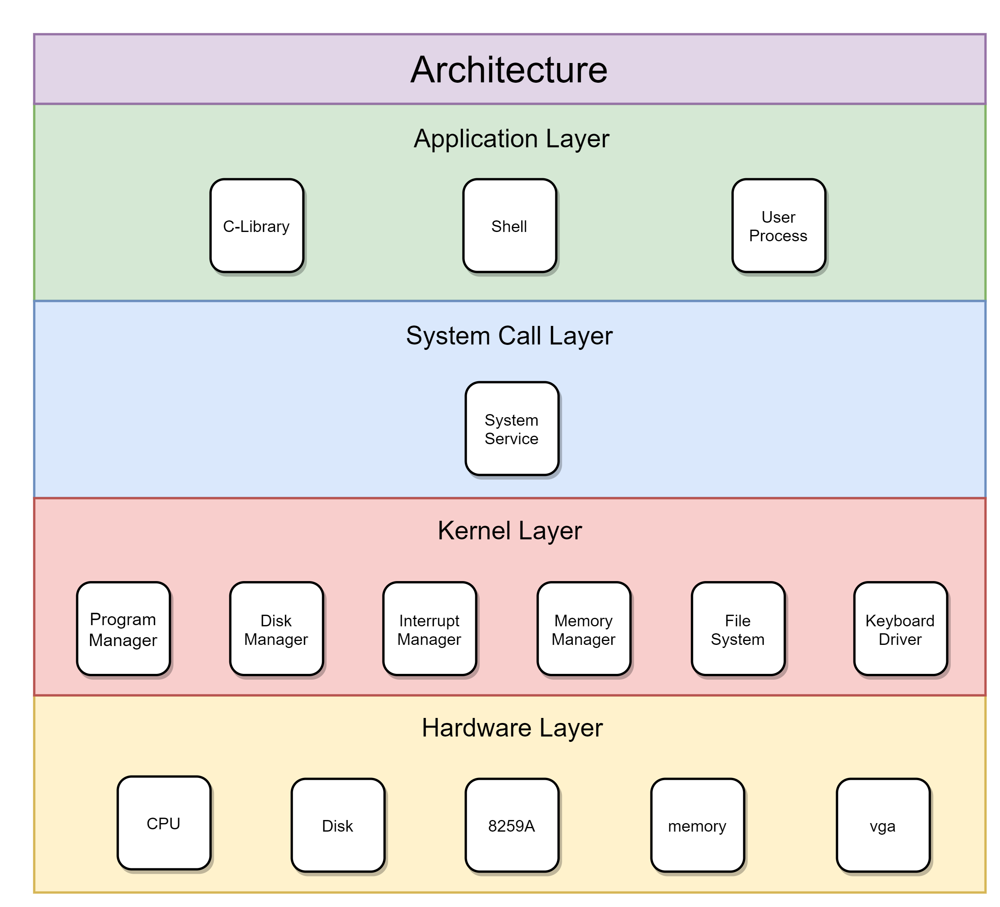
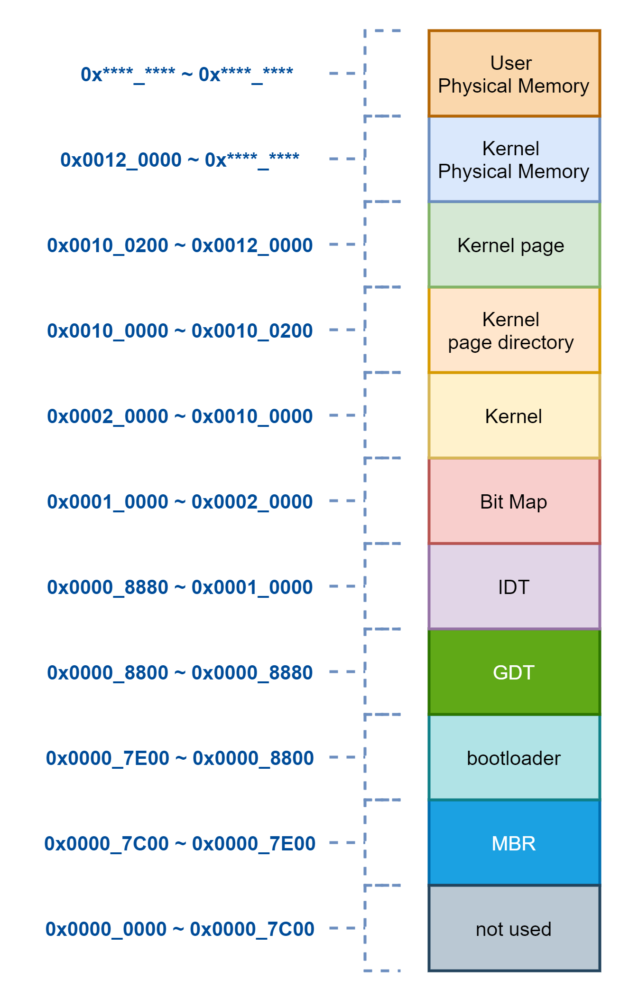
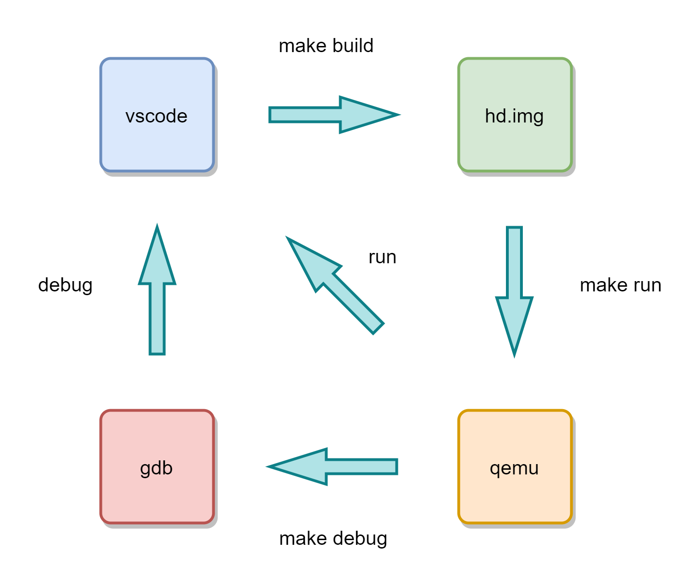
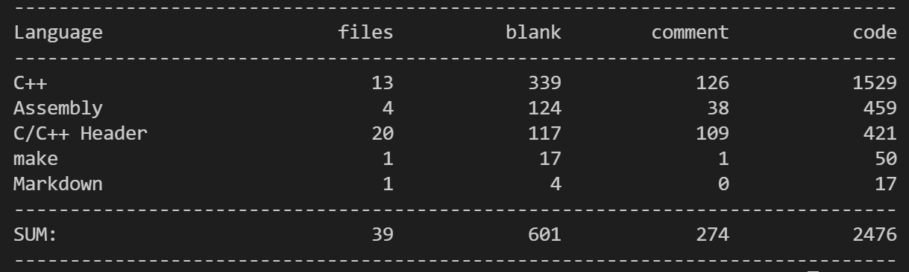
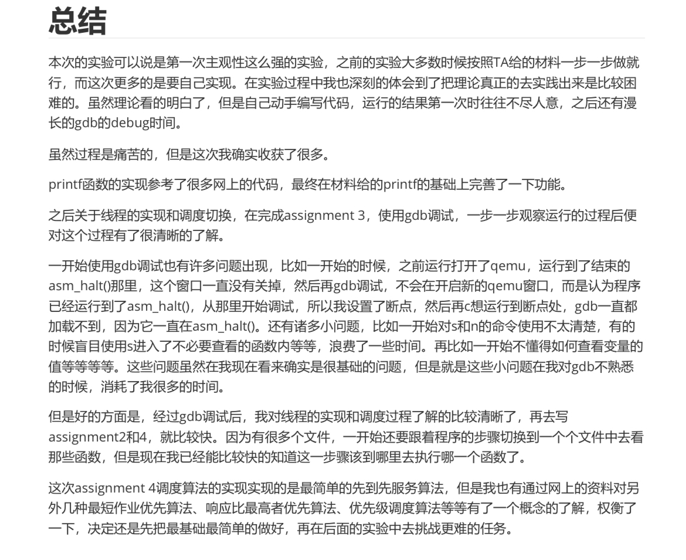
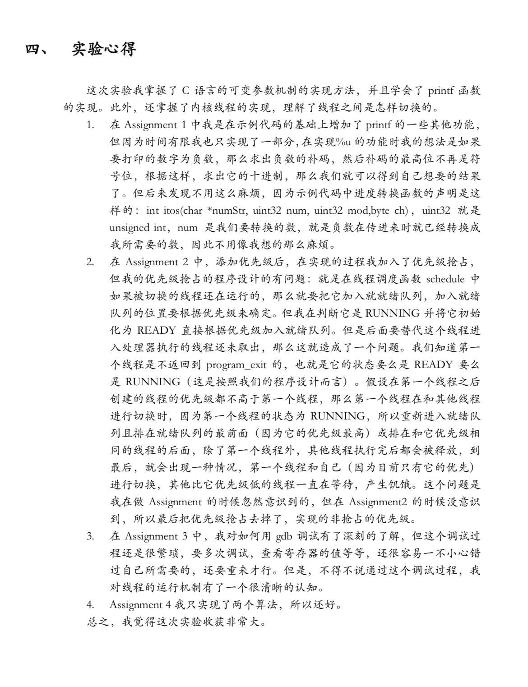
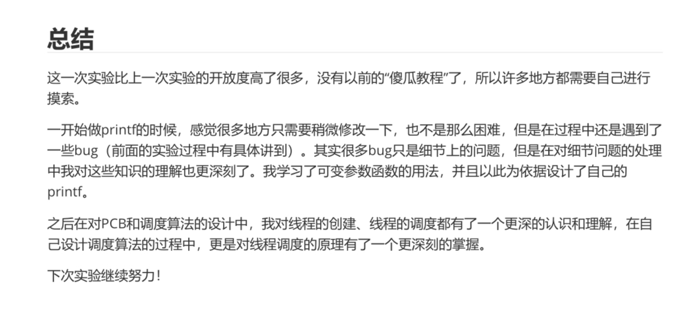
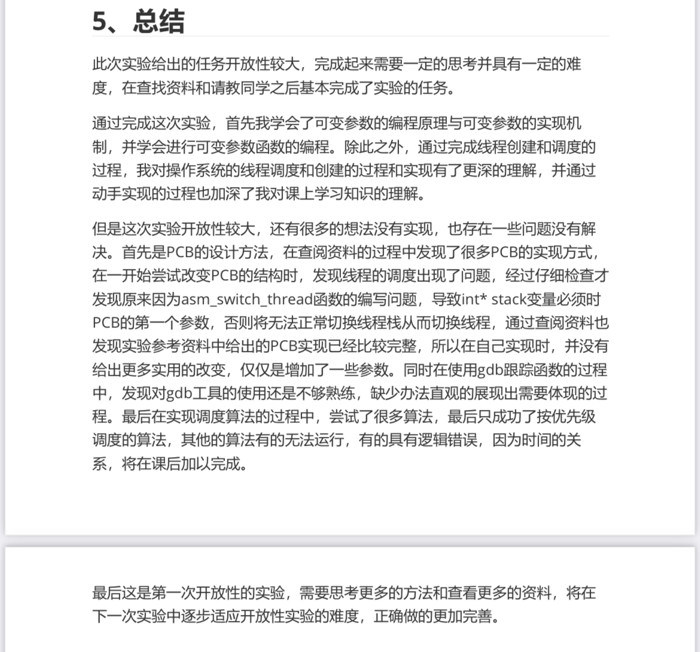

一个支点撬动操作系统大山 ——教学操作系统及实验设计 张钧宇，陈鹏飞 中山大学操作系统实验课程组

# 写作提纲

- [x] 摘要
- [x] 引言
- [x] 相关工作
- [x] 实验方案
  - [x] 教学环境
  - [x] 设计原则
  - [x] 教材结构
  - [x] 内容安排
  - [x] 使用方法
- [x] 方案效果
  - [x] 横向比较
  - [x] 纵向比较
  - [x] 评价收集和截图
- [x] 未来发展
- [x] 参考文献

# 摘要

“给一个支点，可以撬动操作系统这座大山”，操作系统的构建不再是遥不可及的事情。目前，rust、ARM、risc-v以及国产芯片等新型编程语言和新的CPU架构的兴起给原有的操作系统方案带来了极大的挑战，亟需提出一种和操作系统发展相同步的新方案。经过细致而全面的调查，本项目认为完全颠覆旧方案，进行实验课程改革的方式不仅工作量巨大，而且在短时间内无法完成。因此，作为折中方案提出了“以点带面”的发展战略。首先在使用C/CPP + x86的实验模式下提出一种新方案。然后，以此为支点，可以并行地开展“64位操作系统”、“rust + arm + 树莓派”，“rust + risc-v”等实验方案的探索，从而全面地推动中山大学操作实验课程改革。在完成“支点”的过程中，本项目提出了一种简明、全面的实验方案设计原则。在设计原则的指导下，编写了一套以递进演变方式叙述的实验教材，自底向上介绍了如何从零开始编写操作系统。同时，该方案已经应用到2021年中山大学操作系统实验课程中，并收获学生的一致好评。相比较于其他两个使用方案（16位模式操作系统）和使用ucore的方案，学生对操作系统概念、操作系统开发和操作系统设计等重要知识的理解程度均有明显提高。 通过提出新方案完成了中山大学操作系统实验课的初步改造方案。

# 引言

一直以来，从零开始编写操作系统是中山大学操作系统课程的一大特色。但是，随着操作系统的发展，rust，risc-v和ARM等新技术开始不断涌现。在深入地调查目前操作系统发展现状后，本项目认为需要革新原有的操作系统实验方案，使方案能够保持和操作系统的现状相一致。 这样的改革并不是一蹴而就，需要的工作量巨大。同时，改革并不是对旧方案的全盘否定，而是继承和发展。在分析和比较旧方案和操作系统现状后，本项目做了一个折中。 首先使用C/CPP + x86的实验模式下提出一种新方案。新方案保留了中山大学一以贯之的特色——从零开始编写操作系统。但在此基础上，提出了一种简明、全面的实验方案设计原则。在设计方案的指导下，独立自主地编写了32位保护模式操作系统代码。基于本项目的代码， 编写了一套以递进演变方式推进的的实验教材，全方面介绍了从零开始编写操作系统的知识。教材分为两部分，示例代码和指导材料。 在示例代码中以递进的方式给出操作系统的一种简单的实现方式。指导材料分为九章，每一章的结构为实验概述、实验要求、实验内容和课后思考题。从第零章到第八章，操作系统实验覆盖了MBR、bootloader、x86汇编、实模式、保护模式、中断、内核线程、用户进程、信号量和分页机制等主要的操作系统概念。同时，给出了关于新方案的使用方法。

目前，新方案已经成功地应用于2021年中山大学操作系统实验, 并收集了大量的学生反馈。从纵向看，新的实验方案收获学生的一致好评。从横向看，相比较于其他方案，学生在完成新的方案后，其对操作系统概念、操作系统开发和操作系统设计等重要知识的理解程度均明显提高。

综上所述，基于实现的教学操作系统以及实验指导，本项目圆满完成了中山大学操作系统实验课的初步改造方案。

# 相关工作

ucore是清华大学的操作系统实验课程。ucore以相对较少的代码实现了一个较为完备的操作系统，用清华大学陈渝老师话说，就是：“麻雀虽小五脏俱全。”在ucore的实验方案中，学生需要在ucore的代码框架下分析代码的执行逻辑或实现某些特定的函数。但是，本项目认为，这样的模式存在一些不足。例如在ucore lab1中，学生需要学习大量的知识，如ELF模式、实模式和保护模式、汇编和C等。学生还需要掌握许多工具如gdb、qemu等。这无疑会加剧学生对操作系统实验的畏难情绪。除此之外，ucore的模式缺少一些变化，在结果评测方面存在漏洞。例如每一届学生的ucore的实验练习都是固定的，这就导致了前面完成实验的学生为后面的学生提供了充分的答案。

《操作系统真象还原》以一种通俗易懂的方式介绍了如何从零开始编写操作系统。为了满足通俗易懂的特性，作者极力以一种口语化的语言展开叙述。这样反而会导致语言繁琐，使读者找不到重点。而且，作者借鉴了早期Linux的代码，代码中不乏与我们程序设计课程相违背之处，如代码中会存在许多goto语句。

《x86汇编语言：从实模式到保护模式》除了介绍如何从零开始编写操作系统外，还给出了许多课后习题来帮助读者理解。相比于《操作系统真象还原》，《从实模式到保护模式》的叙述方式更加简练、准确。但是，该书始终使用汇编语言来实现操作系统，不涉及到任何C/CPP等高级语言的内容。

《Orange's 一个操作系统的实现》同样是一本从零开始编写操作系统的教材。该书和《操作系统真象还原》恰恰相反，其叙述方式极具作者个人特点。而且，该书会使用许多编程语法上的技巧，这对初学者来说是不必要的。

“这里是否可以加上一些XV6的工作”

# 实验方案

## 想法来源

在本学期之前，学生使用C在x86架构下从零开始编写一个在bochs上模拟运行的16位操作系统。从零开始编写操作系统一直是中山大学操作系统实验课程一以贯之的传统和特色。为什么这样一份实验方案多年来受到老师和学生的追捧呢？主要有以下原因。

1. **契合实际**。在过去的十多年中，CPU一直是x86架构的天下。历经了从16位的实地址模式到32位保护模式的变化。因此，以x86架构作为实验平台无疑是契合学生平时的使用实际的。同时，在x86架构下使用的术语如实模式、保护模式和8259A芯片等都是学生司空见惯的。因此，选择x86架构能够将学生对于硬件的畏难情绪降到最低。
2. **易于上手**。 学生曾在大一接受了为期一年的C和C++的深入学习，对于编写操作系统所必备的Linux环境下的工具的使用、C语言的用法和项目管理等知识都有所了解。同时，学生们在大二上学习了计算机组成原理课程。在该课程中，学生们学习了x86汇编语言，了解了C语言和汇编语言的联系和区别，还使用x86汇编语言编写过程序。这些知识都为学生们在操作系统实验课程中奠定了坚实的基础，从而使得实验易于上手。
3. **收获感强**。从零开始编写操作系统并不是一件容易的事情，往往能够耗费学生许多精力。但是，学生们的收获比较显著。在实验课中，学生们通过具体的、独立的和深入的实践过程学习到许多知识，如计算机的启动过程、内存管理、进程管理和文件系统等。这些从实践中学习到的知识能够帮助同学们加深对理论知识的理解。同时，许多学生会将自己的Linux、Windows和MacOS等功能“仿制”到自己的操作系统中，甚至编写了小游戏，从而形成了具有自己特色的操作系统。

天若有情天易老，人间正道是沧桑。在原有操作系统实验方案应用的十余年间，操作系统的发展也发生了翻天覆地的变化。例如，x86_64架构主宰了CPU的话语权、arm和risc-v也在异军突起、去C/C++，使用rust来编写更加安全的内核正见诸于计算机系统的各大顶会……因此，本项目作者愈发感觉到，改革操作系统实验方案，使其与时俱进的重任迫在眉睫。

为此，结合当下操作系统发展实际、学生的先修知识的广度和深度以及其他高校的操作系统实验设计等因素，重新审视了操作系统实验方案。在对以往的方案做出了批判性继承的基础上，提出了新的实验方案，新方案主要特点如下。

1. **从零开始**。坚持认为，从零开始编写操作系统不仅能够延续我们实验方案的传统，而且能够帮助学生加深对于操作系统的各个组成部分的理解，从而在学生的知识体系中建立起关于操作系统的全貌。因此，在新方案中，从零开始编写操作系统的原则依然是我们的出发点和落脚点。
2. **代码自研**。本项目的操作系统代码是在《操作系统真象还原》和《从实模式到保护模式》的基础上开发的，但相较于二者做了几乎完全的改变。值得注意的是，代码并未参考任何高校的代码，如xv6和ucore等，也并未参考Linux的实现代码。同时，本项目的代码量只有2000余行。
3. **以点带面**。在对工作量和实验难度进行评估后，本项目认为在短时间内我们无法将许多新的内容引入到操作系统实验中。因此，采用了以点带面的方式来推进操作系统实验更新。首先在原有的实验的基础上作出改变，例如彻底抛弃实模式、引入Linux + qemu + gdb + vscode的统一开发调试环境、实验教材的编写等。由于本项目只是在原来的基础上迈出了试探性的一步，这样的改变称之为“点”。在“点”的工作中，本项目已经基本确定了操作系统实验新方案的设计思路，并逐步积累了自己的实践经验。在“点”确立的实验框架下，可以并行地开展“64位操作系统”、“rust + arm + 树莓派”，“rust + risc-v”等实验方案的探索。由于可以并行地对多种方案进行探索，这样的探索称之为“面”。因此，可以说这个实验方案的改革过程称为“以点带面”。
   
4. **保护模式**。原有方案为学生提供了两种实验选择。学生可以在16位的实模式操作系统或32位保护模式操作系统中选择。相较于16位实模式，32位保护模式需要学习的知识比较多。例如，实模式的BIOS中断囊括了读写磁盘，移动光标，输出输出等内容，学生直接调用即可。但是，在保护模式下，BIOS中断无法使用，学生需要了解如何通过读写IO端口，编写系统调用来完成上述内容。这部分内容之多足以让学生望而却步。于是，绝大部分学生选择了编写实模式操作系统。这样就导致了学生无法通过实践了解到二级分页机制的实现，IO端口，特权级保护等内容。这是旧方案的一大弊病，因为本项目认为实验的目的是通过具体的实验来帮助同学们理解抽象的理论。结合了理论课教材后，本项目认为只有通过保护模式才能让学生实现理论课教材的大部分内容。因此，在新方案中，本项目彻底地抛弃了实模式，学生只会在32保护模式下完成实验。
5. **源码调试**。在原有方案中，使用bochs来作为开发和调试环境。但是，bochs有一个最大的弊端是不支持源码级别的debug。即使用C语言来编写操作系统，bochs反汇编出来的代码是C语言对应的汇编代码。这给一些对汇编代码、C和汇编等知识不熟悉的学生造成了极大的困扰。而且，直接使用汇编代码来debug大大降低了debug的效率。因此，在新方案中，通过引入qemu + gdb实现了16位汇编代码，32位汇编代码和C/C++代码的源码级debug，从而降低了学生的debug难度。
6. **实验教材**。新方案和原方案最大的不同点是为实验编写了一套实验教材，而原方案只是简单地为每次实验提供了实验需求。学生自己摸索是一件好事，但这不应该成为一门课程的设计主线。一门好的课程是能够给予学生以充分的路线指导，然后才能让学生沿着路线自行摸索。由于操作系统是硬件和软件之间的一层中间件，开发操作系统必然会涉及到许多硬件知识。如果不了解硬件是怎么工作的，那么学生的程序必定会出现不可解决的bug。在以往的实验中，教师和学生将大量的时间耗费在找出因为先修知识不够而产生的 bug 上。  因此，本项目为新方案编写了一套相对完整的教材。 教材旨在使用最简单的方式来为学生阐明操作系统实验中许多精彩的设计思路，提高学生的学习效率。

## 设计原则

新方案和旧方案，乃至和其他高校的操作系统实验设计方案相比，其最大的不同在于提出了一种简明、全面的操作系统实验设计原则，对设计原则的解释和理解如下。

+ **简明的**。**“简明的”指的是设计一切从简**。由于实验方案是从零开始编写操作系统，操作系统中的中断、线程管理和进程管理都需要学生自行编写。因此，学生需要了解的东西非常多。如果不能够为学生删去一些不必要的东西，提供一种简明的指导方案，那么学生就容易迷失在知识的海洋中，从而对实验产生较大的抵触心理。本项目认为，大道至简，操作系统的设计亦是如此。每一部分的设计都会考虑再三，删去许多与主题相关性不大的内容，最终以一种最简单的方式来实现最全面的编程逻辑。例如应该让学生尽量的使用他们最熟悉的语言来做实验。因此，希望尽量简化汇编代码在编写操作系统中的数量，尽可能地使用高级语言C/C++。同时，认为内联汇编是不必要的。实际上，任何通过内联汇编实现的功能都可以通过汇编提供的函数接口实现。注意到内联汇编也有自己的一套语法，这也会给学生带来额外的学习成本。因此，不会介绍和使用任何内联汇编。
+ **全面的**。**“全面的”指的是内容包罗万象**。实验方案囊括了操作系统理论中许多重要概念，其中包括线程/进程管理、内存管理、文件系统、I/O管理、中断机制和系统调用机制等。通过完成实验，学生可以借助于具体的实践来理解抽象的理论。同时，我们的实验方案不仅讲解操作系统重要概念的实现，还讲述了toolchain的使用和debug技巧。实验课后配有许多相应的课后思考题，同学们借助于课后思考题可以理解实验中的重点内容。除此之外，通过本教程的学习后，同学们将掌握操作系统核心概念，程序的编译执行过程，GCC编译工具的使用，C/C++项目的构建和管理、类Unix环境等内容。

## 教材结构

实验教材可以划分为两部分，示例代码和指导材料。

由于我们采用了递进演变的方式来编写材料，示例代码也是递进演变的。一般来说，后面的代码是在前面的代码的基础上增加、删除或修改的某些部分的代码。也就是说，当学生完成到最后一个实验时，示例代码实际上就是一个具有最基本功能的操作系统代码。

示例代码的主要作用是给出操作系统的一种简单的实现方式。在指导材料中，借助于示例代码来讲解如何实现操作系统中的重要概念，以便学生理解实验的实现方式和思路来源。同时，会在课后思考题中设计一些分析示例代码的题目，分析方法包括gdb跟踪、测例验证和代码逻辑分析等。通过分析示例代码，学生可以加深自己对操作系统实现的理解。除此之外，还会设计一些个性化的题目。在这些题目中，学生或者可以在示例代码的基础上加入自己的个性化内容、或者自行实现一些功能、或者改进示例代码等。通过个性化的题目，学生可以发散自己的思维并动手实现自己的想法，从而加深自己对实验内容的理解。

指导材料可分为实验概述、实验要求、实验内容和课后思考题。

在实验概述中，按照实验内容的讲述顺序来对实验做一个简要的概括。通过阅读实验概述，学生可以迅速地了解每一次实验需要学习和完成的内容，从而在开始实验前就能够对实验内容产生一个初步的印象。

在实验要求中，针对实验内容中的主要内容来为学生设计实验要求。根据学生的实际情况来确定实验要求中的题目数量和难度，这些题目是学生需要独立完成并提交结果和报告的。通过检查学生的题目完成情况，既可以即时地对我们的教学成果进行评估，以便调整后续的实验内容，也可以引导学生朝着我们期望的方向发展。

实验内容是指导材料的主体部分。实验内容的长度被控制在10,000到20,000字之间。通过控制实验内容的长度，既可以保证实验的进度，又不会让学生一下子接触到大量的信息。正如前面所述，实验内容的编写方式是递进演变式的。逐步分析操作系统的一些重要概念的实现代码，如同搭积木一般，将一个操作系统实现的基本过程以递进的方式呈现在学生面前。以递进演变的方式来教授实验内容是符合学生的认知发展过程的。并不只局限于分析操作系统的实现，还会讲授一些预备知识。在预备知识的讲解中，我们往往会穿插若干个示例来帮助学生理解这部分的知识。将这些预备知识讲授清楚比单纯地分析示例代码是更重要的。调查后发现，学生不知道如何设计操作系统代码的根源不在于不懂操作系统的概念。事实恰好相反，学生实际上对操作系统的基本概念了解得十分清楚，但由于其他预备知识的缺失，导致了他们不知道如何去实现一个操作系统。而当我们讲授完预备知识后，学生往往能很快地理解操作系统的代码实现，甚至不用参考代码实现也能根据概念的定义来实现。

课后思考题主要是帮助学生自行理解实验的重点内容。在每一章的最后，精心地设计了10到20​道课后思考题，以帮助学有余力的同学加深自己对于实验内容的理解。在设计课后思考题的过程中，我们实际上划分了每一章的重点内容，然后根据这些重点内容来出题。也就是说，学生通过完成课后思考题就能够检验自己对实验中每一个重点内容的理解情况。

## 内容安排

结合理论课的教学思路，将从零开始实现操作系统的整个过程划分为一个个重要的阶段。根据重要阶段的划分方式编写了实验教材中的每一章，每一章的内容如下。

在第零章中，将熟悉现有Linux内核的编译过程和启动过程，以及在自行编译内核的基础上构建简单应用并启动。同时，利用精简的Busybox工具集构建简单的OS， 熟悉现代操作系统的构建过程。此外，还会尝试如何使用gdb实现内核远程调试。

在第一章中，将会学习到x86汇编、计算机的启动过程、IA-32处理器架构和字符显存原理等知识。根据所学的知识，能自行在MBR下写入16位的汇编程序，然后让计算机在启动后加载运行。同时，将学习使用gdb来调试程序的基本方法。

在第二章中，介绍了如何从16位的实模式跳转到32位的保护模式，然后在平坦模式下运行32位程序。同时，将介绍如何使用I/O端口和硬件交互的基本方法，为后面保护模式编程打下基础。

在第三章中，首先介绍一份C代码是如何通过预编译、编译、汇编和链接生成最终的可执行文件。接着，提出了一种C/C++项目管理方案。在做了上面的准备工作后，我们开始介绍C和汇编混合编程方法。然后，介绍了保护模式下的中断处理机制和可编程中断部件8259A芯片。最后，通过编写实时钟中断处理函数来将本章的所有内容串联起来。

在第四章中，将会学习到C语言的可变参数机制的实现方法。在此基础上，会揭开可变参数背后的原理，进而实现可变参数机制。实现了可变参数机制后，将实现一个较为简单的printf函数。接着，开始学习内核线程的实现。最后，会实现基于时钟中断的时间片轮转(RR)调度算法。

在第五章中，首先使用硬件支持的原子指令来实现自旋锁，自旋锁将成为实现线程互斥的有力工具。接着，使用自旋锁来实现信号量，最后使用自旋锁和信号量来给出两个实现线程互斥的解决方案。

在第六章中，首先学习如何使用位图和地址池来管理资源。然后，将实现在物理地址空间下的内存管理。接着，我们将会学习并开启二级分页机制。在开启分页机制后，将实现在虚拟地址空间下的内存管理。

在第七章中，首先会简单讨论保护模式下的特权级的相关内容。然后，介绍了系统调用的概念和如何通过中断来实现系统调用。在实现了系统调用后，介绍了用户进程的创建和管理的基本方法。最后，介绍了fork/wait/exit的一种简洁的实现思路。

在第八章中，给出了若干个课程项目并不再提供示例代码。

对于一些和操作系统本身无关但和开发操作系统有关的内容，如IDE的选择、使用gdb来进行源码级的debug、使用make来进行项目管理等，将其一并放入到附录中。

## 使用方法

为了便于理解新方案的整体设计，在这里给出我们自己关于新方案的使用方法。

会在课前根据每一章的实验内容制作PPT，然后在上实验课的时候花费0.5\~1个小时来为学生讲解其中的重点内容。讲解完毕后，剩下的实验课时间就留给学生自行阅读并消化实验教材中的内容，教师和助教负责答疑。在课后，我们或者从课后思考题中选取若干道习题并作修改，或者根据学生的学习情况来针对性地命题，学生需要在课后完成并提交这些题目。

值得注意的是，正因为给出的是一种简明的实现思路，我们就可以为同学们留出更多的发挥空间。由于不会限定学生必须完成的内容，在后续的实验中，每一次为同学们颁布的习题都可以不同。这就为教师的教学提供了极大的灵活性。

# 方案效果

## 横向比较

在2021年操作系统实验课程中，有另外两个班级的实验方案与本方案并不相同。一个使用的是旧方案，一个使用的是ucore。

对于使用旧方案的班级，之前陈述的问题依然存在，并未解决。绝大部分学生依然选择只在16位实模式下完成实验，而不会去学习32位保护模式。根据这些班级的同学反映，他们还存在实验环境不统一、实验方案陈旧和缺少一份指导材料的问题。而这些问题均在我们的方案中被重点解决了。

对于使用ucore的班级，由于是第一次使用ucore，他们对ucore的认识还不够充分。同时，这个班级选择了先讲述进程管理，再讲述内存管理。而这与ucore的实验顺序相违背，从而导致了理论和实验不统一的现象。最重要的是，学生都能够在网上找到以往完成了ucore的同学的答案，部分学生只是做了简单的复制粘贴，并未做深入的思考。由于ucore一开始就把整个操作系统的基本框架搭建起来了，部分学生反映内容较多，理解起来难度过大。

综合了学生的评价后，我们发现，相比较于其他两个使用旧方案和使用ucore的班级，学生在完成我们的新方案后，其对操作系统概念、操作系统开发和操作系统设计等重要知识的理解程度均明显高于另外两个班级。

## 纵向比较

在我们的班级中，我们的实验方案受到了学生的一致好评，以下是学生的评价。

以下是学生的报告截图。

# 未来发展

前面已经提到，我们的新方案起到的只是“点”的作用。新方案最大的贡献在于为后面的方案的提出奠定了基础。例如，我们通过Linux、vscode、make、gdb、qemu、gcc和g++为学生统一了从开发到编译，从编译到运行，从运行到debug的道路。但我们并不会止步于此，我们最终的目的还是希望能够通过这个“点”将“面”带出来。在我们的下一代的方案中，我们将会彻底抛弃C/CPP + x86这种操作系统实验模式。我们将会引入rust，在risc-v，arm甚至是开发板上构建我们的操作系统实验。我们应当注意到，下一代方案并不是对当前方案的完全推翻。恰恰相反，当前方案提出的统一实验环境、设计原则和教材结构等重要思想依然会被下一代方案所继承和发展。

为了简化操作系统实验难度，我们提出了一种简明的、优雅的和全面的设计原则。我们的设计原则决定了我们给出的操作系统并不是一个功能十分完善的操作系统，而只是一个包含了操作系统的许多重要概念的toy OS。但这样的结果也是符合我们的课程期望的。因为我们始终认为，实验的根本目的在于通过具体的实践来帮助学生理解抽象的理论。学生的学习成果并不需要在当下完全展现，而是能够通过完成toy OS来熟读操作系统重要概念、了解开发操作系统的基本方法、学习Linux下的开发工具等。通过实验课学到的知识，学生能够在后面的科研、工作中，遇到开发操作系统的问题，能够将这部分知识做出迁移和发展。这才是我们实验课的最终目的。

我们的实验评价体系还没有完全建立，在下一代方案中，我们需要构建出一套自动化的评价系统。

# 结论

在刚刚过去的一年半中，我们综合比较了旧有的实验方案和操作系统发展现状之间的差距，从而在旧方案的基础上提出关于中山大学操作系统实验课改革的设想。为了减少目前的工作量，本项目提出了“以点带面”的发展战略，在使用C/CPP + x86的实验模式下提出一种新方案。在新方案中，提出了一种简明、全面的实验方案设计原则。在设计原则的指导下，编写了一套以递进演变方式叙述的实验教材，自底向上介绍了如何从零开始编写操作系统。同时，成功地将新方案应用到2021年中山大学操作系统实验课程中，并收获学生的一致好评。相比较于其他两个使用旧方案和使用ucore的班级，学生在完成新方案后，其对操作系统概念、操作系统开发和操作系统设计等重要知识的理解程度均明显提高。

# 参考文献

1. kip R Irvine. Intel汇编语言程序设计第五版.  电子工业出版社.
2. 李忠, 王晓波, 余洁. x86汇编语言从实模式到保护模式. 电子工业出版社.
3. 郑钢. 操作系统真象还原. 中国工信出版社.
4. 于渊. Orange' s 一个操作系统的实现. 电子工业出版社.
5. 蒋静, 徐志伟. 操作系统实验: 原理、技术与编程. 机械工业出版社.
6. William Stallings. 操作系统: 精髓与设计原理第八版. 中国工信出版社.
7. 谢煜波.PYOS.纯C论坛
8. 陆勇.中山大学.考试酷
9. [获取内存容量](https://zhuanlan.zhihu.com/p/35776128)
10. [可变参数函数详解](https://www.cnblogs.com/clover-toeic/p/3736748.html)
11. [C语言-从代码到程序的过程理解](https://www.cnblogs.com/linzworld/p/13690620.html)
12. [x86汇编(Intel汇编)入门](https://www.cnblogs.com/jiftle/p/8453106.html)
